# Signal and Noise: A Framework for Reducing Uncertainty in Language Model Evaluation

David Heinemanµ Valentin Hofmannµσ Ian Magnusson $\mu \sigma$ Yuling $\mathbf { G u } ^ { \mu }$ Noah A. Smithµσ Hannaneh Hajishirziµσ Kyle $\mathbf { L o } ^ { \mu }$ Jesse Dodgeµ

µAllen Institute for Artificial Intelligence σPaul G. Allen School of Computer Science & Engineering, University of Washington contact: davidh@allenai.org

# Abstract

Developing large language models is expensive and involves making decisions with small experiments, typically by evaluating on large, multi-task evaluation suites. In this work, we analyze specific properties which make a benchmark more reliable for such decisions, and interventions to design higher-quality evaluation benchmarks. We introduce two key metrics that show differences in current benchmarks: signal, a benchmark’s ability to separate better models from worse models, and noise, a benchmark’s sensitivity to random variability between training steps. We demonstrate that benchmarks with a better signal-to-noise ratio are more reliable when making decisions at small scale, and those with less noise have lower scaling law prediction error. These results suggest that improving signal or noise will lead to more useful benchmarks, so we introduce three interventions designed to directly affect signal or noise. For example, we propose that switching to a metric that has better signal and noise (e.g., perplexity rather than accuracy) leads to better reliability and improved scaling law error. We also find that filtering noisy subtasks, to improve an aggregate signal-to-noise ratio, leads to more reliable multi-task evaluations. We also find that averaging the output of a model’s intermediate checkpoints to reduce noise leads to consistent improvements. We conclude by recommending that those creating new benchmarks, or selecting which existing benchmarks to use, aim for high signal and low noise. We use 30 benchmarks for these experiments, and 375 open-weight language models from 60M to 32B parameters, resulting in a new, publicly available dataset of 900K evaluation benchmark results, totaling 200M instances.

$\pmb { \bigtriangledown }$ allenai/signal-and-noisedatasets/allenai/signal-and-noise

# 1 Introduction

Language model development is expensive. During the development process, researchers need to make decisions such as what architecture to use, what training methods to employ, and what data to train on. These decisions rely on measuring phenomena at smaller, more economical scales, then hoping the trends measured hold for large scale models. This paradigm exists across the research community; many papers experiment with small baselines then scale up the best-performing model [31, 17, 38, inter alia], and there has been extensive research on using scaling laws to predict the performance of larger models [9, 19, inter alia]. While there is a large and ever-growing number of benchmarks, prior work has shown these scaling procedures only works for some benchmarks and not others [66, 56, 15, 50]. This poses a significant challenge because, as we develop more general-purpose language models, developers need to be evaluating on even more diverse benchmarks, some of which may not be well-suited for this critical approach. We need a deeper understanding of what intrinsic properties we can measure to tell if a benchmark provides useful information, if it needs to be reformulated, or if it is best discarded altogether.

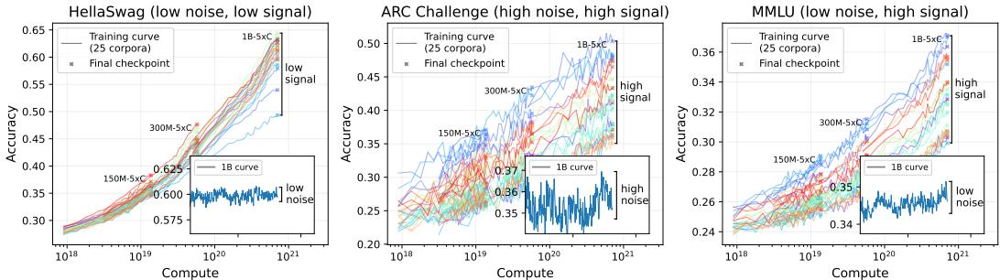  
Figure 1: Training curves for the 25 pretraining corpora in DataDecide [38] on three development benchmarks across different model sizes – the ordering of different model pre-training corpora, shown by different colors, at a small scale (e.g., 150M) should agree with ordering at a larger scale (1B), implying better decision accuracy. We hypothesize that one indicator of decision accuracy is the ratio between the signal (main plot) and the noise of scores within a single training run (inset axis). In this work, we quantify the signal-to-noise ratio at different compute scales, and in later sections, show that it is predictive of large scale phenomena like decision-making error.

To formalize this setup, we study two common experimental settings for language model development: (i) train a pair of small models (e.g., on different pretraining corpora) and use their ranking to predict the ranking of two large models [38], and (ii) fit a scaling law on a set of small models and predict the performance of a large model [19, 3]. We hypothesize that the ability to predict both settings are related to a measure which is cheaper to compute and easier to improve: signal and noise. Signal measures how spread out scores are for different models on a single benchmark and noise measures the variability of a benchmark score during training.

To illustrate the connection from signal and noise to an experimental setting, consider an example of comparing models trained using different pretraining corpora (illustrated in Figure 1); the tasks where scores are either too close (HellaSwag, left) or too noisy (ARC Challenge, center) are the benchmarks where we would be less confident that a ranking of models at a small scale would hold at a large scale. Following this observation, we show in Section 4 that the signal-to-noise ratio (SNR) is highly correlated with the likelihood that a ranking of models at a small scale will hold at a large scale, and then show that noise is highly correlated with the prediction error of a scaling law fit.

Based on these observations, in Section 5 we propose a set of interventions designed to reduce noise or increase signal, and then we measure their impact on our experimental setups of decision accuracy and scaling law error. For example, we show that by averaging out the checkpoint-tocheckpoint noise for a model, we improve our ability to predict performance of large models from small models. We also show that it is possible to find subsets of existing benchmarks that have higher signal-to-noise ratios than the full evaluation sets, and that even though those subsets can have fewer than half as many instances, they improve both experimental setups. Finally, we show that SNR can be used to improve metric construction, where choosing a metric that has better SNR leads to consistent improvements on a wide variety of benchmarks.

Our core contributions are as follows: (i) we introduce definitions for signal, noise, and signalto-noise ratio in the setting of evaluating language models, and show this framework is useful for measuring the utility of benchmarks, and (ii) we demonstrate interventions based on this framework which improve both prediction settings. Our core results evaluate 465 language models on 30 benchmarks across 14 model sizes. We release our data, evaluation results, and trained models.

# 2 Predicting Large Model Phenomena with Small Models

Using small scale experiments to make predictions about large model behavior is ubiquitous in language model development [27, 60, 31, 42]. This process can take many forms. For example, finding a good mix of data from multiple sources to train on typically involves evaluation of small models to calculate an optimal weighting of datasets, then training a large model on the optimized mix [35, 66]. In Blakeney et al. [5], mid-training runs on a sample of candidate pretraining datasets are used to estimate the quality of training from-scratch. Dubey et al. [17] predicted the downstream task using scaling laws to compare candidate data mixes. Hyperparameter transfer methods, such as maximal update parametrization $( \mu P )$ , also rely on small scale experiments [68]. However, the results from small scale experiments are not always reliable. Work on so-called emergent capabilities [65] shows that for some benchmarks, language model performance only rises above random chance for models trained at large compute budgets. Later work has further explored emergence behavior in particular tasks, such as MCQA tasks [67] or generative math and code tasks [57], or by observing the capabilities of open-weight models [51].

While these different experimental setups are all important, we focus on two straightforward and common setups in making data decisions for language model development: decision accuracy and scaling law prediction error. In this section, we present the motivation for both experimental settings, and in Section 3 we show how the signal-to-noise ratio is an effective framework for predicting how useful a benchmark in these scenarios.

# 2.1 Decision Accuracy and Scaling Law Prediction Error

Decision Accuracy. Consider a scenario where a practitioner intends to train a large model, and needs to decide between training on Dataset $a$ or Dataset $b$ to get the best performance on some downstream task, represented by a scalar $B ( \cdot )$ . A simple and intuitive approach is to train a small model $s _ { a }$ on Dataset $a$ and another, $s _ { b }$ , on Dataset $b$ , then choose the dataset that led to the best downstream task performance for training the large model. We evaluate this procedure by training two large models, $m _ { a }$ and $m _ { b }$ , one on each of the datasets, and see if the ranking of the two small models, $s _ { a }$ and $s _ { b }$ , on the benchmark is the same as for the large models.1 In the scenario where we are deciding between more than two choices, we consider pairwise rankings between all pairs $\mathcal { P }$ . Following Magnusson et al. [38] we refer to this small-to-large agreement as “decision accuracy”:

$$
\mathrm { D e c i s i o n \ A c c u r a c y } = { \frac { 1 } { | { \mathcal { P } } | } } \sum _ { ( a , b ) \in { \mathcal { P } } } \mathbb { I } \left[ { \mathrm { s i g n } } ( B ( s _ { a } ) - B ( s _ { b } ) ) = { \mathrm { s i g n } } ( B ( m _ { a } ) - B ( m _ { b } ) ) \right]
$$

We use models of 7 sizes (from 60M parameters up to 1B parameters) trained on 25 different pretraining corpora from Magnusson et al. [38]. Our prediction task is to use a set of small models (e.g., 60M parameter models) to predict the ranking of the 1B models on a given benchmark (e.g., MMLU). High decision accuracy means the ranking of the small models accurately predicts the ranking of the large models on that benchmark; this is an indication that the benchmark is useful for this process of using small models to make decisions about which dataset to train on. We illustrate an example of this in Figure 1, which shows training curves for 25 data recipes on 3 model sizes. We hypothesize that if model scores are very close together, or the evaluations are very noisy, it is more likely that the ranking from small to large models will change, leading to worse decision accuracy; we formalize and test this hypothesis in the following sections.2

Scaling Law Prediction Error. Scaling laws [27, 24, inter alia] have been used extensively to predict the validation loss of a large model using a set of smaller “scaling law” models. Recent work has also used scaling laws to predict downstream task performance [19, 3] by first predicting task loss then using the predicted loss to predict task performance (e.g., accuracy); this is the setup we use in this work. The prediction error for the scaling law fit is defined as the relative error between the predicted and true performance of the large model: Prediction $\begin{array} { r } { \mathrm { E r r o r } = \frac { \left| \mathrm { M e a s u r e d V a l u e - T r u e V a l u e } \right| } { \left| \mathrm { T r u e V a l u e } \right| } , } \end{array}$

Calculating prediction error requires training a set of scaling law models on the same corpus with varying tokens/sizes (e.g., 190M to 1B params), training a large model (e.g., 13B), and fitting a scaling law to the smaller models to predict the larger model performance.3 We describe the scaling law functional form and fitting details in App. A.1, following the setup in Bhagia et al. [3].

# 2.2 Evaluation Dataset

We perform our analysis using existing development benchmarks and models:

Models. Our set of models includes: (i) a suite of scaling law models from 190M to 3.2B, with a corresponding target at 7B and 13B [3], (ii) a suite of 25 models each trained with different pretraining corpora from 60M to 1.3B [38], (iii) the final 30 checkpoints for OLMo 2 1B, 7B, 13B and 32B [42], and (iv) 73 open-weight base models. Additionally, in our comparison between sources of modeling noise in $\ S 3 . 1$ , we train and release $2 0 1 \mathbf { B }$ models, with 10 models trained varying the data order initialization and 10 varying the random seed initialization, along with evaluation on 3.2K intermediate checkpoints.

Benchmarks. We evaluate 30 development tasks which we categorize as knowledge QA, math, and code. We use the OLMES [22] standard where applicable, and reproduce the OLMo 2 evaluation setup [42] for all other benchmarks. Following Gadre et al. [19], we also include multi-task averages for each group, and for the OLMES core tasks. For our test of subset selection in $\ S 5 . 1$ , we include a synthetically generated benchmark, generated using AutoBencher [32].

We include full details on the sets of models and benchmarks in App. A.5.

# 3 Quantifying Signal and Noise

To illustrate the impact of noise on a decision-making setup, Figure 1 shows training curves for 25 1B models trained with different data recipes and, in inset plots, the training curve for a single 1B model on three tasks. Some tasks (left, HellaSwag) exhibit low noise between training checkpoints but low signal between models, and others (center, ARC-Challenge) exhibit high noise and high signal. In this section we define signal and noise, and define two simple metrics to estimate the signal-to-noise ratio that can be calculated from a set of model evaluations on a given benchmark.

# 3.1 Measuring Noise

There are numerous sources of noise in the language model development pipeline. Previous work has shown multiple training runs under the same configuration can lead to different performance as a result of a different initialization or data order [14, 13]. In addition, as illustrated in Figure 1, performance can even vary significantly from one checkpoint to the next: within the final 30 checkpoints of training for 1B models on ARC Challenge, we observe a range of $1 . 7 \%$ accuracy. With these motivations, we consider four potential noise measurements, each calculated on using evaluation on a single benchmark: (i) training multiple models and varying only the random initialization, (ii) training models and varying the training data order, (iii) measuring the total checkpoint-to-checkpoint noise across a full, single training run, and (iv) measuring the checkpoint-to-checkpoint noise of the final $n$ checkpoints of a single training run. We formalize these definitions in App. A.3.

To get estimates for four potential sources of noise, we train 10 different $1 \mathrm { B } { - } 5 \mathrm { x C }$ models varying the initialization and data orders, and evaluate all intermediate checkpoints. We find that the initialization noise, data order noise, and checkpoint-to-checkpoint noise across the whole training run all correlate highly with the relative standard deviation of the final $n$ checkpoints ( $R ^ { 2 }$ of 0.82, 0.86, and 0.95, respectively, see Figure 7; and see the training curves in Figure 19). These results lead us to define noise as the relative standard deviation of the final $n$ checkpoints, as this requires no additional training cost and only uses the final $n$ checkpoints rather than the full training curve. We define noise as: Rel. Std. $\begin{array} { r } { \dot { ( m ) } = \sqrt { \frac { 1 } { n - 1 } \sum _ { i = 1 } ^ { n } \left( m _ { i } - \bar { m } \right) ^ { 2 } } / \bar { m } . } \end{array}$ .

# 3.2 Measuring Signal

A benchmark is most useful during language model development if it can detect a true difference between a good model and a poor model, assuming a true difference exists between the models in the ability that the benchmark aims to measure. This statistical power is what enables us to use small models for development decisions like training dataset to use. To formalize this idea, we consider a benchmark to have high signal when models evaluated on it have a wide and evenly distributed range of scores. We measure signal using a metric from the numerical integration literature: dispersion, calculated as the maximum difference between the scores of any two models, divided by the mean score of all models to account for different scales. This metric is designed specifically to measure how well a set of points cover a space; that is, how spread out the points are from each other. We also considered 20 different measures of spread, including variance, mean pairwise distance, Gini coefficient, etc., in Appendix A.4.

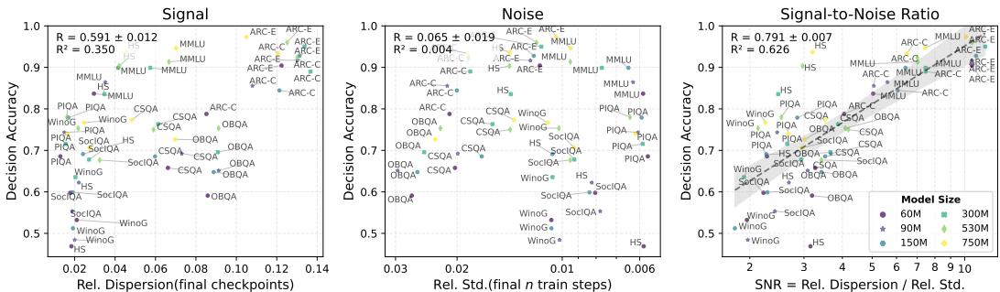  
Figure 2: Signal, noise, and signal-to-noise ratio $\scriptstyle { \dot { x } }$ -axis) vs. decision accuracy $y$ -axis), (see Section 2 for definitions). The signal alone (left) and noise alone (center) have low correlation with decision accuracy, while the signal-to-noise ratio (right) is correlated with decision accuracy. The signal-to-noise ratio gives us information about wether a benchmark is useful during development, as high decision accuracy (and signal-to-noise ratio) means development decisions made at a small scale generalize to large scale models.

In the following section we introduce signal-to-noise ratio, and find that this definition of signal leads to signal-to-noise ratio with the highest correlation with decision accuracy. We define signal as Rel. Dispersion $\begin{array} { r } { { \bf \Pi } ( M ) = \operatorname* { m a x } _ { j , k } | m _ { j } - \bar { m } _ { k } | / \bar { m } } \end{array}$ , the normalized maximum difference between any pair of models $j , k$ .

# 3.3 Measuring Signal-to-noise Ratio

Using our measures of signal (§3.2) and noise (§3.1), we propose measuring the signal-to-noise ratio. For both measures, we first divide by the average to be independent of particular units (e.g., to compare accuracy to unbounded task perplexity). We define the signal-to-noise ratio:

$$
{ \mathrm { S i g n a l - t o - N o i s e ~ R a t i o } } = { \frac { \mathrm { R e l . ~ D i s p e r s i o n ( f i n a l ~ t r a i n ~ c h e c k p o i n t ) } } { \mathrm { R e l . ~ S t d . ( f i n a l ~ } n { \mathrm { ~ t r a i n ~ c h e c k p o i n t s ) } } } }
$$

where signal (Rel. Dispersion) is measured over a population of models trained using a similar compute budget, and noise (Rel. Std.) is measured over the final $n$ intermediate training checkpoints of a single model. We emphasize that, while this is one particular instantiation of the signal-tonoise ratio, our framework is designed to be independent of a particular metric: we find many other measures of signal produce similar results in Appendix A.4 and measures of noise have high correlation in Appendix A.3.

# 4 Signal and Noise Correlate with Better Predictions

In this section, we show that the signal-to-noise ratio correlates with decision accuracy for small scale experiments, and that the noise of the target model correlates with scaling law prediction. These findings motivate our use of SNR to improve benchmarks’ statistical properties in Section 5.

# 4.1 Higher signal-to-noise ratio indicates higher decision accuracy

Setup. We hypothesize that a higher signal-to-noise ratio makes it easier to distinguish between models. To test this, we measure decision accuracy using the ranking of the small DataDecide models (60M to 750M) to predict the ranking of the large DataDecide model (1B). To calculate signal we use the final checkpoint of each of the 25 small models, and to calculate noise, we use the standard deviation around the final 5 checkpoints of the small-scale models. Since we have a measure of noise for each model, we use the average of the noise across the small models.

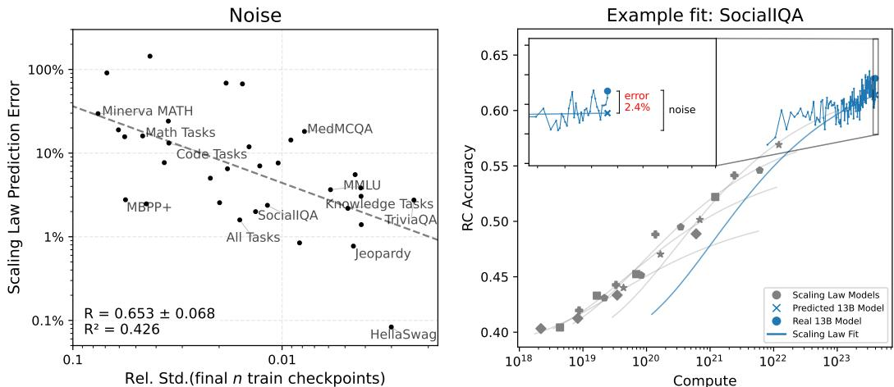  
Figure 3: Left: Correlation between the noise and scaling law prediction error (see Section 2 for definitions). We observe benchmarks with a lower noise around the scaling law target ( $\scriptstyle { \mathrm { ~ \mathcal { x } ~ } }$ -axis) also exhibit lower error ( $y$ -axis). Right: Example of scaling law for one benchmark (SocialIQA), with examples on all benchmarks in Figure 15. We conjecture that the noise of the target model (see inset axis) acts as a bound on the true minimum scaling law error; if the observed scaling law error below this noise, then the error is only possible by random chance. Therefore, when benchmarks exhibit a similar scaling law error but different noise (e.g., $\mathrm { M B P P + }$ , SocialIQA and TriviaQA; see Figure 15), we argue that those with the lowest noise are better.

Signal-to-noise is predictive of decision accuracy. Figure 2 shows the signal, noise and signalto-noise ratio plotted against the decision accuracy across the OLMES benchmarks. While the signal or noise alone do not correlate with decision accuracy, we find a strong correlation between SNR and decision accuracy $R = 0 . 7 9 1$ , $R ^ { 2 } = 0 . 6 2 6 )$ ). We conclude that benchmarks which have higher SNR at small scales exhibit higher decision accuracy, and are more likely for their results to hold at a larger scale. In Appendix B.1, we observe benchmarks with a higher SNR also exhibit lower variance when calculating decision accuracy using different checkpoints around the end of training.

# 4.2 Tasks with higher noise also have higher scaling law error

Setup. We fit scaling laws to predict the performance of OLMo 2 13B using final checkpoint of the set of scaling models trained by Bhagia et al. [3]. We calculate the scaling law prediction error as the relative error of the predicted and final 13B checkpoint. To estimate the noise, we calculate the relative standard deviation of the final 30 checkpoints of the 13B training run, each spaced 1000 training steps until the end of training.4 We hypothesize that the range of the final $k$ checkpoints of the prediction target (the large, 13B model) acts as an lower-bound on the true minimum scaling law prediction error. An example of the prediction error and noise around the prediction target is illustraed using SocialIQA in Figure 3 (right). Assuming a scaling law with no bias, we expect tasks with a lower standard deviation of the prediction target to also have a lower prediction error.

Noise measures the reliability of scaling law prediction errors. In Figure 3 (left), we show the scaling law error and standard deviation for predicting the 13B model performance over 30 tasks. We observe a correlation between the standard deviation of the prediction target and the prediction error across tasks $R = 0 . 6 5 3$ , $R ^ { 2 } = 0 . 4 2 6 )$ , however the fit is not perfect. For example, we observe four tasks $\mathrm { ( M B P P + }$ , SocialIQA, MMLU and TriviaQA) which exhibit similar error (around $2 \mathrm { - } 3 \%$ ), but exhibit different amounts of noise around the prediction target. For these benchmarks with similar error but lower noise, we can be confident that the error we observe from the single scaling law fit is the result of the true error of the scaling law fit rather than random chance. In practice, we recommend practitioners prefer making decisions based on scaling law predictions using tasks with low error and low noise.

Previous work has fit multi-task averages to predict scaling laws. In particular, Gadre et al. [19] find that the error from the individual tasks in their work to be too difficult to predict accurately. In Figure

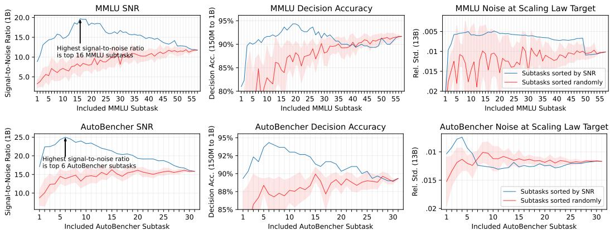  
Figure 4: Evaluating an intervention designed to increase signal-to-noise ratio (SNR): selecting subsets of a benchmark (Top: MMLU; Bottom: AutoBencher) that have higher SNR dramatically improves decision accuracy and the noise of the scaling law prediction target. MMLU and AutoBencher are made of different subtasks; for each benchmark we sort its subtasks by their SNR, then greedily add subtasks to our subset in order of decreasing SNR (left to right). Despite the subsets made in this way having fewer test instances, we find subsets of MMLU (e.g., with 16 subtasks) and of AutoBencher (e.g., with 6 subtasks) that have higher SNR than the full sets, and also have better decision accuracy and noise around the scaling law target. Named subtasks in Figure 16 in Appendix.

3 we also plot results for multi-task averages for each task group (‘Knowledge’, ‘Math’, ‘Code’) and an average across ‘All Tasks’. We find that some individual tasks are easier to predict than multi-task averages, and have lower noise around the prediction target. In particular, generative tasks like TriviaQA or Jeopardy which evaluate the exact match of a short-form generation exhibit lower error than the multi-task averages, and exhibit lower noise around the prediction target. For practitioners, we argue using individual tasks may be a better decision in some cases than the multi-task average, if that task better represents the ability than a multi-task average.

Our core results report SNR at the scales of our experimental settings for decision accuracy and prediction error. However, SNR can be calculated at any model size, so we show how the signal-tonoise ratio changes for tasks at larger 1B, 7B, 13B and 32B scales in Appendix B.3.

# 5 Improving Predictions by Improving SNR

In this section, we introduce three interventions designed to improve the signal, noise, or SNR: filtering subtasks by SNR (§5.1), averaging checkpoint scores during a training run (§5.2), measuring language modeling loss over the test set using bits-per-byte (§5.3). In each setup, we show using signal-to-noise ratio to intervene on the task improved the resulting error in both prediction settings.

# 5.1 Filtering noisy sub-tasks improves signal-to-noise ratio

Setup. Many tasks are a macro-average of subtasks. We hypothesize that some subset of subtasks is usually higher quality than the rest of the set, and that the signal-to-noise ratio may be an indicator of high quality subtasks. To test this, we first calculate the signal-to-noise ratio of each subtask, then rank the subtasks by signal-to-noise ratio and greedily add the highest SNR subtasks. As a baseline, we randomly shuffle the subtasks, and report the average of 10 calculations of each metric, with the shading indicating $\pm 1$ standard deviation.

Results. We show results in Figure 4. For MMLU, using only 16 subtasks had a higher signal-tonoise ratio than using the full test set. For AutoBencher, we observe the same but with only 6 tasks. The lower signal-to-noise ratio also led to a higher decision accuracy: $+ 2 . 6 \%$ for MMLU and $+ 5 \%$ for AutoBencher by using the high SNR subset compared to the full benchmark. We hypothesize that the quality of a task subset may influce that task’s signal-to-noise ratio. To test this, we use the data collected from MMLU Redux, which identified MMLU subtasks with high labeling error [21]. We find that out of the 20 MMLU subtasks which contain errors in least $5 \%$ of instances, half of these subtasks (10 of 20) are also in the lowest 20 tasks sorted by their signal-to-noise ratio. This presents evidence that low SNR may indicate low quality tasks, and we believe this is a good opportunity for future work in evaluation development.

Table 1: Evaluating an intervention designed to average out noise: for a given model on one benchmark, we calculate its score as the average of the scores of its final $k$ checkpoints (evaluated using bits-per-byte task formulation). Left: On small models used to make predictions (‘Avg. Pred.’), or to the large target models (‘Avg. Target’), or both (‘Avg. Both’), decision accuracy improves. ∗ indicates the decision accuracy is the same across columns. Right: On small models used to fit scaling laws (‘Avg. Train’), scaling law error improves. We show results on a subset of benchmarks, and report all benchmarks and the primary metric (accuracy, exact match, pass $@ 1$ ) in Tables 5 and 6.   

<table><tr><td colspan="5">Decision Accuracy (60M-5xC to 1B-5xC), %</td></tr><tr><td>Task ↓</td><td colspan="3">Final</td><td>Avg.</td></tr><tr><td></td><td>Ckpt</td><td>Avg. Pred.</td><td>Avg Target</td><td>Both</td></tr><tr><td>Knowledge QA Tasks</td><td></td><td></td><td></td><td></td></tr><tr><td>ARC Challenge</td><td>94.5</td><td>94.9</td><td>94.3</td><td>94.6</td></tr><tr><td>HellaSwag</td><td>92.4</td><td>93.1</td><td>93.1</td><td>94.0</td></tr><tr><td>ARC Easy</td><td>92.1</td><td>92.2</td><td>91.9</td><td>92.0</td></tr><tr><td>MMLU</td><td>91.5</td><td>91.6</td><td>91.6</td><td>91.6</td></tr><tr><td>AutoBencher</td><td>88.5</td><td>88.9</td><td>89.1</td><td>89.6</td></tr><tr><td>MMLUPro</td><td>90.0</td><td>89.4</td><td>90.0</td><td>89.3</td></tr><tr><td>AGI Eval</td><td>86.3</td><td>86.7</td><td>86.5</td><td>87.0</td></tr><tr><td>MedMCQA*</td><td>86.6</td><td>86.6</td><td>86.6</td><td>86.6</td></tr><tr><td>Jeopardy</td><td>84.4</td><td>84.4</td><td>84.8</td><td>85.0</td></tr><tr><td>TriviaQA</td><td>83.5</td><td>84.3</td><td>83.8</td><td>84.6</td></tr><tr><td>OpenBookQA</td><td>81.4</td><td>81.7</td><td>81.6</td><td>82.0</td></tr><tr><td>SocialIQA</td><td>79.9</td><td>79.5</td><td>79.4</td><td>79.0</td></tr><tr><td>PIQA</td><td>72.5</td><td>72.9</td><td>71.9</td><td>72.0</td></tr><tr><td>CommonsenseQA</td><td>65.8</td><td>66.2</td><td>65.4</td><td>65.6</td></tr><tr><td>BoolQ</td><td>63.7</td><td>64.2</td><td>63.5</td><td>64.0</td></tr><tr><td>SQuAD</td><td>60.8</td><td>60.4</td><td>62.0</td><td>61.6</td></tr><tr><td>Knowledge 19-Task Avg.</td><td>71.3</td><td>71.5</td><td>71.7</td><td>71.7</td></tr><tr><td>Code Tasks</td><td></td><td></td><td></td><td></td></tr><tr><td>HumanEval*</td><td>95.6</td><td>95.6</td><td>95.6</td><td>95.6</td></tr><tr><td>MBPP*</td><td>95.3</td><td>95.3</td><td>95.3</td><td>95.3</td></tr><tr><td>Code 4-Task Avg.*</td><td>96.7</td><td>96.7</td><td>96.7</td><td>96.7</td></tr><tr><td>Math Tasks</td><td></td><td></td><td></td><td></td></tr><tr><td>Minerva MATH*</td><td>90.0</td><td>90.0</td><td>90.0</td><td>90.0</td></tr><tr><td>GSM8K*</td><td>76.6</td><td>76.6</td><td>76.6</td><td>76.6</td></tr><tr><td>Math 6-Task Avg.*</td><td>88.3</td><td>88.3</td><td>88.3</td><td>88.3</td></tr><tr><td>All 30-Task Avg.</td><td>68.9</td><td>70.7</td><td>69.5</td><td>71.3</td></tr></table>

<table><tr><td colspan="3">Prediction Error (13B-5T),Abs. %</td></tr><tr><td>Task ↓</td><td>Final Ckpt</td><td>Avg. Train</td></tr><tr><td>Knowledge QA Tasks</td><td></td><td></td></tr><tr><td>HellaSwag</td><td>0.31</td><td>0.16</td></tr><tr><td>CommonsenseQA</td><td>0.59</td><td>0.46</td></tr><tr><td>Jeopardy</td><td>0.57</td><td>0.54</td></tr><tr><td>SocialIQA</td><td>0.50</td><td>0.59</td></tr><tr><td>PIQA</td><td>0.89</td><td>1.01</td></tr><tr><td>MMLU</td><td>1.68</td><td>1.74</td></tr><tr><td>MMLU Pro</td><td>1.76</td><td>1.75</td></tr><tr><td>AGI Eval</td><td>1.89</td><td>1.98</td></tr><tr><td>BoolQ</td><td>4.13</td><td>2.48</td></tr><tr><td>TriviaQA</td><td>2.33</td><td>2.62</td></tr><tr><td>SQuAD</td><td>2.80</td><td>2.79</td></tr><tr><td>OpenBookQA</td><td>4.02</td><td>3.38</td></tr><tr><td>AutoBencher</td><td>3.86</td><td>3.69</td></tr><tr><td>ARC Easy</td><td>5.13</td><td>5.13</td></tr><tr><td>MedMCQA</td><td>7.72</td><td>7.98</td></tr><tr><td>ARC Challenge</td><td>8.44</td><td>8.43</td></tr><tr><td>Knowledge 19-Task Avg.</td><td>1.43</td><td>1.20</td></tr><tr><td>Code Tasks</td><td></td><td></td></tr><tr><td>MBPP</td><td>2.57</td><td>1.79</td></tr><tr><td>HumanEval</td><td>7.71</td><td>8.85</td></tr><tr><td>Code 4-Task Avg.</td><td>3.15</td><td>2.75</td></tr><tr><td>Math Tasks</td><td></td><td></td></tr><tr><td>Minerva MATH</td><td>1.08</td><td>0.98</td></tr><tr><td>GSM8K</td><td>7.46</td><td>3.85</td></tr><tr><td>Math 6-Task Avg.</td><td>11.33</td><td>2.30</td></tr><tr><td>All 30-Task Avg.</td><td>1.03</td><td>0.86</td></tr></table>

Intuitively, a benchmark developer may increase the statistical power of a comparison between models: by sampling more data by the original process used to construct the benchmark, in order to make a benchmark larger [64], or collect a larger number of tasks in an evaluation suite [58]. Our evidence in Figure 4 suggests that larger benchmarks may not necessarily be better for comparing models. We further explore this phenomenon in App. B.2 by sub-sampling instances of benchmarks, finding some benchmarks can exhibit a higher SNR despite having 10 times fewer instances.

# 5.2 Averaging checkpoint-to-checkpoint noise leads to better predictions

Setup. Typically, models are only compared using the evaluation of the final checkpoint. In the previous sections, we argued that noise is a good indicator of whether we can use a benchmark to predict a large scale phenomenon. In this section, we want to measure the effect of averaging this particular source of step-to-step noise, as a way of improving our ability to make a prediction. In the decision accuracy setting, we can average the results of the small model, the large model (in this case, the 1B model), or both. In the prediction error setting, averaging the small models will help in fitting the scaling law, but averaging the target model will just make the result more reliable, so we average the target model in both settings and only change whether we average the models used to fit the scaling law. Finally, we introduce an additional way to average step-to-step noise during a training run, by evaluating whether the ranking of the 1B models during training agrees with the ranking at the end of training. Note, as our measure of noise is between intermediate training checkpoints, we are only reducing one of many sources of modeling noise.

Results on Final Checkpoints. In Table 1, we observe averaging the noise improved both measures of error. Averaging noise improved decision accuracy by $+ 2 . 4 \%$ for the 30-task average, this procedure improved decision accuracy in all but two tasks. For reducing the scaling law prediction error, averaging the training checkpoints improved prediction error for 20 of 30 tasks.

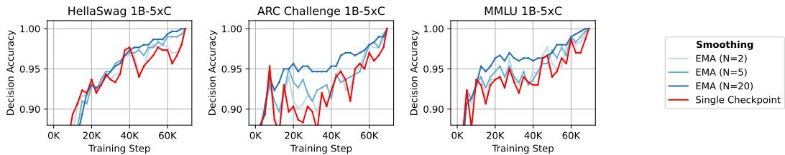  
Figure 5: When stopping a training run early, averaging the checkpoint-to-checkpoint noise improves the decision accuracy between an intermediate and the final training step. Shown are decision accuracy from early-stopping for HellaSwag, ARC-C and MMLU by using both a single checkpoint and the exponential moving average (EMA), with all tasks included in Figure 18.

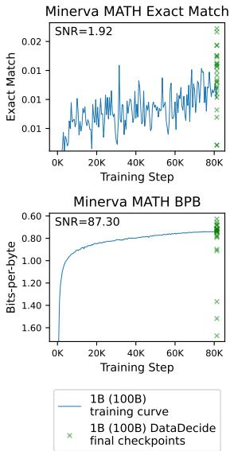

Figure 6: Impact of changing benchmark metric to bits-per-byte (BPB) from the primary score (e.g., accuracy, pass $@ 1$ , etc.). Left. Columns are (i) SNR of 1B models trained to 100B tokens; (ii) scaling law prediction error of 1B (and smaller) models used to predict 13B model performance; (iii) decision accuracy for using 150M model to predict 1B model ranking. For almost all tasks at the scales explored here, bits-per-byte shows a higher SNR, and lower scaling law prediction error, and higher decision accuracy than the primary score. Full results across 30 benchmarks and model scales in Table 17. Right. Example of primary metric and BPB on a single 1B (100B tokens) training curve (blue curve) and the final checkpoint of 25 models for Minerva MATH (green ‘x’s). Visually, the BPB training curve is smoother, corresponding to a higher SNR and a lower error in the prediction settings reported in the table, with all tasks in Figure 14.   

<table><tr><td rowspan="2">Experiment Setting→ Metric→</td><td colspan="2">SNR (↑)</td><td colspan="2">Rel. Error(↓),%</td><td colspan="2">Decision Acc (↑),%</td></tr><tr><td>Primary</td><td>BPB</td><td>Primary</td><td>BPB</td><td>Primary</td><td>BPB</td></tr><tr><td>Knowledge QA Tasks</td><td></td><td></td><td></td><td></td><td></td><td></td></tr><tr><td>TriviaQA</td><td>27.9</td><td>61.8</td><td>2.5</td><td>0.5</td><td>68.3</td><td>85.3</td></tr><tr><td>SQuAD</td><td>23.8</td><td>29.0</td><td>7.6</td><td>27.8</td><td>59.7</td><td>61.7</td></tr><tr><td>ARC Easy</td><td>21.0</td><td>64.6</td><td>5.3</td><td>0.8</td><td>93.0</td><td>93.0</td></tr><tr><td>Jeopardy</td><td>20.2</td><td>22.6</td><td>3.5</td><td>18.6</td><td>82.0</td><td>83.0</td></tr><tr><td>AutoBencher</td><td>15.9</td><td>31.3</td><td>0.2</td><td>4.5</td><td>89.3</td><td>89.3</td></tr><tr><td>HellaSwag</td><td>11.8</td><td>14.9</td><td>1.4</td><td>1.0</td><td>74.3</td><td>95.3</td></tr><tr><td>MMLU</td><td>9.8</td><td>35.9</td><td>4.3</td><td>0.4</td><td>89.0</td><td>92.0</td></tr><tr><td>ARC Challenge</td><td>6.6</td><td>44.8</td><td>9.7</td><td>2.1</td><td>83.3</td><td>95.0</td></tr><tr><td>SocialIQA</td><td>5.5</td><td>48.0</td><td>0.4</td><td>1.9</td><td>55.0</td><td>80.0</td></tr><tr><td>PIQA</td><td>4.2</td><td>8.8</td><td>0.5</td><td>1.3</td><td>73.3</td><td>72.7</td></tr><tr><td>AGI Eval</td><td>2.5</td><td>19.5</td><td>13.7</td><td>3.4</td><td>58.7</td><td>88.0</td></tr><tr><td>Knowledge 19-Task Avg.</td><td>13.7</td><td>44.3</td><td>0.8</td><td>1.0</td><td>79.0</td><td>80.0</td></tr><tr><td>Math Tasks</td><td></td><td></td><td></td><td></td><td></td><td></td></tr><tr><td>Minerva MATH</td><td>1.9</td><td>88.6</td><td>11.9</td><td>1.9</td><td>51.0</td><td>90.0</td></tr><tr><td>GSM8K</td><td>1.2</td><td>7.0</td><td>38.6</td><td>5.9</td><td>46.0</td><td>76.7</td></tr><tr><td>Math 6-Task Avg.</td><td>1.8</td><td>22.6</td><td>46.0</td><td>5.0</td><td>42.3</td><td>88.3</td></tr><tr><td>Code Tasks</td><td></td><td></td><td></td><td></td><td></td><td></td></tr><tr><td>HumanEval</td><td>6.1</td><td>25.1</td><td>9.2</td><td>7.9</td><td>74.3</td><td>95.7</td></tr><tr><td>MBPP</td><td>2.0</td><td>41.8</td><td>23.6</td><td>1.0</td><td>68.3</td><td>95.3</td></tr><tr><td>Code 4-Task Avg.</td><td>5.5</td><td>42.0</td><td>29.5</td><td>9.7</td><td>80.3</td><td>96.7</td></tr><tr><td>All 30-Task Avg.</td><td>10.0</td><td>31.5</td><td>2.3</td><td>0.4</td><td>77.0</td><td>83.7</td></tr></table>

Results on Early Stopping. Another prediction setting is to determine whether the ranking of two partially trained models will exhibit the same order at the end of training. We hypothesize that averaging the step-to-step noise will similarly improve this setting. In Figure 5, we report the decision accuracy for early stopping by using a single checkpoint (red), compared to an exponential moving average of the training curve (blue). We find for almost any training step, applying smoothing led to a higher decision accuracy when comparing models during training. In both settings, reducing the checkpoint-to-checkpoint noise allowed a more accurate extrapolation.

# 5.3 Measuring bits-per-byte improves benchmark signal-to-noise ratio

Setup. Recent work has begun to evaluate by using the test set as a perplexity set, with the intuition that the discontinuous metrics like accuracy or exact match erode the relationship between the language modeling perplexity and the downstream metric [54, 25]. We aim to measure whether the intervention to use a continuous metric improves the signal-to-noise ratio and corresponding error. We calculate the bits-per-byte (BPB) using the correct continuations of each test set – the bits-per-byte is the negative log likelihood of the correct answer divided by the number of UTF-8 bytes in the answer string [20, 37]. We compare BPB to the ‘primary’ task metric (accuracy, exact match, pass $@ 1$ , etc.) on the signal-to-noise ratio, and whether it improves decision-making using decision accuracy from 150M to 1B and reduces the scaling law prediction error at 13B.

Results. In Figure 6 we report the signal-to-noise ratio, scaling law error and decision accuracy for benchmarks using BPB instead of the primary metric, along with an example training curves for Minerva. Most benchmarks have higher signal-to-noise ratio when using the BPB, particularly generative math and code benchmarks like GSM8K (1.2 to 7.0) and MBPP (2.0 to 41.8). To verify this improvement in signal-to-noise ratio corresponds to an improvement in our decision-making setups, we observe an improvement in decision accuracy at the small scale for $9 0 . 0 \%$ of all benchmarks and a lower scaling law prediction error for $7 3 . 3 \%$ of all benchmarks. We see BPB results in dramatic improvement for tasks that small scale models are not able to accomplish at all, primarily generative tasks. Our results confirm that BPB is a useful metric is both a higher quality development benchmark, particularly for challenging tasks at small scales that do not show above random-chance signal.

# 6 Related Work and Discussion

Predicting model behavior at large scales is crucial aspect to language model development, as discussed in the beginning of $\ S 2$ . Noise within evaluation benchmarks is frequently studied as the intrinsic noise of the dataset [2, 7, 40, 6], rather than the noise as a result of differences in the model during training. Closest to our work is Madaan et al. [36], which report a measure of SNR using the benchmark score of a single model and noise using 10 seed models, rather than a population of models. We find that the noise of a single model alone, while a useful measure of modeling noise, is not sufficient as a measure of correlation to decision accuracy (§4), and show the step-to-step noise is a cheap alternative to seed noise. Similarly, Kydlícek et al. ˇ [29] focus on identifying high quality translations of tasks, but do not focus on decision making. Finally, EvalArena [63] also reports a measure of SNR using the final checkpoints of a small/large model pair (e.g., Llama 3 7B vs. 70B). While statistical measures based on intrinsic noise rather than modeling noise are important indicators of dataset noise, we find that many benchmarks may have low statistical variability but high checkpoint-to-checkpoint noise (such as BoolQ, as observed in Figure 9), which can only be captured with a measure of modeling noise.

Interventions to improve evaluation have been well explored, such as constructing higher quality benchmarks by identifying errors [62, 21], expanding test sets [64], selecting high quality instances from benchmarks [45], or generating entirely new synthetic benchmarks from a model [32]. These works typically justify their decisions using inter-annotator agreement, or a high correlation with the original benchmark. We believe this body of work can benefit from verifying their methods using SNR, rather than noise or reconstruction error alone, to indicate whether the benchmark serves as a useful development tool.

Notably, this scope of our connection between the signal-to-noise ratio and predicting large scale phenomena is limited to the two decision accuracy and prediction error settings, and only studies the noise of the model during training. Future work may explore how signal-to-noise ratio indicates other small-to-large phenomena [65, 57], and the effects of additional sources of noise on the ability to extrapolate from small-scale experiments, such as from the evaluation configuration [55, 22].

In this work, we identify signal and noise as a cheap way of estimating whether a benchmark is useful in predicting large-scale phenomena with small scale experiments. We conclude that new benchmark development should use these measures of modeling noise as a guide for building evaluation tools for model developers, and practitioners adopt interventions, such as those introduced in this work, that improve their ability to compare models.

# Acknowledgments and Disclosure of Funding

We would like to thank Pang Wei Koh for feedback on the manuscript; and Dany Haddad, Dirk Groeneveld, Luca Soldaini, Matt Jordan, Oyvind Tafjord, Ronan Le Bras and Saumya Malik for insightful discussions. This material is based upon work supported by the U.S. National Science Foundation under Grant No. 2313998. Any opinions, findings, and conclusions or recommendations expressed in this material are those of the author(s) and do not necessarily reflect the views of the U.S. National Science Foundation. IM is supported by the NSF CSGrad4US Fellowship.

References   
[1] Jacob Austin, Augustus Odena, Maxwell Nye, Maarten Bosma, Henryk Michalewski, David Dohan, Ellen Jiang, Carrie Cai, Michael Terry, Quoc Le, and Charles Sutton. Program synthesis with large language models. arXiv preprint arXiv:2108.07732, 2021.   
[2] Taylor Berg-Kirkpatrick, David Burkett, and Dan Klein. An empirical investigation of statistical significance in NLP. In Jun’ichi Tsujii, James Henderson, and Marius Pa¸sca, editors, Proceedings of the 2012 Joint Conference on Empirical Methods in Natural Language Processing and Computational Natural Language Learning, pages 995–1005, Jeju Island, Korea, July 2012. Association for Computational Linguistics. URL https://aclanthology.org/D12-1091/.   
[3] Akshita Bhagia, Jiacheng Liu, Alexander Wettig, David Heineman, Oyvind Tafjord, Ananya Harsh Jha, Luca Soldaini, Noah A Smith, Dirk Groeneveld, Pang Wei Koh, et al. Establishing task scaling laws via compute-efficient model ladders. arXiv preprint arXiv:2412.04403, 2024.   
[4] Yonatan Bisk, Rowan Zellers, Ronan Le Bras, Jianfeng Gao, and Yejin Choi. Piqa: Reasoning about physical commonsense in natural language. In Proceedings of the AAAI Conference on Artificial Intelligence, pages 7432–7439, 2020.   
[5] Cody Blakeney, Mansheej Paul, Brett W. Larsen, Sean Owen, and Jonathan Frankle. Does your data spark joy? performance gains from domain upsampling at the end of training, 2024. URL https://arxiv.org/abs/2406.03476.   
[6] Sam Bowyer, Laurence Aitchison, and Desi R Ivanova. Position: Don’t use the clt in llm evals with fewer than a few hundred datapoints. arXiv preprint arXiv:2503.01747, 2025.   
[7] Dallas Card, Peter Henderson, Urvashi Khandelwal, Robin Jia, Kyle Mahowald, and Dan Jurafsky. With little power comes great responsibility. In Bonnie Webber, Trevor Cohn, Yulan He, and Yang Liu, editors, Proceedings of the 2020 Conference on Empirical Methods in Natural Language Processing (EMNLP), pages 9263–9274, Online, November 2020. Association for Computational Linguistics. doi: 10.18653/v1/2020.emnlp-main.745. URL https:// aclanthology.org/2020.emnlp-main.745/.   
[8] Mark Chen, Jerry Tworek, Heewoo Jun, Qiming Yuan, Henrique Ponde de Oliveira Pinto, Jared Kaplan, Harri Edwards, Yuri Burda, Nicholas Joseph, Greg Brockman, et al. Evaluating large language models trained on code. arXiv preprint arXiv:2107.03374, 2021.   
[9] Leshem Choshen, Yang Zhang, and Jacob Andreas. A hitchhiker’s guide to scaling law estimation. arXiv preprint arXiv:2410.11840, 2024.   
[10] Christopher Clark, Kenton Lee, Ming-Wei Chang, Tom Kwiatkowski, Michael Collins, and Kristina Toutanova. Boolq: Exploring the surprising difficulty of natural yes/no questions. In Proceedings of the 2019 Conference of the North American Chapter of the Association for Computational Linguistics: Human Language Technologies, pages 2924–2936, 2019.   
[11] Peter Clark, Isaac Cowhey, Oren Etzioni, Tushar Khot, Ashish Sabharwal, Carissa Schoenick, and Oyvind Tafjord. Think you have solved question answering? try arc, the ai2 reasoning challenge. arXiv preprint arXiv:1803.05457, 2018.   
[12] Karl Cobbe, Vineet Kosaraju, Mohammad Bavarian, Mark Chen, Heewoo Jun, Lukasz Kaiser, Matthias Plappert, Jerry Tworek, Jacob Hilton, Reiichiro Nakano, Christopher Hesse, and John Schulman. Training verifiers to solve math word problems. arXiv preprint arXiv:2110.14168, 2021.   
[13] Alexander D’Amour, Katherine Heller, Dan Moldovan, Ben Adlam, Babak Alipanahi, Alex Beutel, Christina Chen, Jonathan Deaton, Jacob Eisenstein, Matthew D Hoffman, et al. Underspecification presents challenges for credibility in modern machine learning. Journal of Machine Learning Research, 23(226):1–61, 2022.   
[14] Jesse Dodge, Gabriel Ilharco, Roy Schwartz, Ali Farhadi, Hannaneh Hajishirzi, and Noah Smith. Fine-tuning pretrained language models: Weight initializations, data orders, and early stopping. arXiv preprint arXiv:2002.06305, 2020.

[15] Zhengxiao Du, Aohan Zeng, Yuxiao Dong, and Jie Tang. Understanding emergent abilities of language models from the loss perspective. arXiv preprint arXiv:2403.15796, 2024.

[16] Dheeru Dua, Yizhong Wang, Pradeep Dasigi, Gabriel Stanovsky, Sameer Singh, and Matt Gardner. Drop: A reading comprehension benchmark requiring discrete reasoning over paragraphs. In Proceedings of the 2019 Conference of the North American Chapter of the Association for Computational Linguistics: Human Language Technologies, pages 2368–2378, 2019.

[17] Abhimanyu Dubey, Abhinav Jauhri, Abhinav Pandey, Abhishek Kadian, Ahmad Al-Dahle, Aiesha Letman, Akhil Mathur, Alan Schelten, Amy Yang, Angela Fan, et al. The llama 3 herd of models. arXiv preprint arXiv:2407.21783, 2024.

[18] Clémentine Fourrier, Nathan Habib, Alina Lozovskaya, Konrad Szafer, and Thomas Wolf. Open llm leaderboard v2. https://huggingface.co/spaces/open-llm-leaderboard/ open_llm_leaderboard, 2024.

[19] Samir Yitzhak Gadre, Georgios Smyrnis, Vaishaal Shankar, Suchin Gururangan, Mitchell Wortsman, Rulin Shao, Jean Mercat, Alex Fang, Jeffrey Li, Sedrick Keh, et al. Language models scale reliably with over-training and on downstream tasks. arXiv preprint arXiv:2403.08540, 2024.

[20] Leo Gao, Stella Biderman, Sid Black, Laurence Golding, Travis Hoppe, Charles Foster, Jason Phang, Horace He, Anish Thite, Noa Nabeshima, et al. The pile: An 800gb dataset of diverse text for language modeling. arXiv preprint arXiv:2101.00027, 2020.

[21] Aryo Pradipta Gema, Joshua Ong Jun Leang, Giwon Hong, Alessio Devoto, Alberto Carlo Maria Mancino, Rohit Saxena, Xuanli He, Yu Zhao, Xiaotang Du, Mohammad Reza Ghasemi Madani, et al. Are we done with mmlu? arXiv preprint arXiv:2406.04127, 2024.

[22] Yuling Gu, Oyvind Tafjord, Bailey Kuehl, Dany Haddad, Jesse Dodge, and Hannaneh Hajishirzi. Olmes: A standard for language model evaluations. arXiv preprint arXiv:2406.08446, 2024.

[23] Dan Hendrycks, Collin Burns, Steven Basart, Andy Zou, Mantas Mazeika, Dawn Song, and Jacob Steinhardt. Measuring massive multitask language understanding. arXiv preprint arXiv:2009.03300, 2021.

[24] Jordan Hoffmann, Sebastian Borgeaud, Arthur Mensch, Elena Buchatskaya, Trevor Cai, Eliza Rutherford, Diego de Las Casas, Lisa Anne Hendricks, Johannes Welbl, Aidan Clark, et al. Training compute-optimal large language models. arXiv preprint arXiv:2203.15556, 2022.

[25] Yuzhen Huang, Jinghan Zhang, Zifei Shan, and Junxian He. Compression represents intelligence linearly. arXiv preprint arXiv:2404.09937, 2024.

[26] Mandar Joshi, Eunsol Choi, Daniel Weld, and Luke Zettlemoyer. Triviaqa: A large scale distantly supervised challenge dataset for reading comprehension. In Proceedings of the 55th Annual Meeting of the Association for Computational Linguistics, pages 1601–1611, 2017.

[27] Jared Kaplan, Sam McCandlish, Tom Henighan, Tom B Brown, Benjamin Chess, Rewon Child, Scott Gray, Alec Radford, Jeffrey Wu, and Dario Amodei. Scaling laws for neural language models. arXiv preprint arXiv:2001.08361, 2020.

[28] Tom Kwiatkowski, Jennimaria Palomaki, Olivia Redfield, Michael Collins, Ankur Parikh, Chris Alberti, Danielle Epstein, Illia Polosukhin, Jacob Devlin, Kenton Lee, et al. Natural questions: A benchmark for question answering research. Transactions of the Association for Computational Linguistics, 7:452–466, 2019.

[29] Hynek Kydlícek, Guilherme Penedo, Clémentine Fourier, Nathan Habib, and Thomas Wolf. ˇ Finetasks: Finding signal in a haystack of $^ { 2 0 0 + }$ multilingual tasks, 2024. URL https:// huggingface.co/spaces/HuggingFaceFW/blogpost-fine-tasks.

[30] Aitor Lewkowycz, Anders Andreassen, David Dohan, Ethan Dyer, Henryk Michalewski, Vinay Ramasesh, Ambrose Slone, Cem Anil, Imanol Schlag, Theo Gutman-Solo, et al. Solving quantitative reasoning problems with language models. arXiv preprint arXiv:2206.14858, 2022.

[31] Jeffrey Li, Alex Fang, Georgios Smyrnis, Maor Ivgi, Matt Jordan, Samir Yitzhak Gadre, Hritik Bansal, Etash Guha, Sedrick Scott Keh, Kushal Arora, et al. Datacomp-lm: In search of the next generation of training sets for language models. Advances in Neural Information Processing Systems, 37:14200–14282, 2024.   
[32] Xiang Lisa Li, Evan Zheran Liu, Percy Liang, and Tatsunori Hashimoto. Autobencher: Creating salient, novel, difficult datasets for language models. arXiv preprint arXiv:2407.08351, 2024.   
[33] Percy Liang, Rishi Bommasani, Tony Lee, Dimitris Tsipras, Dilara Soylu, Michihiro Yasunaga, Yian Zhang, Deepak Narayanan, Yuhuai Wu, Ananya Kumar, et al. Holistic evaluation of language models. arXiv preprint arXiv:2211.09110, 2022.   
[34] Jiawei Liu, Chunqiu Steven Xia, Yuyao Wang, and Lingming Zhang. Is your code generated by chatgpt really correct? rigorous evaluation of large language models for code generation. Advances in Neural Information Processing Systems, 36:21558–21572, 2023.   
[35] Qian Liu, Xiaosen Zheng, Niklas Muennighoff, Guangtao Zeng, Longxu Dou, Tianyu Pang, Jing Jiang, and Min Lin. Regmix: Data mixture as regression for language model pre-training. arXiv preprint arXiv:2407.01492, 2024.   
[36] Lovish Madaan, Aaditya K Singh, Rylan Schaeffer, Andrew Poulton, Sanmi Koyejo, Pontus Stenetorp, Sharan Narang, and Dieuwke Hupkes. Quantifying variance in evaluation benchmarks. arXiv preprint arXiv:2406.10229, 2024.   
[37] Ian Magnusson, Akshita Bhagia, Valentin Hofmann, Luca Soldaini, Ananya Harsh Jha, Oyvind Tafjord, Dustin Schwenk, Evan Pete Walsh, Yanai Elazar, Kyle Lo, et al. Paloma: A benchmark for evaluating language model fit. arXiv preprint arXiv:2312.10523, 2024.   
[38] Ian Magnusson, Tai Nguyen, David Heineman, Jena D. Hwang, Luca Soldaini, Akshita Bhagia, Jiacheng Liu, Dirk Groeneveld, Oyvind Tafjord, Noah A. Smith, Pang Wei Koh, Ben Bogin, and Jesse Dodge. Datadecide: How to predict best pretraining data with small experiments. under submission, 2025.   
[39] Todor Mihaylov, Peter Clark, Tushar Khot, and Ashish Sabharwal. Can a suit of armor conduct electricity? a new dataset for open book question answering. In Proceedings of the 2018 Conference on Empirical Methods in Natural Language Processing, pages 2381–2391, 2018.   
[40] Evan Miller. Adding error bars to evals: A statistical approach to language model evaluations. arXiv preprint arXiv:2411.00640, 2024.   
[41] Iman Mirzadeh, Keivan Alizadeh, Hooman Shahrokhi, Oncel Tuzel, Samy Bengio, and Mehrdad Farajtabar. Gsm-symbolic: Understanding the limitations of mathematical reasoning in large language models. arXiv preprint arXiv:2410.05229, 2024.   
[42] Team OLMo, Pete Walsh, Luca Soldaini, Dirk Groeneveld, Kyle Lo, Shane Arora, Akshita Bhagia, Yuling Gu, Shengyi Huang, Matt Jordan, et al. 2 olmo 2 furious. arXiv preprint arXiv:2501.00656, 2024.   
[43] Ankit Pal, Logesh Kumar Umapathi, and Malaikannan Sankarasubbu. Medmcqa: A large-scale multi-subject multi-choice dataset for medical domain question answering. In Proceedings of the Conference on Health, Inference, and Learning (CHIL), pages 248–260, 2022.   
[44] Tim Pearce and Jinyeop Song. Reconciling kaplan and chinchilla scaling laws. arXiv preprint arXiv:2406.12907, 2024.   
[45] Felipe Maia Polo, Lucas Weber, Leshem Choshen, Yuekai Sun, Gongjun Xu, and Mikhail Yurochkin. tinybenchmarks: evaluating llms with fewer examples. arXiv preprint arXiv:2402.14992, 2024.   
[46] Kun Qian, Shunji Wan, Claudia Tang, Youzhi Wang, Xuanming Zhang, Maximillian Chen, and Zhou Yu. Varbench: Robust language model benchmarking through dynamic variable perturbation. arXiv preprint arXiv:2406.17681, 2024.

[47] Pranav Rajpurkar, Jian Zhang, Konstantin Lopyrev, and Percy Liang. Squad: $^ { 1 0 0 , 0 0 0 + }$ questions for machine comprehension of text. In Proceedings of the 2016 Conference on Empirical Methods in Natural Language Processing, pages 2383–2392, 2016.

[48] Siva Reddy, Danqi Chen, and Christopher D. Manning. Coqa: A conversational question answering challenge. Transactions of the Association for Computational Linguistics, 7:249–266, 2019.

[49] David Rein, Betty Li Hou, Asa C. Stickland, Jackson Petty, Richard Yuanzhe Pang, Julien Dirani, Julian Michael, and Samuel R. Bowman. Gpqa: A graduate-level google-proof q&a benchmark. arXiv preprint arXiv:2311.12022, 2023.

[50] Nicholas Roberts, Niladri Chatterji, Sharan Narang, Mike Lewis, and Dieuwke Hupkes. Compute optimal scaling of skills: Knowledge vs reasoning. arXiv preprint arXiv:2503.10061, 2025.

[51] Yangjun Ruan, Chris J Maddison, and Tatsunori B Hashimoto. Observational scaling laws and the predictability of langauge model performance. Advances in Neural Information Processing Systems, 37:15841–15892, 2025.

[52] Keisuke Sakaguchi, Ronan Le Bras, Chandra Bhagavatula, and Yejin Choi. Winogrande: An adversarial winograd schema challenge at scale. In Proceedings of the AAAI Conference on Artificial Intelligence, pages 8732–8740, 2020.

[53] Maarten Sap, Hannah Rashkin, Derek Chen, Ronan Le Bras, and Yejin Choi. Social iqa: Commonsense reasoning about social interactions. In Proceedings of the 2019 Conference on Empirical Methods in Natural Language Processing, pages 4463–4473, 2019.

[54] Rylan Schaeffer, Hailey Schoelkopf, Brando Miranda, Gabriel Mukobi, Varun Madan, Adam Ibrahim, Herbie Bradley, Stella Biderman, and Sanmi Koyejo. Why has predicting downstream capabilities of frontier ai models with scale remained elusive? arXiv preprint arXiv:2406.04391, 2024.

[55] Melanie Sclar, Yejin Choi, Yulia Tsvetkov, and Alane Suhr. Quantifying language models’ sensitivity to spurious features in prompt design or: How i learned to start worrying about prompt formatting, 2024. URL https://arxiv.org/abs/2310.11324.

[56] Kashun Shum, Yuzhen Huang, Hongjian Zou, Ding Qi, Yixuan Liao, Xiaoxin Chen, Qian Liu, and Junxian He. Predictive data selection: The data that predicts is the data that teaches. arXiv preprint arXiv:2503.00808, 2025.

[57] Charlie Snell, Eric Wallace, Dan Klein, and Sergey Levine. Predicting emergent capabilities by finetuning, 2024. URL https://arxiv.org/abs/2411.16035.

[58] Aarohi Srivastava, Abhinav Rastogi, Abhishek Rao, Abu Awal Md Shoeb, Abubakar Abid, Adam Fisch, Adam R Brown, Adam Santoro, Aditya Gupta, Adrià Garriga-Alonso, et al. Beyond the imitation game: Quantifying and extrapolating the capabilities of language models. arXiv preprint arXiv:2206.04615, 2022.

[59] Alon Talmor, Jonathan Herzig, Nicholas Lourie, and Jonathan Berant. Commonsenseqa: A question answering challenge targeting commonsense knowledge. In Proceedings of the 2019 Conference of the North American Chapter of the Association for Computational Linguistics: Human Language Technologies, pages 4149–4158, 2019.

[60] Hugo Touvron, Louis Martin, Kevin Stone, Peter Albert, Amjad Almahairi, Yasmine Babaei, Nikolay Bashlykov, Soumya Batra, Prajjwal Bhargava, Shruti Bhosale, Dan Bikel, Lukas Blecher, Cristian Canton Ferrer, Moya Chen, Guillem Cucurull, David Esiobu, Jude Fernandes, Jeremy Fu, Wenyin Fu, Brian Fuller, Cynthia Gao, Vedanuj Goswami, Naman Goyal, Anthony Hartshorn, Saghar Hosseini, Rui Hou, Hakan Inan, Marcin Kardas, Viktor Kerkez, Madian Khabsa, Isabel Kloumann, Artem Korenev, Punit Singh Koura, Marie-Anne Lachaux, Thibaut Lavril, Jenya Lee, Diana Liskovich, Yinghai Lu, Yuning Mao, Xavier Martinet, Todor Mihaylov, Pushkar Mishra, Igor Molybog, Yixin Nie, Andrew Poulton, Jeremy Reizenstein, Rashi Rungta,

Kalyan Saladi, Alan Schelten, Ruan Silva, Eric Michael Smith, Ranjan Subramanian, Xiaoqing Ellen Tan, Binh Tang, Ross Taylor, Adina Williams, Jian Xiang Kuan, Puxin Xu, Zheng Yan, Iliyan Zarov, Yuchen Zhang, Angela Fan, Melanie Kambadur, Sharan Narang, Aurelien Rodriguez, Robert Stojnic, Sergey Edunov, and Thomas Scialom. Llama 2: Open foundation and fine-tuned chat models, 2023. URL https://arxiv.org/abs/2307.09288.   
[61] (Kaggle Datasets) Tunguz. $2 0 0 { , } 0 0 0 { + }$ jeopardy! questions. https://www.kaggle.com/ datasets/tunguz/200000-jeopardy-questions, 2019.   
[62] Joshua Vendrow, Edward Vendrow, Sara Beery, and Aleksander Madry. Do large language model benchmarks test reliability? arXiv preprint arXiv:2502.03461, 2025.   
[63] Sida I. Wang, Alex Gu, Lovish Madaan, Dieuwke Hupkes, Jiawei Liu, Yuxiang Wei, Naman Jain, Yuhang Lai, Sten Sootla, Ofir Press, Baptiste Rozière, and Gabriel Synnaeve. Eval-Arena: noise and errors on llm evaluations. https://github.com/crux-eval/eval-arena, 2024.   
[64] Yubo Wang, Xueguang Ma, Ge Zhang, Yuansheng Ni, Abhranil Chandra, Shiguang Guo, Weiming Ren, Aaran Arulraj, Xuan He, Ziyan Jiang, et al. Mmlu-pro: A more robust and challenging multi-task language understanding benchmark. In The Thirty-eight Conference on Neural Information Processing Systems Datasets and Benchmarks Track, 2024.   
[65] Jason Wei, Yi Tay, Rishi Bommasani, Colin Raffel, Barret Zoph, Sebastian Borgeaud, Dani Yogatama, Maarten Bosma, Denny Zhou, Donald Metzler, et al. Emergent abilities of large language models. arXiv preprint arXiv:2206.07682, 2022.   
[66] Alexander Wettig, Kyle Lo, Sewon Min, Hannaneh Hajishirzi, Danqi Chen, and Luca Soldaini. Organize the web: Constructing domains enhances pre-training data curation. arXiv preprint arXiv:2502.10341, 2025.   
[67] Sarah Wiegreffe, Oyvind Tafjord, Yonatan Belinkov, Hannaneh Hajishirzi, and Ashish Sabharwal. Answer, assemble, ace: Understanding how transformers answer multiple choice questions. arXiv preprint arXiv:2407.15018, 2024.   
[68] Greg Yang, Edward J. Hu, Igor Babuschkin, Szymon Sidor, Xiaodong Liu, David Farhi, Nick Ryder, Jakub Pachocki, Weizhu Chen, and Jianfeng Gao. Tensor programs v: Tuning large neural networks via zero-shot hyperparameter transfer, 2022. URL https://arxiv.org/abs/ 2203.03466.   
[69] Rowan Zellers, Ari Holtzman, Yonatan Bisk, Ali Farhadi, and Yejin Choi. Hellaswag: Can a machine really finish your sentence? In Proceedings of the 57th Annual Meeting of the Association for Computational Linguistics, pages 4791–4800, 2019.   
[70] Wanjun Zhong, Ruixiang Cui, Yiduo Guo, Yaobo Liang, Shuai Lu, Yanlin Wang, Amin Saied, Weizhu Chen, and Nan Duan. Agieval: A human-centric benchmark for evaluating foundation models. arXiv preprint arXiv:2304.06364, 2023.

# A Methodology Details

# A.1 Scaling Law Details

Hoffmann et al. [24] models the improvement for larger model training budgets as a power function, proportional to the model parameters $N$ and training tokens $D$ , with the exact functional form and prediction setup varying between work [44]. Recent work has begun using the downstream task as the prediction target [17, 19], in this work we follow Bhagia et al. [3] by fitting a scaling law function to the language modeling loss over the correct continuation, then from the task loss to the downstream evaluation. We use the following functional form:

$$
L ( N , D ) = \frac { A } { N ^ { \alpha } } + \frac { B } { D ^ { \beta } } + E , \quad U ( L ) = \frac { a } { 1 + e ^ { - k ( L - L _ { 0 } ) } } + b
$$

We follow the same methodology as Bhagia et al. [3] and use the Huber loss to fit $L ( N , D )$ and use a non-linear least squares optimizer to fit $U ( L )$ . The prediction error is defined as the relative error of the scaling law fit:

$$
\mathrm { P r e d i c t i o n ~ E r r o r } = { \frac { | \mathrm { M e a s u r e d ~ V a l u e } - \mathrm { T r u e ~ V a l u e } | } { | \mathrm { T r u e ~ V a l u e } | } }
$$

# A.2 Decision Accuracy Details

Decision accuracy is one of many rank agreement metrics we could use to show that models trained across pre-training corpora agree at a small scale and a large scale. We present two alternatives here:

Kendall’s $\tau$ . Here, rather than report Kendall’s $\tau$ , we show it is proportional to decision accuracy. Kendall’s $\tau$ is defined as the difference between the concordant pairs $C$ and discordant pairs $D$ , divided by the total pairs of models: $\tau = ( C - D ) / { \binom { N } { 2 } }$ . We can then rewrite decision accuracy defined only by the number of concordant pairs $C$ : decision accuracy $= C / \binom { N } { 2 }$ .

Since we do not allow ties, $C$ and $D$ make up the total number of pairs ${ \binom { N } { 2 } } = C + D$ , we can rewrite decision accuracy as follows:

$$
\tau = { \frac { C - \left( { \binom { N } { 2 } } - C \right) } { \binom { N } { 2 } } } = { \frac { 2 C - \binom { N } { 2 } } { \binom { N } { 2 } } } = 2 \cdot { \frac { C } { \binom { N } { 2 } } } - 1
$$

Therefore, the decision accuracy measure in Magnusson et al. [38] is equivalent to Kendall’s $\tau$ modulo a scale and shift.

Spearman’s Rank Correlation. Kendall’s $\tau$ is not sensitive to outliers, and instead we can incorporate the strength of the difference in rank with Spearman’s $\rho$ : $\begin{array} { r } { \rho = 1 - \frac { 6 \sum d _ { i } ^ { 2 } } { n ( n ^ { 2 } - 1 ) } } \end{array}$ . This statistic will be more sensitive to large differences in model ranking.

We use decision accuracy in this work for consistency, and to provide a more interpretable metric of rank agreement (for instance, a decision accuracy of $80 \%$ indicates that $80 \%$ of the pairs of mixes agree between the small scale and large scale). To show that both additional measures of agreement produce similar conclusions, we include correlation with these additional measures of agreement in Table 3.

# A.3 Measures of Modeling Noise

Seed Noise. To measure the noise introduced from changing the random seed initialization between training runs, we can compute the standard deviation of the final checkpoint from multiple training runs with different random seeds. To estimate seed noise, we train $M$ models using the same configuration, and average the scores over the final $n$ checkpoints of $T$ total training checkpoints to smooth the checkpoint-to-checkpoint noise, then compute the standard deviation:

$$
\begin{array} { r } { \mathrm { S e e d N o i s e } ( M ) = \sigma ( M ) , \quad M _ { i } = \frac { 1 } { n } \sum _ { j = T - n + 1 } ^ { T } U ( t _ { j } ) } \end{array}
$$

Data Order Noise. This is noise introduced from changing the order of sampled documents from the training data. We estimate the data order noise using the same method as seed noise.

Total Variation. To measure the checkpoint-to-checkpoint noise throughout an entire training run, we measure the total variation of the intermediate training checkpoints on the downstream benchmark. We measure total variation as the average change in metric score across $T$ training checkpoints minus an improvement term:

$$
\begin{array} { r } { \mathrm { T o t a l V a r i a t i o n } = \frac { 1 } { T } \sum _ { t = 1 } ^ { T } | U ( t ) - U ( t - 1 ) | - \frac { 1 } { T } ( U ( T ) - U ( 0 ) ) } \end{array}
$$

Checkpoint-to-checkpoint Noise. Calculating the above sources of noise are either too expensive to estimate at large scales (e.g., training LLMs by varying the random seed) or difficult to run (e.g., evaluating every checkpoint on an LLM training curve). Instead, we propose an estimate measuring only the noise of the final $n$ training checkpoints of training:

$$
\mathrm { C h e c k p o i n t - t o - c h e c k p o i n t ~ N o i s e } = \sigma \left( \{ U ( t _ { j } ) \} _ { j = T - k + 1 } ^ { T } \right)
$$

# A.3.1 Correlation between Sources of noise

To measure the relationship between each source of noise, we train $1 0 ~ 1 \mathrm { B } \ – 5 \mathrm { x C }$ models varying the random seed initializations and 10 models varying the data order. In Figure 7, we measure the correlation between the seed noise, data order noise and total variation against the step-to-step noise. Each source of noise is highly correlated with the step-to-step noise ( $R \ge 0 . 9$ for all measures). While it would be ideal to calculate and reduce all sources of noise, seed noise and data order noise are too expensive to measure (e.g., for large model runs as in Madaan et al. [36]), so only calculating step-to-step noise is a reasonable estimate for the modeling noise. Thus, we use step-to-step noise in as our estimate of the modeling noise.

# A.3.2 Selecting the Number of Checkpoints in Noise

The noise calculation introduced in Section 3.1 requires selecting some $n$ intermediate checkpoints to estimate the checkpoint-to-checkpoint noise. In this section, we provide guidance on selecting $n$ , and discuss its impact on our findings. Increasing the number of intermediate checkpoints $n$ will lead to a less biased estimate of noise. Thus, we can calculate the minimum number of $n$ intermediate checkpoint samples such that the sample noise $s _ { n }$ is a reasonable estimate of the population noise $\sigma$ .

We first assume the checkpoint to checkpoint scores are independent and normally distributed (which we observe when computing decision accuracy on intermediate checkpoints in Figure 7). Under this assumption, the ratio between the sample variance and the population variance follows a scaled chi squared distribution : (n−1)s2nσ2 ∼ χ2n−1

Therefore we would like to calculate the probability that the sample standard deviation $s _ { n }$ is within one standard deviation of the population standard deviation $\sigma$ $\because | s _ { n } - \sigma | < \sigma$

We can rewrite this inequality:

$$
\left| \frac { s _ { n } } { \sigma } - 1 \right| < 1 \Rightarrow 0 < \frac { s _ { n } } { \sigma } < 2
$$

And then, can substitute the chi-squared distribution to compute the likelihood w.r.t. $n$ :

$$
\frac { s _ { n } } { \sigma } \sim \sqrt { \frac { \chi _ { n - 1 } ^ { 2 } } { n - 1 } } \Rightarrow P \left( \sqrt { \frac { \chi _ { n - 1 } ^ { 2 } } { n - 1 } } < 2 \right) \Rightarrow P \left( \chi _ { n - 1 } ^ { 2 } < 4 ( n - 1 ) \right)
$$

We can then solve the inequality for the smallest value of $n$ for a particular threshold $\alpha$ :

$$
P \left( \chi _ { n - 1 } ^ { 2 } < 4 ( n - 1 ) \right) > \alpha
$$

Solving this inequality numerically with $\alpha = 0 . 9 5$ for increasing values of $n$ , we find that $n = 9$ provides the smallest sample size such that the probability that the sample standard deviation (the observed noise) is within one standard deviation of the population standard deviation (the true noise) with $9 5 \%$ confidence. In addition, we can specify a stricter bound by defining the sample standard deviation to be within $k \cdot \sigma$ of the population standard deviation: $| s _ { n } - \sigma | < \bar { k } \cdot \sigma$

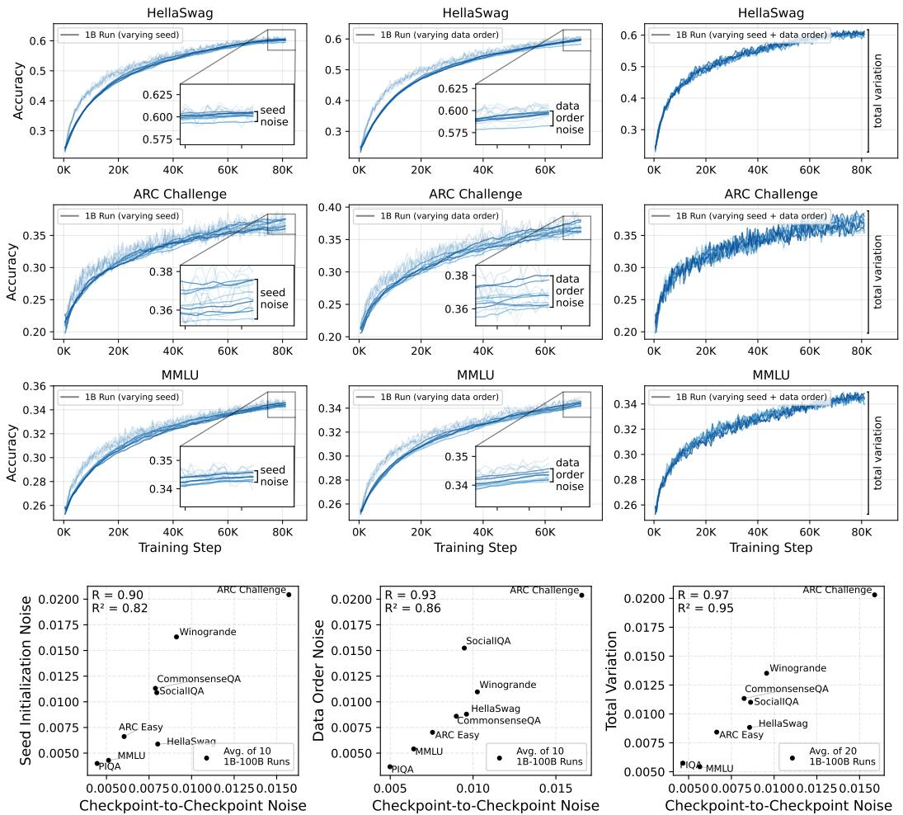  
Figure 7: Top: 10 different training runs ( $1 \mathrm { B } { - } 5 { \times } C$ scale) varying random seed initialization and data order, plotting ARC-C accuracy smoothed across a window of 20 checkpoints. Bottom: Total variation or the relative standard deviation (STD normalized by average performance; $\ S 3$ ) of scores from different seeds, data after averaging the last 20 training checkpoints vs. the Rel. Std. over the last 20 training checkpoints. Benchmarks with a high checkpoint-to-checkpoint noise also exhibit high noise due to random seed initialization, data order and noise along the full training curve. Noise for all tasks reported in Figure 19.

We then verify this empirically using our estimate for noise at the 7B scale (from $\ S 5 . 2$ ). If we assume the 30 intermediate checkpoints provide a reasonable estimate of the population standard deviation, we then compute the sample standard deviation $s _ { n }$ for $n < 3 0$ . We re-compute $s _ { n }$ 1000 times for different subsets to calculate the likelihood that the sampled standard deviation is within $k \cdot \sigma$ of the population standard deviation $\sigma$ . In the below table, we report this likelihood with tolerances $k \in \{ \bar { 0 . 2 } , 1 . 0 \}$ for subsets $n \in \{ 5 , 1 0 , 2 0 \}$ and bold all results with a likelihood above 0.95.

In practice, we find that for a large bound ( $\pm 1$ std. dev.) can be satisfied for almost all benchmarks with $n = 5$ intermediate checkpoints, but for smaller bounds, ( $20 \%$ of $\pm 1$ std. dev.), using $n = 2 0$ gives an adequate estimate for 34 of 39 benchmarks we considered in our work.

For our experiment on the $1 \mathrm { B } { - } 5 \mathrm { x C }$ checkpoints, we estimate noise using the average noise of the last 5 checkpoints for all 25 models, so our estimate of noise considers $5 \cdot 2 5 = 1 2 5$ scores.

Table 2: Ablating the $n$ term in noise: Likelihood that the sample standard deviation for $n$ intermediate checkpoints is a reasonable estimate for the population standard deviation on OLMo 2 7B, calculated using 30 intermediate checkpoints (Values for $\alpha > 0 . 9 5$ in bold). We find that for a low tolerance (within $0 . 2 \sigma$ ), 20 intermediate checkpoints provides an adequate estimate of noise.   

<table><tr><td rowspan="2">k threshold in k·σ→ # Ckpts in Noise(n)→</td><td colspan="3">k=0.2</td><td colspan="3">k=1.0</td></tr><tr><td>5</td><td>10</td><td>20</td><td>5</td><td>10</td><td>20</td></tr><tr><td>AGI Eval</td><td>0.42</td><td>0.61</td><td>0.95</td><td>1.00</td><td>1.00</td><td>1.00</td></tr><tr><td>ARC Challenge</td><td>0.44</td><td>0.70</td><td>0.98</td><td>1.00</td><td>1.00</td><td>1.00</td></tr><tr><td>ARC Easy</td><td>0.38</td><td>0.65</td><td>0.97</td><td>1.00</td><td>1.00</td><td>1.00</td></tr><tr><td>AutoBencher</td><td>0.47</td><td>0.71</td><td>0.97</td><td>1.00</td><td>1.00</td><td>1.00</td></tr><tr><td>BBH</td><td>0.42</td><td>0.60</td><td>0.95</td><td>1.00</td><td>1.00</td><td>1.00</td></tr><tr><td>BoolQ</td><td>0.16</td><td>0.45</td><td>0.88</td><td>1.00</td><td>1.00</td><td>1.00</td></tr><tr><td>HumanEval</td><td>0.52</td><td>0.79</td><td>0.99</td><td>1.00</td><td>1.00</td><td>1.00</td></tr><tr><td>HumanEval+</td><td>0.47</td><td>0.76</td><td>0.99</td><td>1.00</td><td>1.00</td><td>1.00</td></tr><tr><td>CommonsenseQA</td><td>0.39</td><td>0.64</td><td>0.96</td><td>1.00</td><td>1.00</td><td>1.00</td></tr><tr><td>DROP</td><td>0.48</td><td>0.76</td><td>0.99</td><td>1.00</td><td>1.00</td><td>1.00</td></tr><tr><td>GSM8K</td><td>0.49</td><td>0.77</td><td>0.99</td><td>1.00</td><td>1.00</td><td>1.00</td></tr><tr><td>GSM+</td><td>0.50</td><td>0.79</td><td>0.99</td><td>1.00</td><td>1.00</td><td>1.00</td></tr><tr><td>GSM Symbolic</td><td>0.37</td><td>0.64</td><td>0.96</td><td>1.00</td><td>1.00</td><td>1.00</td></tr><tr><td>GSM Symbolic P1</td><td>0.47</td><td>0.69</td><td>0.98</td><td>1.00</td><td>1.00</td><td>1.00</td></tr><tr><td>GSM Symbolic P2</td><td>0.32</td><td>0.57</td><td>0.94</td><td>1.00</td><td>1.00</td><td>1.00</td></tr><tr><td>HellaSwag</td><td>0.39</td><td>0.65</td><td>0.97</td><td>1.00</td><td>1.00</td><td>1.00</td></tr><tr><td>Jeopardy</td><td>0.42</td><td>0.69</td><td>0.98</td><td>1.00</td><td>1.00</td><td>1.00</td></tr><tr><td>MBPP</td><td>0.43</td><td>0.63</td><td>0.96</td><td>1.00</td><td>1.00</td><td>1.00</td></tr><tr><td>MBPP+</td><td>0.41</td><td>0.63</td><td>0.96</td><td>1.00</td><td>1.00</td><td>1.00</td></tr><tr><td>MedMCQA</td><td>0.50</td><td>0.79</td><td>0.99</td><td>1.00</td><td>1.00</td><td>1.00</td></tr><tr><td>Minerva MATH</td><td>0.38</td><td>0.53</td><td>0.93</td><td>1.00</td><td>1.00</td><td>1.00</td></tr><tr><td>MinervaMATH500</td><td>0.28</td><td>0.53</td><td>0.92</td><td>1.00</td><td>1.00</td><td>1.00</td></tr><tr><td>MMLU</td><td>0.00</td><td>0.00</td><td>0.54</td><td>0.83</td><td>1.00</td><td>1.00</td></tr><tr><td>MMLU Pro</td><td>0.51</td><td>0.78</td><td>0.99</td><td>1.00</td><td>1.00</td><td>1.00</td></tr><tr><td>All Tasks</td><td>0.00</td><td>0.00</td><td>0.08</td><td>0.83</td><td>1.00</td><td>1.00</td></tr><tr><td>Code Tasks</td><td>0.49</td><td>0.78</td><td>0.99</td><td>1.00</td><td>1.00</td><td>1.00</td></tr><tr><td>Knowledge Tasks</td><td>0.00</td><td>0.00</td><td>0.15</td><td>0.83</td><td>1.00</td><td>1.00</td></tr><tr><td>Math Tasks</td><td>0.55</td><td>0.83</td><td>0.99</td><td>1.00</td><td>1.00</td><td>1.00</td></tr><tr><td>OLMES Core 9</td><td>0.31</td><td>0.49</td><td>0.92</td><td>1.00</td><td>1.00</td><td>1.00</td></tr><tr><td>OLMES Gen</td><td>0.48</td><td>0.74</td><td>0.98</td><td>1.00</td><td>1.00</td><td>1.00</td></tr><tr><td>OpenBookQA</td><td>0.42</td><td>0.73</td><td>0.98</td><td>1.00</td><td>1.00</td><td>1.00</td></tr><tr><td>PIQA</td><td>0.43</td><td>0.69</td><td>0.98</td><td>1.00</td><td>1.00</td><td>1.00</td></tr><tr><td>SocialIQA</td><td>0.30</td><td>0.44</td><td>0.88</td><td>0.99</td><td>1.00</td><td>1.00</td></tr><tr><td>SQuAD</td><td>0.48</td><td>0.72</td><td>0.99</td><td>1.00</td><td>1.00</td><td>1.00</td></tr><tr><td>TriviaQA</td><td>0.48</td><td>0.76</td><td>0.99</td><td>1.00</td><td>1.00</td><td>1.00</td></tr><tr><td>WinoGrande</td><td>0.42</td><td>0.67</td><td>0.97</td><td>1.00</td><td>1.00</td><td>1.00</td></tr></table>

# A.4 Measures of Signal

Measurements. When designing an measure of signal, we want to incorporate the uniformity of benchmark scores and the overall range of scores. Given the final checkpoints of training runs under similar compute spend $C _ { \mathrm { f i n a l } }$ , we evaluate multiple approaches to measuring signal:

• Variance measures average squared distance from the mean: $\begin{array} { r } { \operatorname { V a r } ( C _ { \mathrm { f i n a l } } ) = \frac { 1 } { n } \sum _ { i = 1 } ^ { n } \| c _ { i } - \bar { c } \| ^ { 2 } } \end{array}$   
• Mean distance measures average pairwise distance between points: Mean $\mathrm { D i s t } ( C _ { \mathrm { f i n a l } } ) =$ 2n(n−1) Pi<j ∥ci − cj ∥   
• Relative standard deviation, or the coefficient of variation, measures the standard deviation√ divided by the mean: Rel. Std. $\begin{array} { r } { ( C _ { \mathrm { f i n a l } } ) = \frac { \sqrt { \mathrm { V a r } \left( C _ { \mathrm { f i n a l } } \right) } } { \mathrm { M e a n } \left( C _ { \mathrm { f i n a l } } \right) } } \end{array}$   
• Star Discrepancy measures the largest difference between any point and the uniform   
distribution: Discrepancy $\begin{array} { r } { \mathbf { \Phi } ^ { \prime } ( C _ { \mathrm { f i n a l } } ) = \mathbf { \tilde { s u p } } _ { t \in [ 0 , 1 ] } \left| \frac { 1 } { n } \sum _ { i = 1 } ^ { n } \mathbf { 1 } \{ c _ { i } \leq t \} \right| ^ { \bullet } - t \vert } \end{array}$ .   
• Dispersion measures the largest difference between any two points, or the largest unfilled   
space in the range of performance: Dispersion $( C _ { \mathrm { f i n a l } } ) \stackrel { - } { = } \operatorname* { m a x } _ { i \neq j } \| c _ { i } - c _ { j } \|$ .

Note, we include metrics that are sensitive and non sensitive to outliers, and find our results hold when measuring both types of spread (Table 3). We also include variants of these terms, such using a min-max normalization or scaling by the mean.

Choosing the a signal measurement. In Table 3, we calculate the correlation between signalto-noise ratio and decision accuracy when using each of the signal variants. We see that many straight forward measures have similarly high correlations. We use relative dispersion, the highest correlated among them, as our measure of signal.

Table 3: Correlation of signal-to-noise ratio to decision accuracy, using different measures of signal. We use the measure which is most predictive of decision accuracy as our measure of signal. We include alternative methods for calculating decision accuracy (Pearson correlation and Spearman’s rank correlation coefficient), as detailed in Appendix A.2. Fits are illustrated in Figure 10.   

<table><tr><td>Measure of Signal</td><td></td><td>SNR vs. Decision Acc R²</td><td>SNR vs. Pearson R²</td><td>SNR vs. Spearman R2</td></tr><tr><td>Rel. Dispersion</td><td>maxi,j lci-cjl/c</td><td>0.5687</td><td>0.4052</td><td>0.4902</td></tr><tr><td>Rel. Std. Dev.</td><td>σ/μ</td><td>0.5657</td><td>0.3850</td><td>0.4771</td></tr><tr><td>Rel.Mean Pairwise Distance</td><td></td><td>0.5458</td><td>0.3624</td><td>0.4561</td></tr><tr><td>Interquartile Range</td><td>Q3-Q1</td><td>0.4836</td><td>0.2866</td><td>0.3980</td></tr><tr><td>Distance Standard Deviation</td><td>ici-0）</td><td>0.4745</td><td>0.3667</td><td>0.3950</td></tr><tr><td>RMS Deviation</td><td>∑(c-a）2</td><td>0.4633</td><td>0.3435</td><td>0.3812</td></tr><tr><td>Mean Pairwise Distance</td><td>∑iglei-cj</td><td>0.4589</td><td>0.3325</td><td>0.3758</td></tr><tr><td>Range</td><td>max(c)-min(c)</td><td>0.4574</td><td>0.3604</td><td>0.3865</td></tr><tr><td>Dispersion</td><td>maxi,j lci-cjl</td><td>0.4574</td><td>0.3604</td><td>0.3865</td></tr><tr><td>Quartile Deviation</td><td>(Q3-Qi)/2</td><td>0.4528</td><td>0.2896</td><td>0.3655</td></tr><tr><td>Average Absolute Deviation</td><td>∑ilei-d</td><td>0.4507</td><td>0.3186</td><td>0.3672</td></tr><tr><td>Median Absolute Deviation</td><td>median(lci-median(c)l)</td><td>0.4168</td><td>0.2663</td><td>0.3346</td></tr><tr><td>Rel.Mean Squared Pairwise Distance</td><td></td><td>0.2908</td><td>0.1627</td><td>0.2324</td></tr><tr><td>Mean Squared Pairwise Distance</td><td></td><td>0.2480</td><td>0.1457</td><td>0.1953</td></tr><tr><td>Gini Coefficient</td><td></td><td>0.0944</td><td>0.0978</td><td>0.0829</td></tr><tr><td>Star Discrepancy (Shift+Scale)</td><td>sup[0,c]|Fn(t)-F(t)| with shifting</td><td>0.0391</td><td>0.0768</td><td>0.0454</td></tr><tr><td>Star Rel.Discrepancy</td><td>sup[0,c]|Fn(t)-F(t)i/F(t)</td><td>0.0379</td><td>0.0587</td><td>0.0420</td></tr><tr><td>Dispersion (Shift+Scale)</td><td>maxi,jlCi-Cj|with shifting</td><td>0.0374</td><td>0.0679</td><td>0.0382</td></tr><tr><td>Halfspace Depth</td><td>min(Fn(x)，1-Fn(x))</td><td>0.0358</td><td>0.0395</td><td>0.0373</td></tr><tr><td>Discrepancy</td><td>maxc |Fn(c)-F(c)l</td><td>0.0340</td><td>0.0754</td><td>0.0401</td></tr><tr><td>Projection Depth</td><td>(1+（）） -1 MAD(c)</td><td>0.0331</td><td>0.0392</td><td>0.0353</td></tr><tr><td>Star Discrepancy</td><td>sup[0,c]|Fn(t)-F(t)l</td><td>0.0319</td><td>0.0665</td><td>0.0356</td></tr></table>

# A.5 Dataset Details

# A.5.1 Models

We evaluate 465 models which represent stages of the decision-making process during pre-training. Unlike existing collections of model evaluations [18, 33], our set is targeted at development models:

Scaling Law Models. 25 ladder models from Bhagia et al. [3]. {190M, 370M, 760M, 1.3B, 3.2B} $\times$ {0.5xC, 1xC, 2xC, 5xC, 10xC} trained on OLMoE mix, and 7B-4T / 13B-5T as prediction targets.

Decision Accuracy Models. 225 models from Magnusson et al. [38] trained on 25 data recepies for {4M, 20M, 60M, 90M, 150M, 300M, 530M, 750M, 1.3B} trained to ${ 5 } \mathbf { x }$ Chinchilla optimal.

Random Seed & Data Order Models. 20 models 1B-5xC models trained on the OLMoE mix, 10 models trained with different random seed initializations and 10 models trained with different data order seeds.

Final $n$ Checkpoints. 120 models representing the 30 final checkpoints before the end of training for OLMo 2 1B, 7B, 13B and 32B [42], with checkpoints spaced by 1000 training checkpoints.

External Models. 73 open-weight base models from the DCLM, DeepSeek, Gemma, Llama, Orca, Phi, Pythia, Qwen, SmolLM, StableLM and Yi model families. We estimate the training FLOPs using the reported token count.

We perform all evaluation using up to $2 \mathrm { H } 1 0 0 \mathrm { s }$ for a particular model, and use 94K H100 hours total for all evaluation. For training our randomly initialized seed and data order models, we use 23K GPU hours, using a cluster of $2 \mathrm { x } 8 \ \mathrm { H } 1 0 0 \mathrm { s }$ for each training run.

# A.5.2 Benchmarks

We intentionally select benchmarks that are widely adopted in pre-training evaluation. We use the OLMES [22] standard when applicable, and for other benchmarks, we reproduce the evaluation setup from OLMo 2 [42]. Notably, all tasks use few-shot examples and we evaluate MCQA benchmarks in both the rank choice (RC) and multiple choice (MC) setting, since our small $\leq 1 \mathrm { B }$ parameter) models show random-chance performance on MCQA benchmarks.

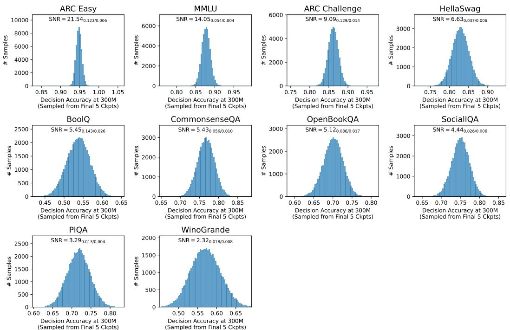  
Figure 8: As the benchmark’s signal-to-noise ratio increases (across histograms), decision accuracy (from 300M to 1B scale) not only increases but becomes more consistent. We test this by resampling decision accuracy for combinations among last 5 checkpoints of the small and large models, respectively, since noise in the results of either size can change rankings. Note how CSQA and MMLU have similar signal (Rel. Dispersion $= 0 . 0 5 6$ vs 0.054) but different noise (Rel. Std. $= 0 . 0 1$ vs. 0.004).

Knowledge QA. MMLU [23], ARC [11], BoolQ [10], CSQA [59], OBQA [39], PiQA [4], SocialIQA [53], HellaSwag [69], WinoGrande [52], DROP [16], CoQA [48], Jeopardy [61], NaturalQs [28], SQuAD [47], TriviaQA [26], MedMCQA [43], MMLU Pro [64], AGI Eval [70], GPQA [49]

Math. GSM [12], GSM Plus [46], GSM Symbolic [41], Minerva [30]

Code. HumanEval [8], HumanEva $^ +$ [34], MBPP [1], MBPP $^ +$ [34]

Using strong LLMs have become a tool for augmenting existing benchmarks with more difficult questions or answer choices [64] and re-evaluating benchmark quality [62], and may provide a cheap method for improving signal. To test this, we add an additional synthetic benchmark:

Autobencher. To test whether fully generated benchmarks can act as an adequate development benchmark, we generate a dataset of 30K MCQA questions using Autobencher [32]. Autobencher iteratively mines for Wikipedia articles and uses a strong LM to generate and prune questions based on saliency, novelty and difficulty constraints.

# B Full Results

# B.1 Noise measures the reliability of decision accuracy.

As discussed in $\ S 3 . 1$ , the checkpoint-to-checkpoint noise can change the ranking of models, which may effect the decision accuracy we observe by only evaluating the final DataDecide model. To measure the impact of checkpoint-to-checkpoint noise on decision accuracy, we can estimate the distribution of possible decision accuracies given the step to step noise. To do this, we sample one of the final 5 checkpoints for both the small and large model, and repeatedly sample to estimate the distribution. A wider distribution would indicate that one should be less confident in the decision accuracy.

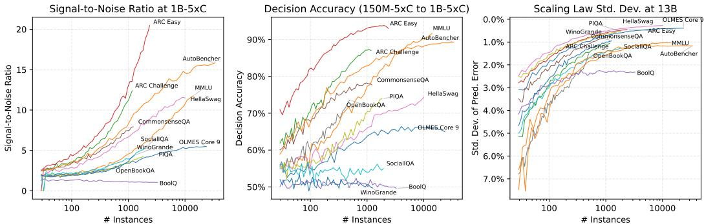  
Figure 9: Signal-to-noise ratio, decision accuracy, and scaling law prediction error for randomly sampled subsets of instances for 6 development benchmarks. A large sample size alone does not improve signal-to-noise ratio. For example, a 1000 question subset of ARC Easy has a higher decision accuracy than MMLU despite having $90 \%$ fewer instances.

We show the distribution of decision accuracies for 10K random samples in Figure 8. For tasks with a higher signal-to-noise ratio, the sampled decision accuracy distribution has a higher mean and lower variance. Additionally, we find that tasks with similar signal, but different noise (e.g., CSQA and MMLU, where CSQA has higher noise), the tasks with lower noise also have a lower variance of sampled decision accuracy distribution.

# B.2 Increasing benchmark size has diminishing returns

Setup. One intuitive way to reduce modeling noise is to increase the size of the benchmark, while this is expensive in practice, recent work has given LLMs access to privileged information to generate distractor options or full benchmarks [32, 64]. To test the impact of sample size on modeling noise, we use the existing set of benchmarks, select a random sample of instances and recalculate SNR, decision accuracy and scaling law error. To test the limits of synthetic benchmarks, we use our version of AutoBencher, which has 33K instances, or $2 \mathbf { x }$ more test instances than the next largest benchmark in our dataset (MMLU).

Results. Figure 9 shows how each metric improves as the number of instances increases. Initially, all benchmarks benefit from more samples (up until ${ \sim } 1 \mathrm { K }$ samples) as expected. However, we find dimishing returns for some benchmarks after only 1K instances, in particular the signal-tonoise ratio for AutoBencher shows an inflection point at around 2K instances. This is due to the AutoBencher having high noise, as shown by the scaling law standard deviation (right figure) – despite having the largest sample size, AutoBencher has the highest checkpoint-to-checkpoint noise. In fact, the 300 instance subset of ARC-Easy has lower noise than the full 30K instance AutoBench. As using LLMs as part of benchmark construction has become a more popular method of constructing benchmarks, a high quality, small benchmark can actually show a less noisy signal.

# B.3 Signal-to-Noise Ratio at Large $\mathbf { ( > 3 2 B ) }$ Scales

Setup. For models larger than the DataDecide scale (1B-100B), we can rely on the signal-to-noise ratio directly to indicate development benchmarks which may not be useful. We estimate the signalto-noise ratio at the compute scales used to train the OLMo 2 models: 1.5B-4T, 7B-4T, 13B-5T and 32B-6T. For noise, we use the final 30 intermediate checkpoints, one checkpoint for every 1000 training steps until the end of training. For signal, we do not have access to different data recepies trained on the same model, so instead we use a population of open-weight base models trained to similar compute budget as the OLMo 2 models. We use models trained using $\pm 1 0 \%$ of the estimated FLOPs, which results in a population of at least 8 models for each size.

Results. Table 4 reports the SNR for each compute budget, sorted by SNR at the 1.5B-4T model scale. SNR can indicate when benchmarks saturated, for example ARC Easy and SocialIQA have high SNR at 1.5B-4T, but low SNR at 32B-6T: 7.89 to 5.10 and 8.73 to 1.95 respectively. For these benchmarks, they have less powerful comparisons at larger sizes. SNR also indicates when particular benchmarks become useful. For example, Minerva MATH 500 has the lowest SNR of all tasks at 1.5B-4T $\mathbf { \bar { S } N R } = 0 . 9 1$ ) but much higher SNR already at 7B-4T $\mathbf { \langle S N R = 4 . 4 5 }$ ).

Table 4: Signal-to-noise ratio for language model development benchmarks for the compute budgets of the OLMo 2 family [42]. For benchmarks measuring a similar ability, we recommend using benchmarks with a higher signal-to-noise ratio ratio for a particular model scale. Performance on all models is shown in Figure 12.   

<table><tr><td>Model Size →</td><td>1.5B-4T</td><td>7B-4T</td><td>13B-5T</td><td>32B-6T</td></tr><tr><td>Compute→ Benchmark↓</td><td>2:1022FLOPs SNRSignal/Noise</td><td>1.6:1023 FLOPs SNRSignal/Noise</td><td>3.9·1023 FLOPs SNRSignal/Noise</td><td>1.2:1024 FLOPs SNRSignal /Noise</td></tr><tr><td></td><td></td><td></td><td></td><td></td></tr><tr><td colspan="5">Knowledge QA Tasks</td></tr><tr><td>HellaSwag</td><td>39.770.180/0.005</td><td>23.940.061/0.003</td><td>17.810.054/0.003</td><td>8.200.028/0.003</td></tr><tr><td>TriviaQA</td><td>28.150.411/0.015</td><td>47.030.135/0.003</td><td>60.370.141/0.002</td><td>27.190.064/0.002</td></tr><tr><td>Jeopardy</td><td>23.660.374/0.016</td><td>14.380.082/0.006</td><td>18.490.084/0.005</td><td>8.000.032/0.004</td></tr><tr><td>OLMES Gen</td><td>19.340.247/0.013</td><td>32.580.129/0.004</td><td>4.190.092/0.022</td><td>1.060.048/0.046</td></tr><tr><td>OLMES Core 9</td><td>19.110.118/0.006</td><td>9.610.039/0.004</td><td>7.130.030/0.004</td><td>8.160.027/0.003</td></tr><tr><td>AutoBencher</td><td>17.620.264/0.015</td><td>11.420.102/0.009</td><td>8.230.105/0.013</td><td>3.730.050/0.014</td></tr><tr><td>MMLU Pro</td><td>16.280.246/0.015</td><td>17.440.168/0.010</td><td>9.340.098/0.010</td><td>15.040.136/0.009</td></tr><tr><td>MMLU</td><td>14.520.139/0.010</td><td>3.390.078/0.023</td><td>7.510.044/0.006</td><td>5.190.061/0.012</td></tr><tr><td>PIQA</td><td>14.230.058/0.004</td><td>5.310.023/0.004</td><td>5.520.023/0.004</td><td>4.970.015/0.003</td></tr><tr><td>WinoGrande</td><td>14.120.118/0.008</td><td>7.350.062/0.008</td><td>7.680.070/0.009</td><td>6.600.046/0.007</td></tr><tr><td>CommonsenseQA</td><td>12.170.120/0.010</td><td>5.660.033/0.006</td><td>2.690.022/0.008</td><td>7.050.039/0.006</td></tr><tr><td>DROP</td><td>10.790.337/0.031</td><td>20.790.262/0.013</td><td>12.190.226/0.019</td><td>9.010.143/0.016</td></tr><tr><td>ARC Challenge</td><td>9.410.193/0.021</td><td>5.850.081/0.014</td><td>2.320.033/0.014</td><td>4.740.064/0.014</td></tr><tr><td>SocialIQA</td><td>8.730.119/0.014</td><td>5.150.049/0.010</td><td>1.690.020/0.012</td><td>1.950.026/0.013</td></tr><tr><td>MedMCQA</td><td>8.590.106/0.012</td><td>5.790.051/0.009</td><td>7.700.060/0.008</td><td>4.000.041/0.010</td></tr><tr><td>ARC Easy</td><td>7.890.102/0.013</td><td>5.770.035/0.006</td><td>3.940.018/0.004</td><td>5.100.018/0.004</td></tr><tr><td>SQuAD</td><td>6.110.090/0.015</td><td>9.760.061/0.006</td><td>10.450.044/0.004</td><td>3.920.027/0.007</td></tr><tr><td>AGI Eval</td><td>5.310.105/0.020</td><td>4.230.076/0.018</td><td>2.740.050/0.018</td><td>5.400.062/0.012</td></tr><tr><td>BoolQ</td><td>4.870.116/0.024</td><td>2.990.048/0.016</td><td>1.180.016/0.013</td><td>2.670.016/0.006</td></tr><tr><td>OpenBookQA</td><td>4.820.145/0.030</td><td>2.130.053/0.025</td><td>2.420.048/0.020</td><td>3.050.063/0.021</td></tr><tr><td colspan="5">Math Tasks</td></tr><tr><td>GSM+</td><td>8.060.610/0.076</td><td>13.070.500/0.038</td><td>8.550.299/0.035</td><td>8.420.199/0.024</td></tr><tr><td>GSM Symbolic P1</td><td>7.180.831/0.116</td><td>4.850.677/0.140</td><td>6.540.450/0.069</td><td>5.310.277/0.052</td></tr><tr><td>GSM8K</td><td>3.830.587/0.153</td><td>8.210.434/0.053</td><td>6.980.255/0.037</td><td>6.610.160/0.024</td></tr><tr><td>GSM Symbolic P2</td><td>3.620.805/0.222</td><td>2.980.769/0.258</td><td>3.390.560/0.165</td><td>4.670.468/0.100</td></tr><tr><td>GSM Symbolic</td><td>3.050.662/0.217</td><td>8.940.527/0.059</td><td>6.610.283/0.043</td><td>4.290.134/0.031</td></tr><tr><td>MinervaMATH</td><td>2.280.568/0.250</td><td>9.320.643/0.069</td><td>7.480.567/0.076</td><td>10.190.409/0.040</td></tr><tr><td>Minerva MATH500</td><td>0.910.491/0.539</td><td>4.450.748/0.168</td><td>4.440.647/0.146</td><td>4.300.383/0.089</td></tr><tr><td colspan="5">Code Tasks</td></tr><tr><td>HumanEval+</td><td>3.700.482/0.130</td><td>7.180.432/0.060</td><td>8.470.377/0.045</td><td>3.340.131/0.039</td></tr><tr><td>HumanEval</td><td>3.640.452/0.124</td><td>6.250.395/0.063</td><td>5.180.314/0.061</td><td>3.190.117/0.037</td></tr><tr><td>MBPP+</td><td>0.880.207/0.235</td><td>3.600.302/0.084</td><td>4.720.265/0.056</td><td>2.940.137/0.047</td></tr><tr><td>MBPP</td><td>0.880.221/0.251</td><td>5.090.382/0.075</td><td>4.520.255/0.057</td><td>3.570.167/0.047</td></tr><tr><td colspan="5">Multi-task Averages</td></tr><tr><td>Knowledge Tasks</td><td>17.700.146/0.008</td><td>1.610.080/0.049</td><td>9.820.048/0.005</td><td>1.030.058/0.056</td></tr><tr><td>OLMES + Gen</td><td>17.350.143/0.008</td><td>2.650.074/0.028</td><td>9.520.045/0.005</td><td>0.930.052/0.056</td></tr><tr><td>All Tasks</td><td>13.920.152/0.011</td><td>3.680.128/0.035</td><td>9.260.055/0.006</td><td>2.940.075/0.026</td></tr><tr><td>Math Tasks</td><td>5.780.656/0.113</td><td>11.720.580/0.050</td><td>5.060.384/0.076</td><td>7.870.253/0.032</td></tr><tr><td>Code Tasks</td><td>3.280.333/0.102</td><td>8.200.371/0.045</td><td>8.870.308/0.035</td><td>5.550.126/0.023</td></tr></table>

Additionally, some individual tasks show better SNR than mutli-task averages. For the OLMES Core 9 average, HellaSwag has higher SNR at all model sizes. For OLMES Gen, TriviaQA has higher SNR at all model sizes. In cases where the SNR of the mutli-task average is low, like the OLMES Average, we recommend comparing models based on individual, high SNR tasks.

# C Additional Results

We include for our core experiments across all benchmarks we study:

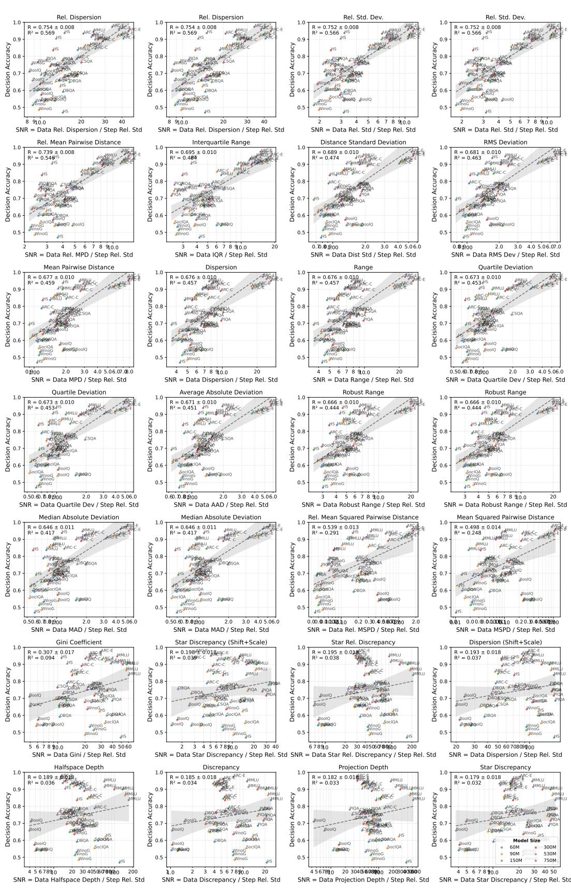  
Figure 10: Correlation between decision accuracy and variants of signal-to-noise ratio, using different measures of signal. To pick the measure of signal, we use the metric which is most predictive of decision accuracy.

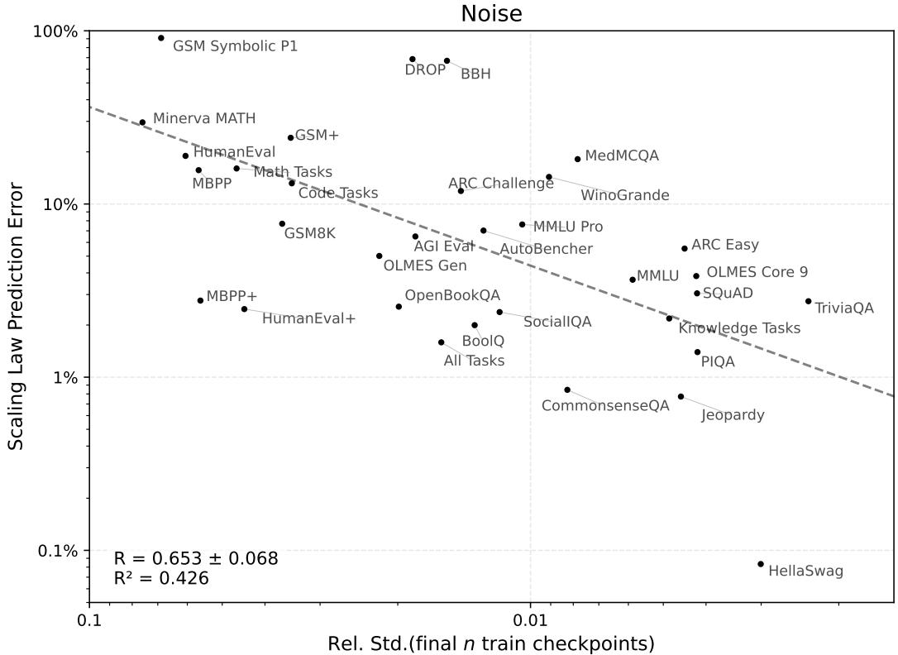  
Figure 11: Scaled-up version of the Figure 3 in $\ S 4 . 2$ with labels on each task.

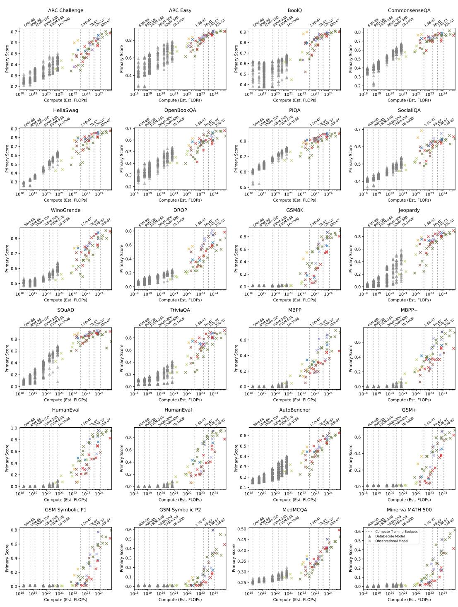  
Figure 12: Performance of language models from 60M parameters to 32B parameters, which we use to measure spread at different training budgets in Table 4. For our core experiments, we use the DataDecide models to measures spread, and at large scales, we use external models trained at similar compute budgets.

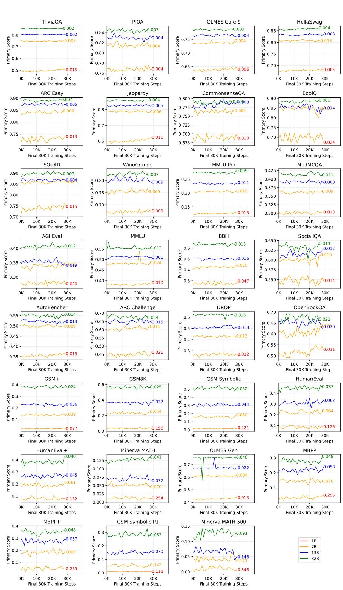  
Figure 13: Final 30 checkpoints, each spaced 1000 training steps, for OLMo 2 1B, 7B, 13B and 32B along with the Rel. Std. Dev., which is used to estimate noise.

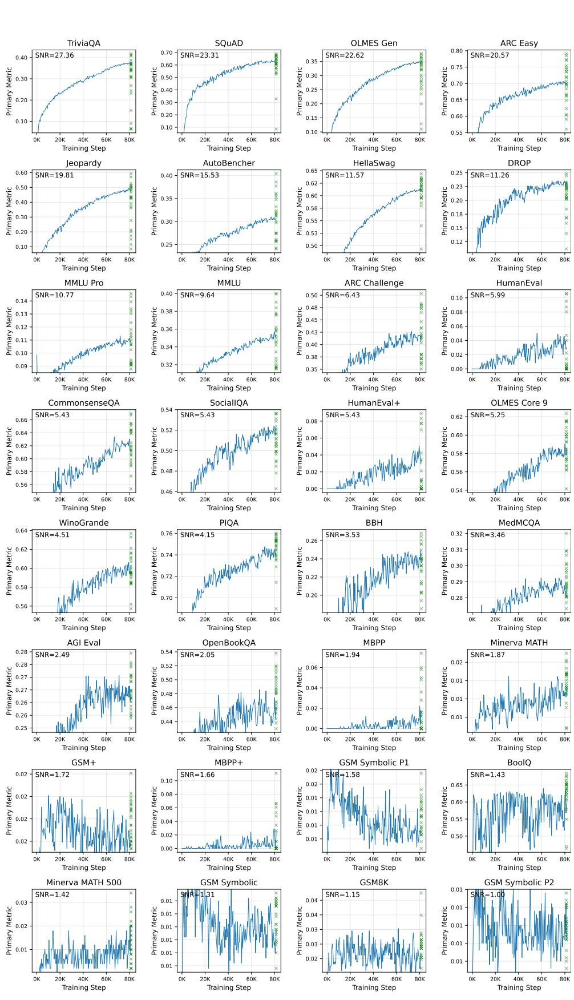  
Figure 14: $1 \mathrm { B } { - } 5 \mathrm { x C }$ training curves and final checkpoints for DataDecide models across tasks, sorted by the signal-to-noise ratio.

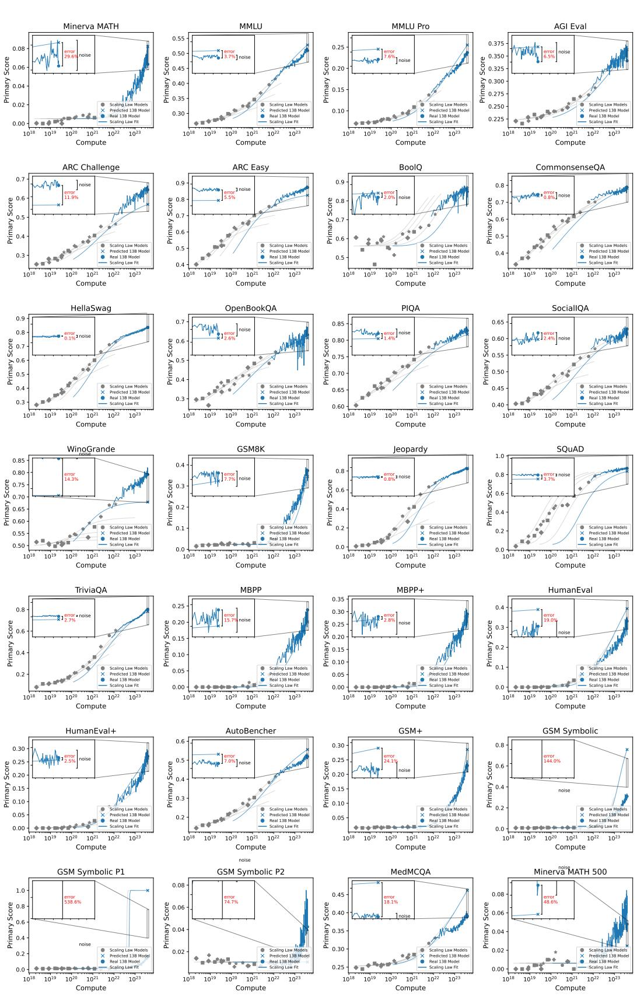  
Figure 15: Scaling law fits for all tasks using the OLMo 2 13B-5T prediction target.

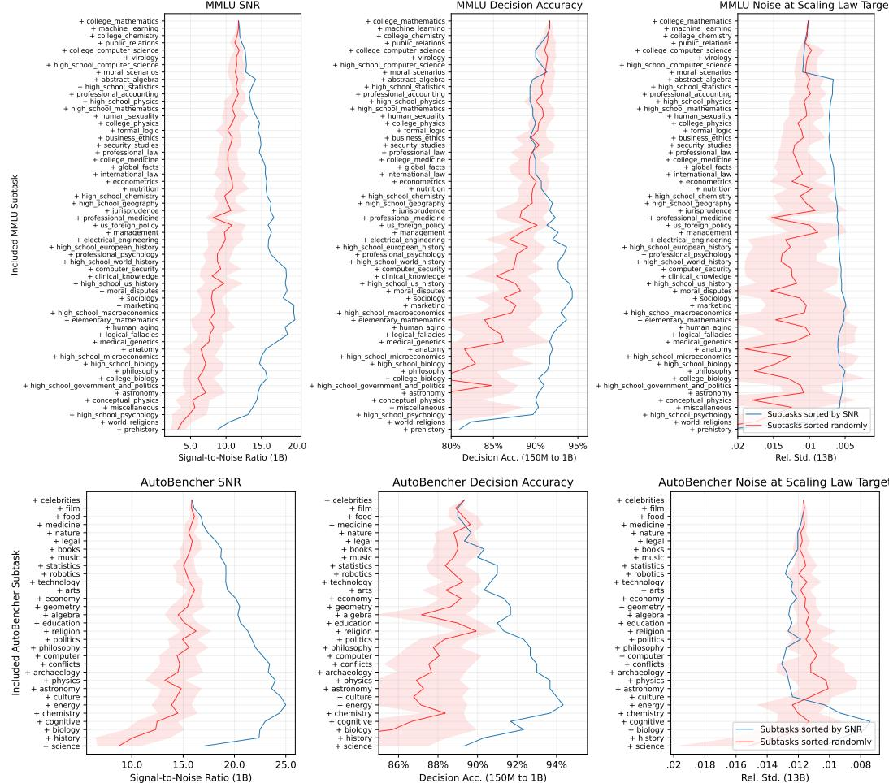  
Figure 16: Larger version of Figure 4, showing the names of each subtask, sorted by SNR from bottom (highest SNR) to top (lowest SNR).

Table 5: Scaling law fit error for BPB and primary score for all tasks with averaging the final 5 checkpoints in the ladder train models.   

<table><tr><td colspan="5">Predicting Bits-per-byte</td><td colspan="4">Predicting Primary Score</td></tr><tr><td></td><td>Abs.Error, %</td><td></td><td></td><td>Rel. Error, %</td><td></td><td>Abs.Error, %</td><td></td><td>Rel. Error, %</td></tr><tr><td rowspan="3">Task (↓)</td><td>Final</td><td>Avg.</td><td>Final</td><td>Avg.</td><td>Final</td><td>Avg.</td><td>Final</td><td>Avg.</td></tr><tr><td>Only</td><td>Train</td><td>Only</td><td>Train</td><td>Only</td><td>Train</td><td>Only</td><td>Train</td></tr><tr><td></td><td></td><td></td><td></td><td></td><td></td><td></td><td></td></tr><tr><td>Knowledge QA Tasks HellaSwag</td><td>0.76</td><td>0.80</td><td>1.16</td><td>1.22</td><td>0.31</td><td>0.16</td><td>0.37</td><td>0.20</td></tr><tr><td>CommonsenseQA</td><td>6.24</td><td>5.32</td><td>8.75</td><td>7.46</td><td>0.59</td><td>0.46</td><td>0.75</td><td>0.58</td></tr><tr><td>Jeopardy</td><td>5.08</td><td>5.14</td><td>18.51</td><td>18.73</td><td>0.57</td><td>0.54</td><td>0.69</td><td>0.66</td></tr><tr><td>SocialIQA</td><td>0.66</td><td>0.41</td><td>0.74</td><td>0.46</td><td>0.50</td><td>0.59</td><td>0.80</td><td>0.95</td></tr><tr><td>PIQA</td><td>1.23</td><td>1.39</td><td>1.40</td><td>1.59</td><td>0.89</td><td>1.01</td><td>1.08</td><td>1.22</td></tr><tr><td>MMLU</td><td>0.56</td><td>0.49</td><td>0.75</td><td>0.66</td><td>1.68</td><td>1.74</td><td>3.28</td><td>3.39</td></tr><tr><td>MMLU Pro</td><td>0.78</td><td>0.71</td><td>0.73</td><td>0.67</td><td>1.76</td><td>1.75</td><td>7.51</td><td>7.45</td></tr><tr><td>AGIEval</td><td>2.79</td><td>2.66</td><td>3.33</td><td>3.18</td><td>1.89</td><td>1.98</td><td>5.43</td><td>5.70</td></tr><tr><td>OLMES Gen</td><td>4.66</td><td>2.32</td><td>3.92</td><td>1.95</td><td>4.19</td><td>2.16</td><td>6.22</td><td>3.20</td></tr><tr><td>BoolQ</td><td>1.49</td><td>1.76</td><td>8.54</td><td>10.11</td><td>4.13</td><td>2.48</td><td>4.91</td><td>2.96</td></tr><tr><td>OLMES Core 9</td><td>0.47</td><td>0.25</td><td>0.62</td><td>0.33</td><td>2.47</td><td>2.62</td><td>3.23</td><td>3.42</td></tr><tr><td>TriviaQA</td><td>1.56</td><td>2.05</td><td>2.27</td><td>2.98</td><td>2.33</td><td>2.62</td><td>2.89</td><td>3.25</td></tr><tr><td>SQuAD</td><td>4.96</td><td>4.96</td><td>32.35</td><td>32.37</td><td>2.80</td><td>2.79</td><td>3.23</td><td>3.21</td></tr><tr><td>OpenBookQA</td><td>3.18</td><td>3.92</td><td>2.80</td><td>3.46</td><td>4.02</td><td>3.38</td><td>6.22</td><td>5.22</td></tr><tr><td>AutoBencher</td><td>2.92</td><td>2.78</td><td>4.70</td><td>4.49</td><td>3.86</td><td>3.69</td><td>7.47</td><td>7.14</td></tr><tr><td>ARC Easy</td><td>1.36</td><td>1.37</td><td>2.89</td><td>2.90</td><td>5.13</td><td>5.13</td><td>5.87</td><td>5.87</td></tr><tr><td>MedMCQA</td><td>5.07</td><td>5.38</td><td>5.35</td><td>5.67</td><td>7.72</td><td>7.98</td><td>19.72</td><td>20.41</td></tr><tr><td>ARC Challenge</td><td>2.08</td><td>2.07</td><td>3.15</td><td>3.14</td><td>8.44</td><td>8.43</td><td>13.02</td><td>13.01</td></tr><tr><td>WinoGrande</td><td>1.01</td><td>1.38</td><td>0.83</td><td>1.12</td><td>10.01</td><td>10.82</td><td>12.47</td><td>13.49</td></tr><tr><td>BBH</td><td>61.84</td><td>65.01</td><td>12.81</td><td>13.47</td><td>33.09</td><td>33.08</td><td>66.61</td><td>66.59</td></tr><tr><td>DROP</td><td>47.51</td><td>48.19</td><td>10.75</td><td>10.91</td><td>35.17</td><td>35.20</td><td>68.77</td><td>68.82</td></tr><tr><td>Knowledge 19-Task Avg.</td><td>1.18</td><td>0.87</td><td>1.32</td><td>0.98</td><td>1.43</td><td>1.20</td><td>2.22</td><td>1.85</td></tr><tr><td>Math Tasks</td><td></td><td></td><td></td><td></td><td></td><td></td><td></td><td></td></tr><tr><td>Minerva MATH</td><td>0.73</td><td>0.66</td><td>1.50</td><td>1.36</td><td>1.08</td><td>0.98</td><td>15.28</td><td>13.93</td></tr><tr><td>Minerva MATH 500</td><td>0.34</td><td>0.14</td><td>0.71</td><td>0.29</td><td>17.35</td><td>1.78</td><td>306.18</td><td>31.36</td></tr><tr><td>GSM Symbolic P2</td><td>2.57</td><td>2.83</td><td>5.23</td><td>5.75</td><td>7.46</td><td>3.50</td><td>164.53</td><td>77.13</td></tr><tr><td>GSM8K</td><td>2.43</td><td>2.48</td><td>5.90</td><td>6.01</td><td>7.46</td><td>3.85</td><td>20.55</td><td>10.61</td></tr><tr><td>GSM+</td><td>2.02</td><td>1.95</td><td>4.54</td><td>4.40</td><td>29.14</td><td>28.54</td><td>130.01</td><td>127.36</td></tr><tr><td>GSM Symbolic</td><td>1.87</td><td>1.71</td><td>4.64</td><td>4.25</td><td>39.88</td><td>38.88</td><td>132.62</td><td>129.30</td></tr><tr><td>GSM Symbolic P1</td><td>2.31</td><td>2.35</td><td>5.04</td><td>5.11</td><td>27.15</td><td>83.62</td><td>178.46</td><td>549.63</td></tr><tr><td>Math 6-Task Avg.</td><td>2.05</td><td>2.01</td><td>4.52</td><td>4.42</td><td>11.33</td><td>2.30</td><td>65.52</td><td>13.28</td></tr><tr><td>Code Tasks</td><td></td><td></td><td></td><td></td><td></td><td></td><td></td><td></td></tr><tr><td>HumanEval+</td><td>1.92</td><td>2.21</td><td>3.57</td><td>4.10</td><td>1.05</td><td>0.04</td><td>3.91</td><td>0.16</td></tr><tr><td>MBPP</td><td>0.30</td><td>0.32</td><td>0.46</td><td>0.48</td><td>2.57</td><td>1.79</td><td>11.63</td><td>8.10</td></tr><tr><td>MBPP+</td><td>6.49</td><td>6.62</td><td>12.56</td><td>12.81</td><td>9.08</td><td>8.79</td><td>33.14</td><td>32.11</td></tr><tr><td>HumanEval</td><td>1.59</td><td>2.01</td><td>3.85</td><td>4.87</td><td>7.71</td><td>8.85</td><td>24.00</td><td>27.55</td></tr><tr><td>Code 4-Task Avg.</td><td>3.23</td><td>3.33</td><td>6.07</td><td>6.25</td><td>3.15</td><td>2.75</td><td>11.61</td><td>10.15</td></tr><tr><td></td><td></td><td></td><td></td><td></td><td></td><td></td><td></td><td></td></tr><tr><td>All 30-Task Avg.</td><td>0.47</td><td>0.15</td><td>0.62</td><td>0.20</td><td>1.03</td><td>0.86</td><td>2.10</td><td>1.76</td></tr></table>

Table 6: Decision accuracy averaging the final 5 checkpoints for bits-per-byte and the primary metric (accuracy, exact match, pass $@ 1$ ).   

<table><tr><td colspan="7"></td></tr><tr><td></td><td colspan="4">Bits-per-byte,%</td><td colspan="3">Primary Metric,%</td></tr><tr><td>Task (↓)</td><td>Final Ckpt</td><td>Avg. Pred</td><td>Avg. Target</td><td>Avg. Both</td><td>Final Ckpt</td><td>Avg. Pred</td><td>Avg. Avg.</td></tr><tr><td></td><td></td><td></td><td></td><td></td><td></td><td>Target</td><td>Both</td></tr><tr><td>Knowledge QA Tasks</td><td></td><td></td><td>94.67</td><td>82.91</td><td></td><td>82.91</td><td></td></tr><tr><td>ARC Challenge</td><td>94.56</td><td>94.88</td><td>94.38 94.00</td><td>71.05</td><td>82.27</td><td>72.37</td><td>82.00</td></tr><tr><td>HellaSwag</td><td>92.42</td><td>93.19</td><td>93.21 92.00</td><td></td><td>71.26</td><td></td><td>72.33</td></tr><tr><td>ARC Easy</td><td>92.23</td><td>92.15</td><td>91.96</td><td>93.96</td><td>93.99</td><td>94.05</td><td>94.00</td></tr><tr><td>MMLU</td><td>91.53</td><td>91.64</td><td>91.63</td><td>91.67 89.08</td><td>88.84</td><td>89.60</td><td>89.00</td></tr><tr><td>AutoBencher</td><td>88.55</td><td>88.95</td><td>89.19</td><td>89.67 88.80</td><td>89.05</td><td>88.81</td><td>89.00</td></tr><tr><td>MMLU Pro</td><td>90.00</td><td>89.40</td><td>90.04</td><td>89.33 83.34</td><td>83.77</td><td>84.20</td><td>84.67</td></tr><tr><td>AGI Eval</td><td>86.38</td><td>86.75</td><td>86.54</td><td>87.00 57.38</td><td>58.60</td><td>56.45</td><td>57.67</td></tr><tr><td>MedMCQA</td><td>86.67</td><td>86.67</td><td>86.67</td><td>86.67 61.33</td><td>61.33</td><td>61.33</td><td>60.33</td></tr><tr><td>Jeopardy</td><td>84.42</td><td>84.46</td><td>84.88</td><td>85.00 83.01</td><td>82.60</td><td>83.74</td><td>83.33</td></tr><tr><td>TriviaQA</td><td>83.55</td><td>84.29</td><td>83.86</td><td>84.67 69.10</td><td>69.54</td><td>69.09</td><td>69.33</td></tr><tr><td>OpenBookQA</td><td>81.53</td><td>81.75</td><td>81.68</td><td>82.00 66.82</td><td>66.98</td><td>68.05</td><td>68.33</td></tr><tr><td>OLMES Core 9</td><td>79.05</td><td>80.10</td><td>79.32</td><td>80.33 74.67</td><td>73.92</td><td>74.24</td><td>73.67</td></tr><tr><td>SocialIQA</td><td>79.92</td><td>79.57</td><td>79.45</td><td>79.00 55.58</td><td>55.58</td><td>56.09</td><td>56.67</td></tr><tr><td>WinoGrande</td><td>73.20</td><td>74.29</td><td>72.83</td><td>74.00 50.52</td><td>50.27</td><td>49.81</td><td>49.00</td></tr><tr><td>PIQA</td><td>72.60</td><td>72.91</td><td>71.93</td><td>72.00 72.78</td><td>72.66</td><td>73.09</td><td>72.33</td></tr><tr><td>CommonsenseQA</td><td>65.86</td><td>66.25</td><td>65.42</td><td>65.67 68.74</td><td>69.05</td><td>70.61</td><td>71.00</td></tr><tr><td>BoolQ</td><td>63.72</td><td>64.19</td><td>63.51</td><td>64.00 50.38</td><td>48.90</td><td>50.66</td><td>49.33</td></tr><tr><td>SQuAD</td><td>60.93</td><td>60.59</td><td>62.02</td><td>61.67 58.69</td><td>58.35</td><td>59.72</td><td>59.33</td></tr><tr><td>OLMES Gen</td><td>61.16</td><td>55.44</td><td>55.11</td><td>58.86 62.06</td><td>54.87</td><td>53.42</td><td>50.12</td></tr><tr><td>DROP</td><td>56.67</td><td>56.48</td><td>57.46</td><td>57.33 57.77</td><td>59.06</td><td>57.80</td><td>59.33</td></tr><tr><td>BBH</td><td>57.48</td><td>57.25</td><td>57.66</td><td>57.33 59.15</td><td>59.88 75.82</td><td>60.85</td><td>61.33</td></tr><tr><td>Knowledge 19-Task Avg.</td><td>71.39</td><td>71.49</td><td>71.62</td><td>71.67</td><td>70.70</td><td>72.65</td><td>78.00</td></tr><tr><td>Math Tasks</td><td></td><td></td><td></td><td></td><td></td><td>51.00</td><td></td></tr><tr><td>Minerva MATH 500 Minerva MATH</td><td>90.33</td><td>90.33</td><td>90.33</td><td>90.33</td><td>51.00</td><td>51.00</td><td>51.00</td></tr><tr><td></td><td>90.00</td><td>90.00</td><td>90.00</td><td>90.00 51.00</td><td>51.00</td><td>51.00</td><td>51.00</td></tr><tr><td>GSM Symbolic P1</td><td>81.33</td><td>81.33</td><td>81.33</td><td>81.33 41.67</td><td>41.67</td><td>41.67</td><td>41.67</td></tr><tr><td>GSM Symbolic P2</td><td>79.67</td><td>79.67</td><td>79.67</td><td>79.67 40.33</td><td>40.33</td><td>40.33</td><td>40.33</td></tr><tr><td>GSM+</td><td>79.00</td><td>79.00</td><td>79.00</td><td>79.00</td><td>59.67 59.67</td><td>59.67</td><td>59.67</td></tr><tr><td>GSM Symbolic</td><td>78.33</td><td>78.33</td><td>78.33</td><td>78.33 51.67</td><td>51.67</td><td>51.67</td><td>51.67</td></tr><tr><td>GSM8K</td><td>76.67</td><td>76.67</td><td>76.67</td><td>76.67 46.33</td><td>46.33</td><td>46.33</td><td>46.33</td></tr><tr><td>Math 6-Task Avg.</td><td>88.33</td><td>88.33</td><td>88.33</td><td>88.33</td><td>42.67 42.67</td><td>42.67</td><td>42.67</td></tr><tr><td>Code Tasks</td><td></td><td></td><td></td><td></td><td></td><td></td><td></td><td></td></tr><tr><td>HumanEval+</td><td>96.33</td><td>96.33</td><td>96.33</td><td>96.33</td><td>71.33</td><td>71.33</td><td>71.33</td><td>71.33</td></tr><tr><td>HumanEval</td><td>95.67</td><td>95.67</td><td>95.67</td><td>95.67</td><td>80.00</td><td>80.00</td><td>80.00</td><td>80.00</td></tr><tr><td>MBPP</td><td>95.33</td><td>95.33</td><td>95.33</td><td>95.33</td><td>76.00</td><td>76.00</td><td>76.00</td><td>76.00</td></tr><tr><td>MBPP+</td><td>93.00</td><td>93.00</td><td>93.00</td><td>93.00</td><td>70.67</td><td>70.67</td><td>70.67</td><td>70.67</td></tr><tr><td>Code 4-Task Avg.</td><td>96.67</td><td>96.67</td><td>96.67</td><td>96.67</td><td>85.67</td><td>85.67</td><td>85.67</td><td>85.67</td></tr><tr><td>All 30-Task Avg.</td><td>68.57</td><td>70.63</td><td>69.78</td><td>71.33</td><td>62.15</td><td>68.88</td><td>67.29</td><td>77.33</td></tr></table>

Figure 17: Bits-per-byte vs. primary metric on the full suite of tasks shown in Figure 6.   

<table><tr><td rowspan="2">Experiment Setting → Metric→</td><td colspan="2">SNR (↑)</td><td colspan="2">Rel. Error (↓),%</td><td colspan="2">Decision Acc (↑), %</td></tr><tr><td>Primary</td><td>BPB</td><td>Primary</td><td>BPB</td><td>Primary</td><td>BPB</td></tr><tr><td>Knowledge QA Tasks</td><td></td><td></td><td></td><td></td><td></td><td></td></tr><tr><td>TriviaQA</td><td>27.9</td><td>61.8</td><td>2.5</td><td>0.5</td><td>68.3</td><td>85.3</td></tr><tr><td>SQuAD</td><td>23.8</td><td>29.0</td><td>7.6</td><td>27.8</td><td>59.7</td><td>61.7</td></tr><tr><td>OLMES Gen</td><td>23.1</td><td>20.6</td><td>0.9</td><td>2.6</td><td>63.3</td><td>67.3</td></tr><tr><td>ARC Easy</td><td>21.0</td><td>64.6</td><td>5.3</td><td>0.8</td><td>93.0</td><td>93.0</td></tr><tr><td>Jeopardy</td><td>20.2</td><td>22.6</td><td>3.5</td><td>18.6</td><td>82.0</td><td>83.0</td></tr><tr><td>AutoBencher</td><td>15.9</td><td>31.3</td><td>0.2</td><td>4.5</td><td>89.3</td><td>89.3</td></tr><tr><td>HellaSwag</td><td>11.8</td><td>14.9</td><td>1.4</td><td>1.0</td><td>74.3</td><td>95.3</td></tr><tr><td>DROP</td><td>11.5</td><td>9.9</td><td>59.0</td><td>11.3</td><td>57.3</td><td>58.7</td></tr><tr><td>OLMES + Gen</td><td>11.2</td><td>40.0</td><td>2.1</td><td>0.4</td><td>89.0</td><td>89.0</td></tr><tr><td>MMLU Pro</td><td>11.0</td><td>27.6</td><td>2.7</td><td>1.3</td><td>83.0</td><td>89.0</td></tr><tr><td>MMLU</td><td>9.8</td><td>35.9</td><td>4.3</td><td>0.4</td><td>89.0</td><td>92.0</td></tr><tr><td>ARC Challenge</td><td>6.6</td><td>44.8</td><td>9.7</td><td>2.1</td><td>83.3</td><td>95.0</td></tr><tr><td>CommonsenseQA</td><td>5.5</td><td>41.9</td><td>3.6</td><td>5.9</td><td>68.7</td><td>65.7</td></tr><tr><td>SocialIQA</td><td>5.5</td><td>48.0</td><td>0.4</td><td>1.9</td><td>55.0</td><td>80.0</td></tr><tr><td>OLMES Core 9</td><td>5.4</td><td>73.2</td><td>3.7</td><td>0.2</td><td>73.3</td><td>79.3</td></tr><tr><td>WinoGrande</td><td>4.6</td><td>3.6</td><td>10.3</td><td>0.9</td><td>49.7</td><td>75.0</td></tr><tr><td>PIQA</td><td>4.2</td><td>8.8</td><td>0.5</td><td>1.3</td><td>73.3</td><td>72.7</td></tr><tr><td>BBH</td><td>3.6</td><td>2.5</td><td>67.1</td><td>12.9</td><td>64.7</td><td>55.0</td></tr><tr><td>MedMCQA</td><td>3.5</td><td>29.5</td><td>8.8</td><td>4.6</td><td>60.3</td><td>86.7</td></tr><tr><td>AGI Eval</td><td>2.5</td><td>19.5</td><td>13.7</td><td>3.4</td><td>58.7</td><td>88.0</td></tr><tr><td>OpenBookQA</td><td>2.1</td><td>24.2</td><td>7.7</td><td>3.3</td><td>65.7</td><td>82.7</td></tr><tr><td>BoolQ</td><td>1.5</td><td>64.8</td><td>5.1</td><td>6.6</td><td>47.7</td><td>62.3</td></tr><tr><td>Knowledge 19-Task Avg.</td><td>13.7</td><td>44.3</td><td>0.8</td><td>1.0</td><td>79.0</td><td>80.0</td></tr><tr><td>Math Tasks</td><td></td><td></td><td></td><td></td><td></td><td></td></tr><tr><td>Minerva MATH</td><td>1.9</td><td>88.6</td><td>11.9</td><td>1.9</td><td>51.0</td><td>90.0</td></tr><tr><td>GSM+</td><td>1.8</td><td>7.3</td><td>20.0</td><td>4.8</td><td>59.7</td><td>79.0</td></tr><tr><td>GSM Symb.</td><td>1.3</td><td>6.5</td><td>83.0</td><td>5.1</td><td>51.0</td><td>78.3</td></tr><tr><td>GSM8K</td><td>1.2</td><td>7.0</td><td>38.6</td><td>5.9</td><td>46.0</td><td>76.7</td></tr><tr><td>Math 6-Task Avg.</td><td>1.8</td><td>22.6</td><td>46.0</td><td>5.0</td><td>42.3</td><td>88.3</td></tr><tr><td>Code Tasks</td><td></td><td></td><td></td><td></td><td></td><td></td></tr><tr><td>HumanEval</td><td>6.1</td><td>25.1</td><td>9.2</td><td>7.9</td><td>74.3</td><td>95.7</td></tr><tr><td>HumanEval+</td><td>5.5</td><td>27.4</td><td>29.7</td><td>7.1</td><td>66.0</td><td>96.3</td></tr><tr><td>MBPP</td><td>2.0</td><td>41.8</td><td>23.6</td><td>1.0</td><td>68.3</td><td>95.3</td></tr><tr><td>MBPP+</td><td>1.7</td><td>30.8</td><td>39.5</td><td>8.9</td><td>62.7</td><td>93.0</td></tr><tr><td>GSM Symb.P1</td><td>1.6</td><td>6.6</td><td>538.6</td><td>5.2</td><td>41.3</td><td>81.3</td></tr><tr><td>Minerva MATH500</td><td>1.4</td><td>90.5</td><td>52.5</td><td>0.9</td><td>50.7</td><td>90.3</td></tr><tr><td>GSM Symb. P2</td><td>1.0</td><td>7.0</td><td>74.8</td><td>5.1</td><td>40.3</td><td>79.7</td></tr><tr><td>Code 4-Task Avg.</td><td>5.5</td><td>42.0</td><td>29.5</td><td>9.7</td><td>80.3</td><td>96.7</td></tr><tr><td>All 30-Task Avg.</td><td>10.0</td><td>31.5</td><td>2.3</td><td>0.4</td><td>77.0</td><td>83.7</td></tr></table>

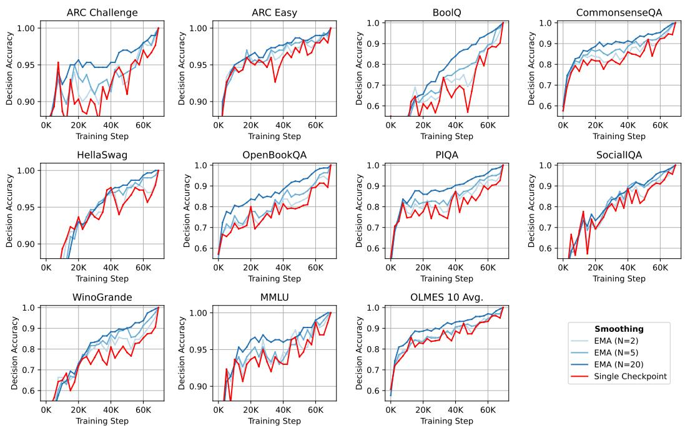  
Figure 18: When stopping a training run early, averaging the checkpoint-to-checkpoint noise improves the decision accuracy between an intermediate and the final training step. Shown are decision accuracy from early-stopping for the core OLMES tasks by using both a single checkpoint and the exponential moving average (EMA)

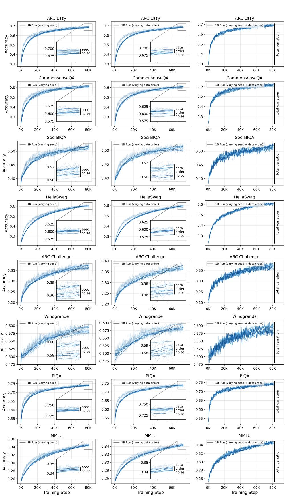  
Figure 19: Visualization for the seed noise, data order noise and total variation for all OLMES tasks.

# NeurIPS Paper Checklist

# 1. Claims

Question: Do the main claims made in the abstract and introduction accurately reflect the paper’s contributions and scope?

Answer: [Yes]

Justification: The abstract accurately summarizes the main contribution and scope of the paper.

Guidelines:

• The answer NA means that the abstract and introduction do not include the claims made in the paper.   
• The abstract and/or introduction should clearly state the claims made, including the contributions made in the paper and important assumptions and limitations. A No or NA answer to this question will not be perceived well by the reviewers.   
• The claims made should match theoretical and experimental results, and reflect how much the results can be expected to generalize to other settings.   
• It is fine to include aspirational goals as motivation as long as it is clear that these goals are not attained by the paper.

# 2. Limitations

Question: Does the paper discuss the limitations of the work performed by the authors?

Answer: [Yes]

Justification: Yes, we discuss the limitations of our work as part of $\ S 6$

Guidelines:

• The answer NA means that the paper has no limitation while the answer No means that the paper has limitations, but those are not discussed in the paper.   
• The authors are encouraged to create a separate "Limitations" section in their paper.   
• The paper should point out any strong assumptions and how robust the results are to violations of these assumptions (e.g., independence assumptions, noiseless settings, model well-specification, asymptotic approximations only holding locally). The authors should reflect on how these assumptions might be violated in practice and what the implications would be. The authors should reflect on the scope of the claims made, e.g., if the approach was only tested on a few datasets or with a few runs. In general, empirical results often depend on implicit assumptions, which should be articulated. The authors should reflect on the factors that influence the performance of the approach. For example, a facial recognition algorithm may perform poorly when image resolution is low or images are taken in low lighting. Or a speech-to-text system might not be used reliably to provide closed captions for online lectures because it fails to handle technical jargon.   
• The authors should discuss the computational efficiency of the proposed algorithms and how they scale with dataset size.   
• If applicable, the authors should discuss possible limitations of their approach to address problems of privacy and fairness.   
• While the authors might fear that complete honesty about limitations might be used by reviewers as grounds for rejection, a worse outcome might be that reviewers discover limitations that aren’t acknowledged in the paper. The authors should use their best judgment and recognize that individual actions in favor of transparency play an important role in developing norms that preserve the integrity of the community. Reviewers will be specifically instructed to not penalize honesty concerning limitations.

# 3. Theory assumptions and proofs

Question: For each theoretical result, does the paper provide the full set of assumptions and a complete (and correct) proof?

Answer: [NA]

Justification: This paper does not include theoretical results.

Guidelines:

• The answer NA means that the paper does not include theoretical results.   
• All the theorems, formulas, and proofs in the paper should be numbered and crossreferenced.   
• All assumptions should be clearly stated or referenced in the statement of any theorems.   
• The proofs can either appear in the main paper or the supplemental material, but if they appear in the supplemental material, the authors are encouraged to provide a short proof sketch to provide intuition.   
• Inversely, any informal proof provided in the core of the paper should be complemented by formal proofs provided in appendix or supplemental material.   
• Theorems and Lemmas that the proof relies upon should be properly referenced.

# 4. Experimental result reproducibility

Question: Does the paper fully disclose all the information needed to reproduce the main experimental results of the paper to the extent that it affects the main claims and/or conclusions of the paper (regardless of whether the code and data are provided or not)?

Answer: [Yes]

Justification: We specify the open models and datasets used to perform the core evaluation of the work in $\ S 2 . 2$ and describe the exact evaluation setup in Appendix A.5.

Guidelines:

• The answer NA means that the paper does not include experiments.   
• If the paper includes experiments, a No answer to this question will not be perceived well by the reviewers: Making the paper reproducible is important, regardless of whether the code and data are provided or not.   
• If the contribution is a dataset and/or model, the authors should describe the steps taken to make their results reproducible or verifiable.   
Depending on the contribution, reproducibility can be accomplished in various ways. For example, if the contribution is a novel architecture, describing the architecture fully might suffice, or if the contribution is a specific model and empirical evaluation, it may be necessary to either make it possible for others to replicate the model with the same dataset, or provide access to the model. In general. releasing code and data is often one good way to accomplish this, but reproducibility can also be provided via detailed instructions for how to replicate the results, access to a hosted model (e.g., in the case of a large language model), releasing of a model checkpoint, or other means that are appropriate to the research performed.   
While NeurIPS does not require releasing code, the conference does require all submissions to provide some reasonable avenue for reproducibility, which may depend on the nature of the contribution. For example (a) If the contribution is primarily a new algorithm, the paper should make it clear how to reproduce that algorithm. (b) If the contribution is primarily a new model architecture, the paper should describe the architecture clearly and fully. (c) If the contribution is a new model (e.g., a large language model), then there should either be a way to access this model for reproducing the results or a way to reproduce the model (e.g., with an open-source dataset or instructions for how to construct the dataset). (d) We recognize that reproducibility may be tricky in some cases, in which case authors are welcome to describe the particular way they provide for reproducibility. In the case of closed-source models, it may be that access to the model is limited in some way (e.g., to registered users), but it should be possible for other researchers to have some path to reproducing or verifying the results.

# 5. Open access to data and code

Question: Does the paper provide open access to the data and code, with sufficient instructions to faithfully reproduce the main experimental results, as described in supplemental material?

Answer: [Yes]

Justification: We will provide the code used for launching and analyzing the evaluation, and will release the full dataset to reproduce the tables and figures as part of the supplementary material.

Guidelines:

• The answer NA means that paper does not include experiments requiring code.   
• Please see the NeurIPS code and data submission guidelines (https://nips.cc/ public/guides/CodeSubmissionPolicy) for more details.   
• While we encourage the release of code and data, we understand that this might not be possible, so “No” is an acceptable answer. Papers cannot be rejected simply for not including code, unless this is central to the contribution (e.g., for a new open-source benchmark).   
• The instructions should contain the exact command and environment needed to run to reproduce the results. See the NeurIPS code and data submission guidelines (https: //nips.cc/public/guides/CodeSubmissionPolicy) for more details.   
• The authors should provide instructions on data access and preparation, including how to access the raw data, preprocessed data, intermediate data, and generated data, etc.   
• The authors should provide scripts to reproduce all experimental results for the new proposed method and baselines. If only a subset of experiments are reproducible, they should state which ones are omitted from the script and why.   
• At submission time, to preserve anonymity, the authors should release anonymized versions (if applicable).   
• Providing as much information as possible in supplemental material (appended to the paper) is recommended, but including URLs to data and code is permitted.

# 6. Experimental setting/details

Question: Does the paper specify all the training and test details (e.g., data splits, hyperparameters, how they were chosen, type of optimizer, etc.) necessary to understand the results?

Answer: [Yes]

Justification: We specify these details for collecting evaluation results $\ S 2 . 2$ and describe the exact evaluation setup in Appendix A.5.

Guidelines:

• The answer NA means that the paper does not include experiments. • The experimental setting should be presented in the core of the paper to a level of detail that is necessary to appreciate the results and make sense of them. • The full details can be provided either with the code, in appendix, or as supplemental material.

# 7. Experiment statistical significance

Question: Does the paper report error bars suitably and correctly defined or other appropriate information about the statistical significance of the experiments?

Answer: [Yes]

Justification: For our main results on the correlation between SNR and decision accuracy, and correlation between SNR and prediction error in $\ S 4$ , we report a confidence interval. For our experiment randomizing the sub-task in $\ S 5 . 1$ , we report error bars for the standard deviation using different random selections.

Guidelines:

• The answer NA means that the paper does not include experiments.   
• The authors should answer "Yes" if the results are accompanied by error bars, confidence intervals, or statistical significance tests, at least for the experiments that support the main claims of the paper.   
• The factors of variability that the error bars are capturing should be clearly stated (for example, train/test split, initialization, random drawing of some parameter, or overall run with given experimental conditions).   
• The method for calculating the error bars should be explained (closed form formula, call to a library function, bootstrap, etc.)   
• The assumptions made should be given (e.g., Normally distributed errors).   
• It should be clear whether the error bar is the standard deviation or the standard error of the mean.   
• It is OK to report 1-sigma error bars, but one should state it. The authors should preferably report a 2-sigma error bar than state that they have a $96 \%$ CI, if the hypothesis of Normality of errors is not verified.   
• For asymmetric distributions, the authors should be careful not to show in tables or figures symmetric error bars that would yield results that are out of range (e.g. negative error rates).   
• If error bars are reported in tables or plots, The authors should explain in the text how they were calculated and reference the corresponding figures or tables in the text.

# 8. Experiments compute resources

Question: For each experiment, does the paper provide sufficient information on the computer resources (type of compute workers, memory, time of execution) needed to reproduce the experiments?

Answer: [Yes]

Justification: In our description of the models used to run experiments $\ S \mathrm { A } . 5 . 1$ , we describe both the compute used to run evaluation and the compute used to train the 1B seed and data order models discussed in $\ S 3 . 1$ .

Guidelines:

• The answer NA means that the paper does not include experiments.   
• The paper should indicate the type of compute workers CPU or GPU, internal cluster, or cloud provider, including relevant memory and storage.   
• The paper should provide the amount of compute required for each of the individual experimental runs as well as estimate the total compute.   
• The paper should disclose whether the full research project required more compute than the experiments reported in the paper (e.g., preliminary or failed experiments that didn’t make it into the paper).

# 9. Code of ethics

Question: Does the research conducted in the paper conform, in every respect, with the NeurIPS Code of Ethics https://neurips.cc/public/EthicsGuidelines?

Answer: [Yes]

Justification: The research conducted in the paper conform, in every respect, with the NeurIPS Code of Ethics.

Guidelines:

• The answer NA means that the authors have not reviewed the NeurIPS Code of Ethics.   
• If the authors answer No, they should explain the special circumstances that require a deviation from the Code of Ethics.   
• The authors should make sure to preserve anonymity (e.g., if there is a special consideration due to laws or regulations in their jurisdiction).

# 10. Broader impacts

Question: Does the paper discuss both potential positive societal impacts and negative societal impacts of the work performed?

Answer: [Yes]

Justification: Our method performs fundamental research on language model evaluation, and is not tied to a particular application. We do not see any direct societal impact of the work performed.

Guidelines:

• The answer NA means that there is no societal impact of the work performed.

• If the authors answer NA or No, they should explain why their work has no societal impact or why the paper does not address societal impact.   
• Examples of negative societal impacts include potential malicious or unintended uses (e.g., disinformation, generating fake profiles, surveillance), fairness considerations (e.g., deployment of technologies that could make decisions that unfairly impact specific groups), privacy considerations, and security considerations.   
• The conference expects that many papers will be foundational research and not tied to particular applications, let alone deployments. However, if there is a direct path to any negative applications, the authors should point it out. For example, it is legitimate to point out that an improvement in the quality of generative models could be used to generate deepfakes for disinformation. On the other hand, it is not needed to point out that a generic algorithm for optimizing neural networks could enable people to train models that generate Deepfakes faster.   
The authors should consider possible harms that could arise when the technology is being used as intended and functioning correctly, harms that could arise when the technology is being used as intended but gives incorrect results, and harms following from (intentional or unintentional) misuse of the technology.   
If there are negative societal impacts, the authors could also discuss possible mitigation strategies (e.g., gated release of models, providing defenses in addition to attacks, mechanisms for monitoring misuse, mechanisms to monitor how a system learns from feedback over time, improving the efficiency and accessibility of ML).

# 11. Safeguards

Question: Does the paper describe safeguards that have been put in place for responsible release of data or models that have a high risk for misuse (e.g., pretrained language models, image generators, or scraped datasets)?

Answer: [NA]

Justification: This paper poses no such risks

Guidelines:

• The answer NA means that the paper poses no such risks.   
• Released models that have a high risk for misuse or dual-use should be released with necessary safeguards to allow for controlled use of the model, for example by requiring that users adhere to usage guidelines or restrictions to access the model or implementing safety filters.   
• Datasets that have been scraped from the Internet could pose safety risks. The authors should describe how they avoided releasing unsafe images.   
• We recognize that providing effective safeguards is challenging, and many papers do not require this, but we encourage authors to take this into account and make a best faith effort.

# 12. Licenses for existing assets

Question: Are the creators or original owners of assets (e.g., code, data, models), used in the paper, properly credited and are the license and terms of use explicitly mentioned and properly respected?

Answer: [Yes]

Justification: This paper cites the original authors for all of the benchmarks and models used in this work, as listed in $\ S _ { \mathrm { A } . 5 }$ .

Guidelines:

• The answer NA means that the paper does not use existing assets.   
• The authors should cite the original paper that produced the code package or dataset.   
• The authors should state which version of the asset is used and, if possible, include a URL.   
• The name of the license (e.g., CC-BY 4.0) should be included for each asset.   
• For scraped data from a particular source (e.g., website), the copyright and terms of service of that source should be provided.   
• If assets are released, the license, copyright information, and terms of use in the package should be provided. For popular datasets, paperswithcode.com/datasets has curated licenses for some datasets. Their licensing guide can help determine the license of a dataset.   
• For existing datasets that are re-packaged, both the original license and the license of the derived asset (if it has changed) should be provided.   
• If this information is not available online, the authors are encouraged to reach out to the asset’s creators.

# 13. New assets

Question: Are new assets introduced in the paper well documented and is the documentation provided alongside the assets?

Answer: [Yes]

Justification: This paper will release the accompanying code and assets as part of the supplimentary material, and will provide documentation.

Guidelines:

• The answer NA means that the paper does not release new assets.   
• Researchers should communicate the details of the dataset/code/model as part of their submissions via structured templates. This includes details about training, license, limitations, etc.   
• The paper should discuss whether and how consent was obtained from people whose asset is used.   
• At submission time, remember to anonymize your assets (if applicable). You can either create an anonymized URL or include an anonymized zip file.

# 14. Crowdsourcing and research with human subjects

Question: For crowdsourcing experiments and research with human subjects, does the paper include the full text of instructions given to participants and screenshots, if applicable, as well as details about compensation (if any)?

Answer: [NA]

Justification: This paper does not perform crowdsourcing or research with human subjects.

Guidelines:

• The answer NA means that the paper does not involve crowdsourcing nor research with human subjects.   
• Including this information in the supplemental material is fine, but if the main contribution of the paper involves human subjects, then as much detail as possible should be included in the main paper.   
• According to the NeurIPS Code of Ethics, workers involved in data collection, curation, or other labor should be paid at least the minimum wage in the country of the data collector.

# 15. Institutional review board (IRB) approvals or equivalent for research with human subjects

Question: Does the paper describe potential risks incurred by study participants, whether such risks were disclosed to the subjects, and whether Institutional Review Board (IRB) approvals (or an equivalent approval/review based on the requirements of your country or institution) were obtained?

Answer: [NA]

Justification: This paper does not perform crowdsourcing or research with human subjects.

Guidelines:

• The answer NA means that the paper does not involve crowdsourcing nor research with human subjects.   
• Depending on the country in which research is conducted, IRB approval (or equivalent) may be required for any human subjects research. If you obtained IRB approval, you should clearly state this in the paper.   
• We recognize that the procedures for this may vary significantly between institutions and locations, and we expect authors to adhere to the NeurIPS Code of Ethics and the guidelines for their institution.   
• For initial submissions, do not include any information that would break anonymity (if applicable), such as the institution conducting the review.

# 16. Declaration of LLM usage

Question: Does the paper describe the usage of LLMs if it is an important, original, or non-standard component of the core methods in this research? Note that if the LLM is used only for writing, editing, or formatting purposes and does not impact the core methodology, scientific rigorousness, or originality of the research, declaration is not required.

Answer: [NA]

Justification: LLMs were not used for implementing the core methodology of the work.

Guidelines:

• The answer NA means that the core method development in this research does not involve LLMs as any important, original, or non-standard components. • Please refer to our LLM policy (https://neurips.cc/Conferences/2025/LLM) for what should or should not be described.