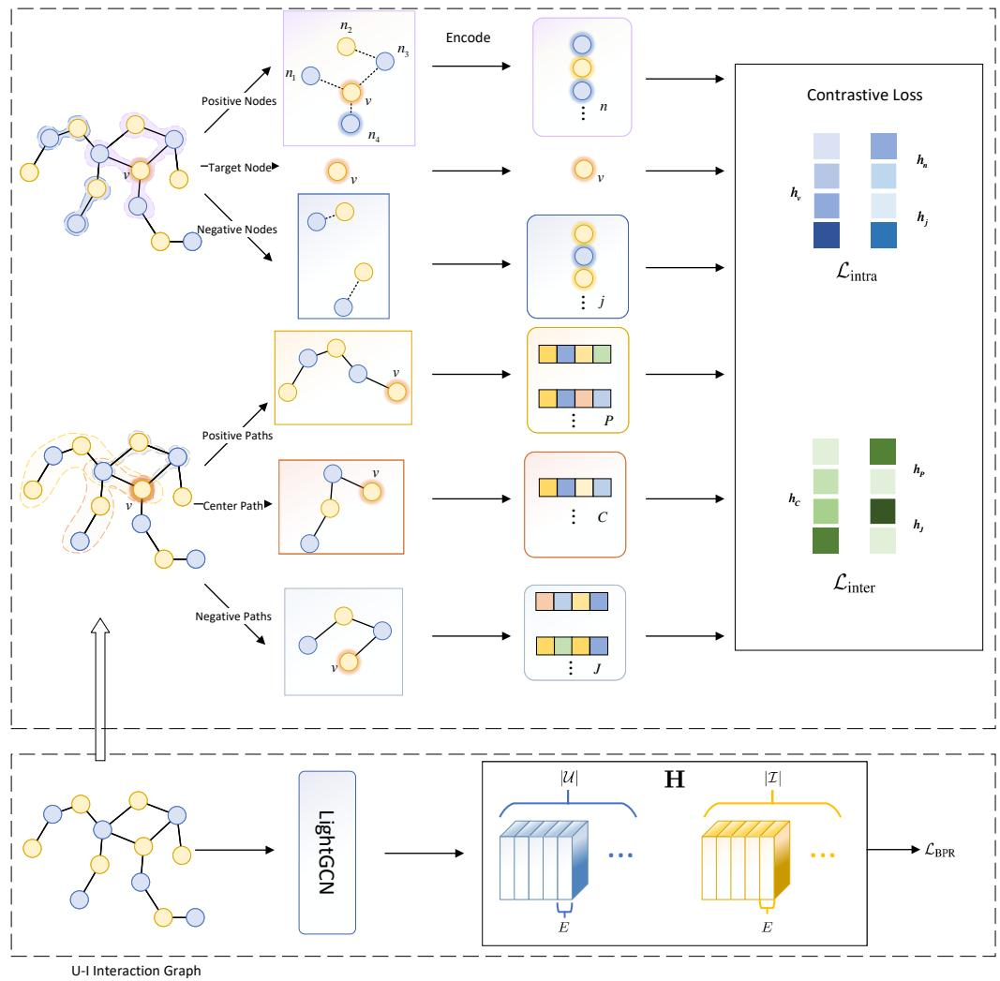
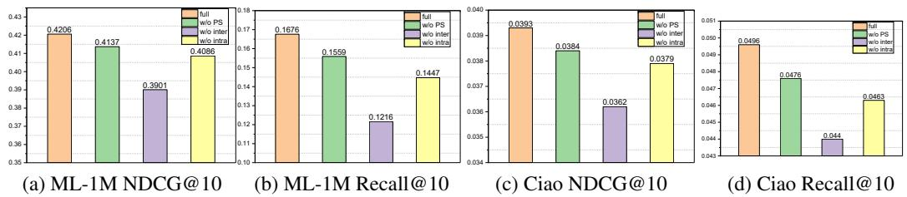
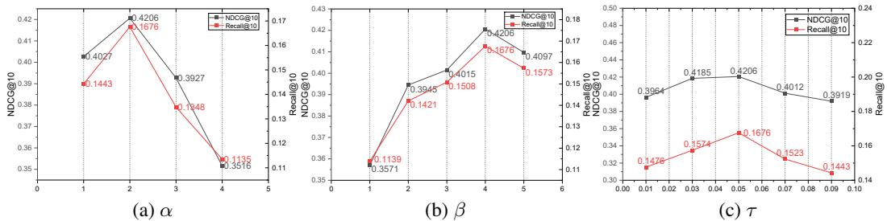
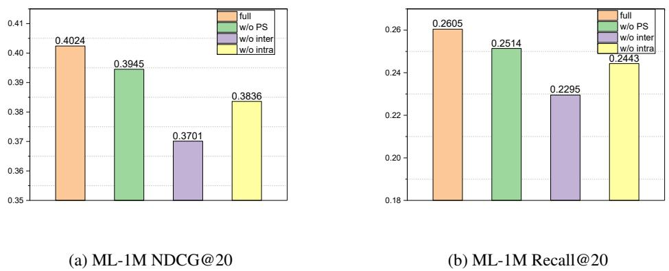
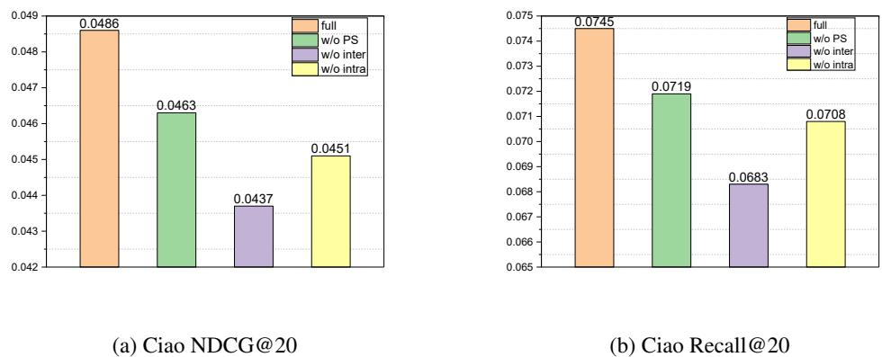
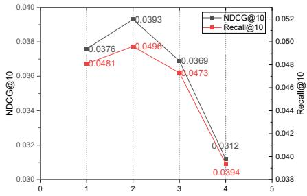
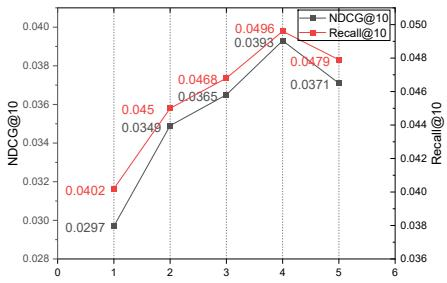
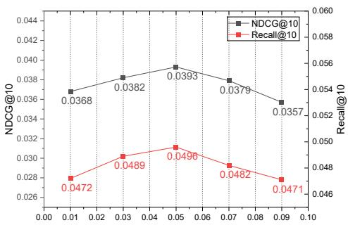

# Path-Enhanced Contrastive Learning for Recommendation

Haoran Sun† Beijing Jiaotong University haoran.sun@bjtu.edu.cn

Fei Xiong†∗ Beijing Jiaotong University xiongf@bjtu.edu.cn

Yuanzhe $\mathbf { H } \mathbf { u } ^ { \dag }$ Institute of Software Chinese Academy of Sciences yuanzhe@iscas.ac.cn

Liang Wang Northwestern Polytechnical University liangwang0123@gmail.com

# Abstract

Collaborative filtering (CF) methods are now facing the challenge of data sparsity in recommender systems. In order to reduce the effect of data sparsity, researchers proposed contrastive learning methods to extract self-supervised signals from raw data. Contrastive learning methods address this problem by graph augmentation and maximizing the consistency of node representations between different augmented graphs. However, these methods tends to unintentionally distance the target node from its path nodes on the interaction path, thus limiting its effectiveness. In this regard, we propose a solution that uses paths as samples in the contrastive loss function. In order to obtain the path samples, we design a path sampling method. In addition to the contrast of the relationship between the target node and the nodes within the path (intra-path contrast), we also designed a method of contrasting the relationship between the paths (inter-path contrast) to better pull the target node and its path nodes closer to each other. We use Simplifying and Powering Graph Convolution Network (LightGCN) as the basis and combine with a new path-enhanced graph approach proposed for graph augmentation. It effectively improves the performance of recommendation models. Our proposed Path Enhanced Contrastive Loss (PECL) model replaces the common contrastive loss function with our novel loss function, showing significant performance improvement. Experiments on three real-world datasets demonstrate the effectiveness of our model.

# 1 Introduction

In the era of information explosion, recommender systems play a crucial role in identifying users’ preferences and delivering personalized experiences effectively[18]. Among the various techniques, CF[9, 21] has become a cornerstone approach to generate recommendations utilizing implicit feedback such as clicks, purchases, and comments. The core idea of CF methods is that users with similar behaviors are likely to share similar preferences. CF methods are broadly classified into memorybased[15, 4, 20] and model-based approaches[17, 10, 12]. Recent research trends focus on modelbased CF techniques due to their superior performance and scalability. However, CF methods are often challenged by the data sparsity problem. To address this, researchers proposed various models to enhance the representations of users and items by using additional information[10, 25, 2, 13, 27, 5]. For instance, models like $\mathrm { S V D + + }$ incorporate implicit feedback from user-item interactions to refine predictions[12], while LightGCN effectively captures higher-order collaborative signals to improve the embedding quality of users and items[10].

Recently, contrastive learning has emerged as a powerful paradigm in representation learning, achieving remarkable success in various domains such as computer vision[3, 7, 1, 8] and natural language processing[6, 28, 31]. By leveraging self-supervised signals, contrastive learning can effectively extract meaningful features from large-scale unlabeled data, offering a promising solution to the problem of data sparsity[24, 23]. Given its ability to provide additional supervisory signals, an increasing number of studies[14, 26, 33] have applied contrastive learning techniques to recommender systems, resulting in significant improvements in recommendation performance. The core concept behind contrastive learning is creating additional supervised instances and applying a self-designed task to this augmented data, thereby tackling the challenge of data scarcity. Specifically, we randomly select a node from the interaction graph to be the target node and paths extending from the target node as center paths. Data augmentation is achieved by perturbing the interaction graph. During training, the augmentation of the target node is represented as its positive samples and other nodes as negative samples. However, disturbing interaction graph may generate irrelevant connections or discard critical training information, thereby weakening the reliability and overall performance of contrastive learning models. Moreover, treating other nodes as negative nodes will unintentionally distance the target node from its node neighbors along the interaction path. However, these neighbors exert a positive influence on the target node.

To overcome these challenges, we propose a path-enhanced contrastive learning method (PECL) that focuses on path-level representations, offering a neighborhood-based perspective for contrastive learning approaches. We first propose an intra-path contrastive learning strategy that effectively selects nodes for contrastive learning, so that the target node is pulled closer to the nodes along the interaction path. Nevertheless, the semantics of a single node can often be diverse or ambiguous, which motivates us to further design an inter-path contrastive learning method. Since a path consists of multiple sequentially connected nodes, it naturally encodes contextual constraints and thus helps to mitigate noise. To enable inter-path contrast, we devise a general path sampling strategy that selects representative paths extending from the target node as positive samples of the center path, thereby enabling the model to align semantically similar paths more effectively.

In summary, our main contributions are summarized as follows:

• We propose an efficient path contrastive learning model that utilizes multiple positive path samples to guide the updating of the representation of the center path. The experiments show that multiple positive samples together influence the representation of the center path and enhance the recommendation performance of the model.   
• We design a path sampling method that can sample paths similar to the center path as positive samples. The positive samples provided allow model to perform inter-path contrastive learning, which in turn brings the target node closer to its collaborative nodes on other paths.   
• By utilizing three datasets derived from actual real-world situations, we conducted empirical research that revealed a distinct advantage of PECL compared to state-of-the-art baseline models.

# 2 Related Work

Graph Neural Network Based Recommender Systems. Graph Neural Networks (GNNs) have emerged as a powerful tool for recommendation tasks, particularly because they can capture intricate relationships between users and items in a graph-based setting. Traditional collaborative filtering (CF) models, such as matrix factorization, have been widely adopted in recommender systems. However, these models often struggle with data sparsity and fail to capture complex higher-order interactions between users and items. GNN-based models, such as NGCF (Neural Graph Collaborative Filtering)[25], address these limitations by leveraging message-passing mechanisms to propagate information across the user-item graph. NGCF captures both direct and indirect collaborative signals, making it particularly suitable for recommendation tasks in sparse data scenarios. Despite the improvements offered by NGCF, its heavy reliance on deep message-passing layers and non-linear activations leads to potential over-smoothing and overfitting, making the model inefficient and computationally expensive. LightGCN[10] addresses these issues by simplifying the architecture—removing the non-linear activation functions and transformation parameters typically used in GNN models. This reduction in complexity not only improves computational efficiency but also enhances the model’s ability to focus on essential collaborative signals. However, such aggregation-based modeling paradigm does not explicitly account for the sequential or semantic continuity of nodes along interaction paths.

Self-Supervised Learning Techniques in Recommender Systems. In recent years, Selfsupervised learning has become an important technique in enhancing recommendation models, especially when dealing with sparse or noisy data. In contrastive self-supervised learning, the goal is to pull positive samples closer together while pushing negative samples further apart, thus improving the robustness of learned representations. SimGCL[33] proposes a contrastive learning framework for graph-based recommendation models, where the authors introduce augmented views of users and items to enhance the model’s ability to distinguish between relevant and irrelevant interactions. By incorporating contrastive loss, SimGCL not only improves the robustness of the learned embeddings but also helps address the issue of negative sampling, which is often problematic in collaborative filtering-based systems. Furthermore, NCL[14] enhances this approach by clustering users and items into meaningful groups, allowing the model to leverage these clusters as positive samples. This clustering technique, combined with contrastive loss, significantly improves the quality of the learned representations, particularly in sparse scenarios. IHGCL[19] leverages meta-paths in heterogeneous graphs to extract user intents and enhances recommendation via intent–intent and intent–interaction contrastive learning. However, existing work does not fully consider the relationships between target nodes and nodes on the interaction path in a recommendation scenario. In this paper, we use contrastive learning to interpretively model these potential node relationships.

# 3 The PECL framework

In this section, we introduce the PECL framework. The PECL framework is composed by four parts: graph collaborative filtration backbone LightGCN, path node-aware contrastive learning method, path sampling network and the path-aware contrastive learning method. The overall framework is shown in Fig.1.

# 3.1 Graph Collaborative Filtering Backbone

In PECL, we use LightGCN as the backbone model. The LightGCN model focuses on effectively capturing high-order collaborative signals in a user-item interaction graph by leveraging a simplified GCN structure. Given a bipartite graph $\mathcal { G } = ( \nu , \mathcal { E } )$ , the node set $\mathcal { V } = \mathcal { U } \cup \mathcal { T }$ includes both users and items, and the edge set $\mathcal { E } = \{ ( u , i ) | \mathcal { R } _ { u i } = 1 \}$ captures observed interactions $\mathcal { R } _ { u i }$ . that connects users and items. LightGCN updates node embeddings over $k$ layers, where each layer aggregates information from increasingly distant neighbors. The embedding at the $k$ -th layer, $\mathbf { \dot { H } ^ { k } }$ represents knowledge collected from $k$ -hop neighbors. To counteract the over-smoothing commonly observed in deep GCNs, LightGCN constructs the final node representations by combining embeddings from all layers, including the input embeddings:

$$
\begin{array} { r l r } {  { \mathbf { H } = \alpha _ { 0 } \mathbf { H } ^ { ( 0 ) } + \alpha _ { 1 } \mathbf { H } ^ { ( 1 ) } + \alpha _ { 2 } \mathbf { H } ^ { ( 2 ) } + \ldots + \alpha _ { \mathbf { K } } \mathbf { H } ^ { ( \mathbf { K } ) } } } \\ & { = \alpha _ { 0 } \mathbf { H } ^ { ( 0 ) } + \alpha _ { 1 } \tilde { \mathbf { A } } \mathbf { H } ^ { ( 0 ) } + \alpha _ { 2 } \tilde { \mathbf { A } } ^ { 2 } \mathbf { H } ^ { ( 0 ) } + \ldots + \alpha _ { K } \tilde { \mathbf { A } } ^ { K } \mathbf { H } ^ { ( 0 ) } , } & \\ & { } & { \tilde { \mathbf { A } } = \mathbf { D } ^ { - \frac { 1 } { 2 } } \mathbf { A } \mathbf { D } ^ { - \frac { 1 } { 2 } } , \quad \quad } \end{array}
$$

where $\tilde { \mathbf { A } }$ is the symmetrically normalized matrix and $\mathbf { D }$ is a $( | \mathcal { U } | + | \mathcal { T } | ) \times ( | \mathcal { U } | + | \mathcal { T } | )$ diagonal matrix.   
The 0-th layer embedding matrix $\mathbf { H } ^ { ( 0 ) } \in \mathbb { R } ^ { ( | \mathcal { U } | + | \mathcal { T } | ) \times E }$ , where $E$ is the embedding size.

These final embeddings are used to represent users and items—specifically, user $u$ and item $i$ are represented by $h _ { u }$ and $h _ { i }$ , respectively. The predicted interaction score between user $u$ and item $i$ is then computed using the inner product operation:

$$
\hat { r } _ { u i } = h _ { u } h _ { i } ^ { \mathrm { T } }
$$

The model is trained using a ranking loss function, encouraging observed interactions (positive samples from $\mathcal { R } ^ { + }$ ) to have higher scores than unobserved ones (negative samples from $\mathcal { R } ^ { - }$ ), with a sigmoid function $\sigma ( x ) = 1 / ( \bar { 1 } + e ^ { - x } )$ used to map predictions to probabilities:

$$
\mathcal { L } _ { \mathrm { B P R } } = - \sum _ { u \in \mathcal { U } } \sum _ { i \in \mathcal { R } _ { u } ^ { + } , j \in \mathcal { R } _ { u } ^ { - } } \log ( \sigma ( \hat { r } _ { u i } - \hat { r } _ { u j } ) )
$$

  
Figure 1: Method framework.

# 3.2 Path Node Aware Contrastive Learning

Existing graph augmentation contrastive learning methods mainly augment graph collaborative filtering by utilizing similar or structural neighbors[14, 22]. These methods ignore the internal nodes of the interaction paths, however, in fact, the nodes inside the interaction paths also have influence on the target nodes. In order to take full advantage of contrastive learning, we argue that when constructing the contrast loss of a target node, it is also important to consider the representatives of the nodes inside its interaction path as positive samples. Computing all nodes on paths may make the computation too large, so we use the random walk with restart for path sampling based on length classification proposed by Xiong et al.[30].

$$
p = \left\{ \begin{array} { l l } { p _ { r } , } & { \mathrm { r e s t a r t ; } } \\ { \frac { 1 - p _ { r } } { \left| \mathcal { N } _ { n e i g h b o r } \right| } , } & { \mathrm { r a n d o m ~ s e l e c t i o n ~ o f ~ n e i g h b o r s } , } \end{array} \right.
$$

where $\mathcal { N } _ { n e i g h b o r }$ denotes the set of neighbors and the probability $p$ of the next move in a random walk is governed by two distinct scenarios. We obtain our set of center paths $\mathcal { P } _ { v }$ of the target node $v$ utilizing the above sampling approach. In order to find the positive nodes $n$ of the target node $v$ ,we define a positive node selection method:

$$
\mathcal { V } _ { v } ^ { + } = \{ n | \alpha \leq | \{ P \in \mathcal { P } _ { v } | n \in P \} | \} ,
$$

where $P$ denotes the path and $\alpha$ is a hyperparameter that determines the minimum number of positive nodes in sample paths. Then, other nodes are treated as negative samples. During the contrast loss construction process, specifically, we learn the embeddings of the target nodes themselves and the sampled intra-path nodes by contrast. Building on the principles of InfoNCE[16], we introduce an intra-path contrastive learning framework aimed at encouraging closer alignment between related representations by reducing their mutual divergence:

$$
\mathcal { L } _ { \mathrm { i n t r a } } = - \sum _ { v \in \mathcal { V } } \log \sum _ { n \in \mathcal { V } _ { v } ^ { + } } \frac { \exp ( h _ { v } ( h _ { n } ) ^ { \mathrm { T } } / \tau ) } { \sum _ { j \in \mathcal { V } } \exp ( h _ { v } ( h _ { j } ) ^ { \mathrm { T } } / \tau ) } ,
$$

where $h$ denotes the embedding vector of the node and $j$ denotes the negative node.

# 3.3 Preparation for Path Aware Contrastive Learning

This section will introduce how to find sample paths of the path-aware contrastive learning. Our ultimate target is to bring the target node on the center path closer to the nodes on the positive path through the path. Random walk sampling with the target node as the starting point is an option. However, since we define our own way of obtaining the center path, the path obtained by random walk sampling is not guaranteed to have a high similarity with our center path, since it can only determine that it has the same starting point. The meta-path sampling approach is not available for the recommendation task we study because we only have a simple user-item binary graph. To our knowledge, few studies have performed contrastive learning between paths, while our study has center paths that we define, so we need a corresponding positive path sampling method which can ensure that the computation is not too large and the similarity is also good. Meanwhile, negative sampling is performed in other paths.

To better capture the time dynamics and structural patterns in user-item interaction graphs, we propose a two-stage path sampling method termed Target-guided Random Walk. This strategy integrates deterministic time traversal with stochastic exploration, enabling sampled paths to reflect both the structured information flow and the inherent uncertainty of user behavior.

Formally, each edge $( u , i ) \in \mathcal { E }$ is associated with a timestamp $t ( u , i ) \in \mathcal { T }$ . For the set of center paths $\mathcal { P } _ { v }$ of the target node $v$ , we define a center path $C = ( v _ { 1 } , v _ { 2 } , \ldots , v _ { n } ) , C \in \mathcal { P } _ { v }$ , constructed by following the time interaction sequence such that:

$$
t ( v _ { i } , v _ { i + 1 } ) \leq t ( v _ { i + 1 } , v _ { i + 2 } ) , \quad \forall i = 1 , \ldots , n - 2
$$

This path reflects a plausible trajectory of user or item interaction based on actual historical data.

We divide the sampling process into two stages to obtain path $C$ ’s positive path set $\mathcal { P } _ { C } ^ { + }$ :

Stage 1 (Target-guided traversal): We deterministically follow one center path $C \in \mathcal { P } _ { v }$ from the start node $v _ { 1 }$ to the intermediate node $v _ { \beta }$ , where $\beta$ is a hyperparameter controlling the number of steps before random walking. The partial path is denoted as:

$$
P ^ { ( 1 ) } = ( v _ { 1 } , v _ { 2 } , \ldots , v _ { \beta } )
$$

Stage 2 (Conditional random walk): Starting from node $v _ { \beta }$ , we conduct a time-aware conditional random walk to generate the remaining $n - \beta$ nodes. At each step $j$ , the next node $v _ { j + 1 } ^ { \prime }$ is sampled from the neighborhood $\mathcal { N } ( v _ { j } ^ { \prime } )$ based on a temporally-biased transition probability $\mathcal { T P } ( v _ { j } ^ { \prime } )$ :

$$
\mathcal { T P } ( v _ { j } ^ { \prime } ) = \mathrm { S o f t m a x } _ { v \in \mathcal { N } ( v _ { j } ^ { \prime } ) } \left( \frac { 1 } { \Delta t ( v _ { j } ^ { \prime } , v ) } \cdot w ( v _ { j } ^ { \prime } , v ) \right) ,
$$

where $\Delta t ( v _ { j } ^ { \prime } , v ) = t ( v _ { j } ^ { \prime } , v ) - t _ { \mathrm { l a s t } }$ captures the relative time gap, and $w ( v _ { j } ^ { \prime } , v )$ denotes a tunable edge weight that can incorporate interaction frequency or node similarity. The second-stage path $P ^ { ( 2 ) }$ is defined as a sequence of nodes generated via a time-aware random walk process:

$$
P ^ { ( 2 ) } = ( v _ { \beta + 1 } ^ { \prime } , \ldots , v _ { n } ^ { \prime } ) , \quad \mathrm { w h e r e } \quad v _ { j + 1 } ^ { \prime } \sim \mathcal { T P } ( v _ { j } ^ { \prime } ) \quad \mathrm { f o r } j = \beta , \ldots , n - 1
$$

The final sampled path is defined as:

$$
P = P ^ { ( 1 ) } \cup P ^ { ( 2 ) } = ( v _ { 1 } , \dots , v _ { \beta } , v _ { \beta + 1 } ^ { \prime } , \dots , v _ { n } ^ { \prime } )
$$

This hybrid sampling mechanism ensures that the sampled paths maintain time consistency with realworld interaction sequences while introducing stochasticity to enhance path diversity and coverage.

# 3.4 Path Aware Contrastive Learning

The inter-path loss introduced in this section leverages representative paths extending from the target node as positive counterparts of the center path, enabling the model to align semantically similar paths and mitigate the ambiguity of single-node semantics.

To perform inter-path contrastive learning, we need to encode the paths. Since we are sampling the paths based on time series, we consider incorporating time information in the encoding of the paths. We use Temporal Context Encoding[11] to get the encoding of the timestamps $e$ . We show specific coding methods in A.5. Since the timestamp in the recommender system is an attribute of the user-item relationship, i.e., it is a time code corresponding to each edge on the graph. So it is necessary to choose a suitable way to fuse node and edge information. In this paper, the Hermitian inner product is chosen as the interaction between node embedding and time embedding. The rotation on the complex plane maintains the invariance of the relationship between the node embedding and the time embedding, so that the distance between the two in the complex plane does not change due to the rotation. Normalizing the time embedding and then doing the Hermitian inner product operation with the node embedding, i.e., rotating the node embedding by a certain angle in the complex plane. For node embeddings and time embeddings, first treat the first half of the dimension of the embedding vector as the real part $x ^ { r e a l } , e ^ { r e a l }$ and the second half of the dimension as the imaginary part $x ^ { i m g } , e ^ { i m g }$ . Perform the Hermitian inner product with the edges from the farthest node of the path towards the center node in the following order:

$$
\begin{array} { r l } & { w _ { 0 } = x _ { 0 } ^ { ' } , } \\ & { w _ { i - 1 } ^ { ' r e a l } = w _ { i - 1 } ^ { r e a l } \odot e _ { i } ^ { r e a l } + w _ { i - 1 } ^ { i m g } \odot e _ { i } ^ { i m g } , } \\ & { w _ { i - 1 } ^ { ' i m g } = - w _ { i - 1 } ^ { r e a l } \odot e _ { i } ^ { i m g } + w _ { i - 1 } ^ { i m g } \odot e _ { i } ^ { r e a l } , } \\ & { w _ { i - 1 } ^ { ' } = \left( w _ { i - 1 } ^ { ' r e a l } \parallel w _ { i - 1 } ^ { ' i m g } \right) } \\ & { w _ { i } = x _ { i } ^ { ' } + w _ { i - 1 } ^ { ' } , } \\ & { h _ { P } = \frac { w _ { n } } { n } , } \end{array}
$$

where $\odot$ denotes the elemental product of vectors, $w _ { i }$ is the intermediate computation, $i$ denotes the order of nodes on the path, $i \in [ 0 , L ]$ , and $L$ is the path length.

Similar to Eq.7, the contrast loss between paths is defined as follows:

$$
\mathcal { L } _ { \mathrm { i n t e r } } = - \sum _ { v \in \mathcal { V } } \sum _ { C \in \mathcal { P } _ { v } } \log \sum _ { P \in \mathcal { P } _ { C } ^ { + } } \frac { \exp ( h _ { C } ( h _ { P } ) ^ { \mathrm { T } } / \tau ) } { \sum _ { J \in \mathcal { P } _ { v } } \exp ( h _ { C } ( h _ { J } ) ^ { \mathrm { T } } / \tau ) | }
$$

# 3.5 Gradient Analysis and Comparative Study of Contrastive Losses

Contrastive learning enhances representation learning by encouraging proximity between positive samples and separation from negatives. In this section, we provide a detailed gradient derivation for the intra-path and inter-path contrastive losses and analyze their roles in optimization.

Gradient of Intra-path Contrastive Loss. For the gradient of the intra-path loss with respect to the target node embedding, we differentiate the Eq.7:

$$
\frac { \partial \mathcal { L } _ { \mathrm { i n t r a } } } { \partial h _ { v } } = - \sum _ { n \in \mathcal { V } _ { v } ^ { + } } \frac { \exp ( h _ { v } h _ { n } ^ { \operatorname { T } } / \tau ) } { Z _ { \mathrm { i n t r a } } } \frac { h _ { n } } { \tau } + \sum _ { j \in \mathcal { V } } \frac { \exp ( h _ { v } h _ { n } ^ { \operatorname { T } } / \tau ) } { Z _ { \mathrm { i n t r a } } } \frac { h _ { j } } { \tau }
$$

where $Z _ { \mathrm { i n t r a } }$ is the partition function given by:

$$
Z _ { \mathrm { i n t r a } } = \sum _ { n \in \mathcal { V } _ { v } ^ { + } } \exp ( h _ { v } h _ { n } ^ { \mathrm { T } } / \tau ) + \sum _ { j \in \mathcal { V } } \exp ( h _ { v } h _ { n } ^ { \mathrm { T } } / \tau )
$$

The gradient analysis reveals that the intra-path loss encourages positive nodes closer to the target node while pushing negative nodes away. The strength of this attraction-repulsion mechanism is modulated by the temperature parameter $\tau$ .

Gradient of Inter-path Contrastive Loss. Recalling the inter-path loss from Eq.14, we compute the gradient w.r.t. with respect to the center path embedding $h _ { C }$ :

$$
\frac { \partial \mathcal { L } _ { \mathrm { i n t e r } } } { \partial h _ { C } } = - \sum _ { P \in \mathcal { P } _ { C } ^ { + } } \frac { \exp \left( h _ { C } h _ { P } ^ { \mathrm { T } } / \tau \right) } { Z _ { \mathrm { i n t e r } } } \frac { h _ { P } } { \tau } + \sum _ { J \in \mathcal { P } } \frac { \exp \left( h _ { C } h _ { J } ^ { \mathrm { T } } / \tau \right) } { Z _ { \mathrm { i n t e r } } } \frac { h _ { J } } { \tau }
$$

where $Z _ { \mathrm { i n t e r } }$ is the partition function defined as:

$$
Z _ { \mathrm { i n t e r } } = \sum _ { P \in \mathcal { P } _ { C } ^ { + } } \exp ( h _ { C } h _ { P } ^ { \mathrm { T } } / \tau ) + \sum _ { J \in \mathcal { P } } \exp ( h _ { C } h _ { J } ^ { \mathrm { T } } / \tau )
$$

The gradient analysis indicates that the inter-path loss minimizes the discrepancy between the center path and positive paths while distinguishing them from negative paths.

From the gradient perspective, the intra-path loss directly updates node embeddings through their pairwise similarities weighted by influence functions, resulting in localized embedding refinement. In contrast, the inter-path loss updates path-level representations that indirectly influence the node embeddings through path encoding networks, promoting global consistency across paths. Combining these two losses yields a complementary synergy: intra-path loss strengthens local neighborhood coherence within sampled paths, while inter-path loss encourages global structural alignment across diverse paths. This joint optimization facilitates learning robust and discriminative representations for recommendation tasks. We provide further analysis in A.6.

# 3.6 Model Training

In this section, we will present the overall loss of the model. As with most contrastive learning methods, our model loss is composed of the BPR loss for interactions between user items and the contrastive learning loss.

$$
\mathcal { L } = \mathcal { L } _ { \mathrm { B P R } } + \lambda _ { 1 } \mathcal { L } _ { \mathrm { i n t r a } } + \lambda _ { 2 } \mathcal { L } _ { \mathrm { i n t e r } } + \lambda _ { 3 } \| \Theta \| _ { 2 }
$$

where $[ \lambda _ { 1 } , \lambda _ { 2 } , \lambda _ { 3 } ]$ denotes the regularized penalty coefficient and $\Theta$ corresponds to the parameters of the model. We give the values of lambda in A.7.

# 4 Experimental Results

# 4.1 Experimental Settings

Our experiments utilize three publicly available, real-world datasets—ML-1M, Ciao and Amazon—that offer rich information, including both user-item ratings and the corresponding timestamps of user interactions. Each dataset is divided into training and test sets by randomly selecting $80 \%$ of the rating entries for training purposes, while the leftover $20 \%$ is reserved to evaluate the model’s performance during testing. To assess the effectiveness of our recommendation approach, we rely on two widely adopted evaluation metrics: Recall $@ \mathrm { K }$ and ${ \mathrm { N D C G } } \ @ { \mathrm { K } }$ . In our experiment, K is set to 10 and 20. To evaluate performance differences, we conduct a comparison between PECL and nine state-of-the-art recommendation approaches: SimGCL[33], SGL[26],SCCF[29], LightGCN[10], NGCF[25], SelfCF[34], SEPT[32], GAIPSRec[30], IHGCL[19].

# 4.2 Comparative Experiments

To validate the effectiveness and generalizability of the proposed PECL, we conducted a comprehensive performance comparison against several baseline models using three distinct datasets. We compute the average results 5 times for each dataset. The results of these experiments are presented in Table 1, and the key findings are summarized as follows: The experimental results demonstrate that PECL outperforms all baseline models in both Recall $@ \mathbf { K }$ and ${ \mathrm { N D C G } } @ { \mathrm { K } }$ across the evaluated datasets. In particular, PECL achieves significant gains over the best-performing baseline models in terms of ${ \mathrm { N D C G } } \ @ 1 0$ on the Ciao, with improvement rate of $4 . 5 2 \%$ . The improvement can be attributed to the following key factors: (1) PECL generates multiple complementary nodes and paths through its contrastive learning framework. These nodes and paths are not simply based on random augmentations, but on the rich paths formed through both direct interactions and higher-order connections within the user-item graph. This mechanism ensures that PECL can effectively learn diverse representations that better capture the complex relationships between users and items. (2) Unlike traditional recommendation models that focus solely on direct user-item interactions, PECL introduces a novel contrastive learning strategy that incorporates path-based comparisons. By leveraging multiple interaction paths between users and items, PECL ensures that richer and more diverse representations of user preferences are captured. This path-based contrast helps the model discern nuanced patterns in the data, allowing for more accurate recommendations. (3) The combination of temporal information and collaborative filtering principles enables PECL to balance historical interaction patterns with the evolving preferences of users, resulting in improved predictive accuracy and user satisfaction.

<table><tr><td>Datasets</td><td>Metrics</td><td>NGCF</td><td>SGL</td><td>LightGCN</td><td>SEPT</td><td>SelfCF</td><td>SimGCL</td><td>SCCF</td><td>GAIPSRec</td><td>IHGCL</td><td>PECL</td></tr><tr><td rowspan="4">ML-1M</td><td>NDCG@10</td><td>0.3279</td><td>0.3645</td><td>0.3542</td><td>0.3529</td><td>0.3629</td><td>0.3667</td><td>0.3364</td><td>0.4096</td><td>0.4148</td><td>0.4206</td></tr><tr><td>NDCG@20</td><td>0.3115</td><td>0.3981</td><td>0.3476</td><td>0.3462</td><td>0.3475</td><td>0.3523</td><td>0.3274</td><td>0.3985</td><td>0.4006</td><td>0.4024</td></tr><tr><td>Recall@10</td><td>0.1275</td><td>0.1429</td><td>0.1443</td><td>0.1357</td><td>0.1514</td><td>0.1542</td><td>0.1437</td><td>0.1582</td><td>0.1601</td><td>0.1676</td></tr><tr><td>Recall@ 20</td><td>0.2161</td><td>0.2510</td><td>0.2419</td><td>0.2218</td><td>0.2259</td><td>0.2373</td><td>0.2501</td><td>0.2514</td><td>0.2565</td><td>0.2605</td></tr><tr><td rowspan="4">Ciao</td><td>NDCG@10</td><td>0.0298</td><td>0.0376</td><td>0.0354</td><td>0.0354</td><td>0.0371</td><td>0.0369</td><td>0.0297</td><td>0.0362</td><td>0.0364</td><td>0.0393</td></tr><tr><td>NDCG@20</td><td>0.0353</td><td>0.0447</td><td>0.0435</td><td>0.0368</td><td>0.0451</td><td>0.0471</td><td>0.0360</td><td>0.0473</td><td>0.0450</td><td>0.0486</td></tr><tr><td>Recall@10</td><td>0.0338</td><td>0.0483</td><td>0.0420</td><td>0.0433</td><td>0.0439</td><td>0.0476</td><td>0.0444</td><td>0.0481</td><td>0.0476</td><td>0.0496</td></tr><tr><td>Recall@20</td><td>0.0520</td><td>0.0713</td><td>0.0687</td><td>0.0678</td><td>0.0709</td><td>0.0721</td><td>0.0663</td><td>0.0728</td><td>0.0691</td><td>0.0745</td></tr><tr><td rowspan="4">Amazon</td><td>NDCG@10</td><td>0.0785</td><td>0.1091</td><td>0.1016</td><td>0.1013</td><td>0.1054</td><td>0.1021</td><td>0.1086</td><td>0.1105</td><td>0.1132</td><td>0.1169</td></tr><tr><td>NDCG@20</td><td>0.0913</td><td>0.1256</td><td>0.1183</td><td>0.1156</td><td>0.1195</td><td>0.1243</td><td>0.1208</td><td>0.1240</td><td>0.1309</td><td>0.1354</td></tr><tr><td>Recall@10</td><td>0.0813</td><td>0.1135</td><td>0.1084</td><td>0.1034</td><td>0.1089</td><td>0.1145</td><td>0.1029</td><td>0.1128</td><td>0.1193</td><td></td></tr><tr><td>Recall@20</td><td>0.1257</td><td>0.1501</td><td>0.1528</td><td>0.1486</td><td>0.1548</td><td>0.1691</td><td>0.1494</td><td>0.1664</td><td>0.1764</td><td>0.1241 0.1820</td></tr></table>

Table 1: NDCG and Recall of PECL and baseline models.

When analyzing the performance of all baseline models, it is clear that self-supervised learning (SSL)-enhanced methods consistently outperform traditional recommendation approaches. This trend is especially noticeable in models such as SimGCL and SGL, which incorporate SSL techniques into the learning process. While these methods are useful, they fail to fully capture the complexity of user-item interactions and their higher-order relationships. On the other hand, PECL’s path-based contrastive learning directly addresses this issue by comparing different paths within the user-item interaction graph. This allows PECL to learn richer and more meaningful representations.

# 4.3 Ablation Study

To verify the effectiveness of the core components in PECL, we conducted ablation studies by designing the following model variants: PECL w/o Inter-Path Contrast(w/o inter): This variant removes the inter-path contrastive learning mechanism. PECL w/o Intra-Path Contrast(w/o intra): This version excludes the intra-path contrast mechanism. PECL w/o Path Sampling(w/o PS): In this variant, we replace our proposed path sampling method with a standard random walk sampling technique. PECL (Full): The complete model incorporating all three components, serving as the baseline for comparison. The performance of these variants is summarized in Fig.2 in terms of Recall $@ 1 0$ , $\mathrm { N D C G } @ 1 0$ on the ML-1M and Ciao.

When the inter-path contrast mechanism is removed, the model experiences substantial performance degradation, with a decline of $2 7 . 4 \%$ in Recall $@ 1 0$ on ML-1M. This demonstrates that contrasting multiple paths effectively enhances the model’s capability to capture diverse interaction patterns across different user-item paths, leading to more comprehensive and robust representations. The exclusion of intra-path contrast also results in noticeable performance drops, particularly in both metrics, where the model shows a $7 . 3 \%$ reduction in $\mathrm { N D C G } @ 1 0$ and a $1 3 . 7 \%$ reduction on ML-1M. This indicates that contrasting within a single path helps the model refine its representations by reinforcing the consistency of the learned embeddings within each path, thus preventing noisy or trivial patterns from dominating. Replacing our path sampling method with random walk sampling (PECL w/o PS) leads to declines in both Recall and NDCG scores, with a $1 1 . 3 \%$ drop in Recall $@ 1 0$ on ML-1M. This demonstrates that our proposed path sampling strategy is more effective in selecting informative and diverse paths that contribute to more discriminative and expressive user-item representations. PECL w/o PS’s decline is least because it does not ablate any contrast loss. The full model (PECL) consistently outperforms all ablation variants, indicating that each proposed component contributes to the overall performance improvement. Notably, the inter-path contrast mechanism exhibits the most significant impact, highlighting its crucial role in capturing diverse and informative paths.

  
Figure 2: PECL and its variants.

  
Figure 3: Effect of hyperparameters on ML-1M.

# 4.4 Hyperparameter Analysis

To comprehensively evaluate the impact of hyperparameters on PECL performance, we performed a series of controlled experiments by varying key hyperparameters. Specifically, we focus on three crucial hyperparameters: $\alpha$ (Eq.6), $\beta$ (Eq.9), and $\tau$ (Eqs.7, 14). We conducted these experiments on the ML-1M with $\mathrm { N D C G } @ 1 0$ and Recall $@ 1 0$ . Experiments on Ciao are shown in A.8.5.

We vary $\alpha$ in $\{ 1 , 2 , 3 , 4 \}$ to assess how the number of positive nodes influences the model’s ability to capture various interaction patterns. As depicted in Fig.3a, increasing the $\alpha$ from 1 to 2 improves the performance, with an $4 . 4 \%$ gain in ${ \mathrm { N D C G } } \ @ 1 0$ on ML-1M. However, further increasing $\alpha$ to 4 leads to performance decreases. When the value of alpha is too small, the model tends to capture too many positive nodes, leading to overfitting. Conversely, when alpha is too large, the model may fail to capture sufficient path nodes, resulting in potential information loss. Therefore, setting alpha to 2 can effectively balance the model’s generalization ability and the capture of path nodes, thereby enhancing the overall performance.

We examine $\beta$ in $\{ 1 , 2 , 3 , 4 , 5 \}$ to verify the effect of this parameter on our path sampling method. As shown in Fig.3b, increasing the number of positive nodes generally improves performance, with the optimal performance observed at $\beta = 4$ . further increase $\beta$ beyond 4 leads to performance degradation. This is likely because excessive positive nodes introduce redundant, diluting the effectiveness of contrastive learning. It is worth noting that the performance improvement when changing from odd to even is higher when alpha is less than 5. This is due to the fact that in the user-item bipartite graph, paths grow even lengths with the addition of nodes of the same type, which allows for the learning of more efficient path node information.

We vary $\tau$ in $\{ 0 . 0 1 , 0 . 0 3 , 0 . 0 5 , 0 . 0 7 , 0 . 0 9 \}$ to investigate its effect on representation discrimination. As depicted in Fig.3c, the impact of $\tau$ is evident in both metrics. When $\tau$ is set to 0.05, the model achieves the highest performance, indicating that a moderate temperature provides a balanced contrastive distribution. Setting $\tau$ too low results in overly sharp distributions, making it difficult for the model to differentiate similar paths. Conversely, a higher $\tau$ produces excessively smooth distributions, weakening the contrastive effect.

# 5 Conclusion

In this work, we proposed a novel path-enhanced contrastive learning framework for recommendation, which leverages the structural information embedded in multiple interaction paths to enhance representation learning. Unlike conventional contrastive learning methods that primarily focus on node-level or edge-level interactions, PECL explores both inter-path and intra-path relationships, effectively capturing richer contextual dependencies among users and items. Additionally, our tailored path sampling strategy mitigates the risk of redundant or noisy paths, enabling more informative contrastive learning signals. Extensive experiments conducted on three real world datasets, ML-1M, Ciao and Amazon, demonstrate the effectiveness of the proposed framework, highlighting the importance of path-level contrastive learning and the proposed path sampling strategy. In summary, this study underscores the potential of integrating path-level information into contrastive learning for recommendation tasks, offering a promising direction for further exploration. Future work may extend this framework by incorporating adaptive path sampling techniques or integrating additional auxiliary information to further improve recommendation accuracy and robustness.

# Acknowledgments

This work has been supported by the Fundamental Research Funds for the Central Universities under Grant 2024YJS203 and the National Natural Science Foundation of China under Grant 62472024.

# References

[1] Mathilde Caron, Ishan Misra, Julien Mairal, Priya Goyal, Piotr Bojanowski, and Armand Joulin. Unsupervised learning of visual features by contrasting cluster assignments. Advances in neural information processing systems, 33:9912–9924, 2020.   
[2] Lei Chen, Le Wu, Richang Hong, Kun Zhang, and Meng Wang. Revisiting graph based collaborative filtering: A linear residual graph convolutional network approach. In Proceedings of the AAAI conference on artificial intelligence, volume 34, pages 27–34, 2020.   
[3] Ting Chen, Simon Kornblith, Mohammad Norouzi, and Geoffrey Hinton. A simple framework for contrastive learning of visual representations. In International conference on machine learning, pages 1597–1607. PmLR, 2020.   
[4] Mukund Deshpande and George Karypis. Item-based top-n recommendation algorithms. ACM Transactions on Information Systems (TOIS), 22(1):143–177, 2004.   
[5] Fuli Feng, Xiangnan He, Hanwang Zhang, and Tat-Seng Chua. Cross-gcn: Enhancing graph convolutional network with $k \mathbf { k }$ -order feature interactions. IEEE Transactions on Knowledge and Data Engineering, 35(1):225–236, 2021. [6] Tianyu Gao, Xingcheng Yao, and Danqi Chen. Simcse: Simple contrastive learning of sentence embeddings. arXiv preprint arXiv:2104.08821, 2021.   
[7] Jean-Bastien Grill, Florian Strub, Florent Altché, Corentin Tallec, Pierre Richemond, Elena Buchatskaya, Carl Doersch, Bernardo Avila Pires, Zhaohan Guo, Mohammad Gheshlaghi Azar, et al. Bootstrap your own latent-a new approach to self-supervised learning. Advances in neural information processing systems, 33:21271–21284, 2020. [8] Kaiming He, Haoqi Fan, Yuxin Wu, Saining Xie, and Ross Girshick. Momentum contrast for unsupervised visual representation learning. In Proceedings of the IEEE/CVF conference on computer vision and pattern recognition, pages 9729–9738, 2020. [9] Xiangnan He, Lizi Liao, Hanwang Zhang, Liqiang Nie, Xia Hu, and Tat-Seng Chua. Neural collaborative filtering. In Proceedings of the 26th international conference on world wide web, pages 173–182, 2017.   
[10] Xiangnan He, Kuan Deng, Xiang Wang, Yan Li, Yongdong Zhang, and Meng Wang. Lightgcn: Simplifying and powering graph convolution network for recommendation. In Proceedings of the 43rd International ACM SIGIR conference on research and development in Information Retrieval, pages 639–648, 2020.

[11] Chao Huang, Huance Xu, Yong Xu, Peng Dai, Lianghao Xia, Mengyin Lu, Liefeng Bo, Hao Xing, Xiaoping Lai, and Yanfang Ye. Knowledge-aware coupled graph neural network for social recommendation. In Proceedings of the AAAI conference on artificial intelligence, volume 35, pages 4115–4122, 2021.

[12] Yehuda Koren. Factorization meets the neighborhood: a multifaceted collaborative filtering model. In Proceedings of the 14th ACM SIGKDD international conference on Knowledge discovery and data mining, pages 426–434, 2008.

[13] Hui Li, Yanlin Wang, Ziyu Lyu, and Jieming Shi. Multi-task learning for recommendation over heterogeneous information network. IEEE Transactions on Knowledge and Data Engineering, 34(2):789–802, 2020.

[14] Zihan Lin, Changxin Tian, Yupeng Hou, and Wayne Xin Zhao. Improving graph collaborative filtering with neighborhood-enriched contrastive learning. In Proceedings of the ACM web conference 2022, pages 2320–2329, 2022.

[15] Xia Ning and George Karypis. Slim: Sparse linear methods for top-n recommender systems. In 2011 IEEE 11th international conference on data mining, pages 497–506. IEEE, 2011.

[16] Aaron van den Oord, Yazhe Li, and Oriol Vinyals. Representation learning with contrastive predictive coding. arXiv preprint arXiv:1807.03748, 2018.

[17] Steffen Rendle, Christoph Freudenthaler, Zeno Gantner, and Lars Schmidt-Thieme. Bpr: Bayesian personalized ranking from implicit feedback. arXiv preprint arXiv:1205.2618, 2012.

[18] Francesco Ricci, Lior Rokach, and Bracha Shapira. Introduction to recommender systems handbook. In Recommender systems handbook, pages 1–35. Springer, 2010.

[19] Lei Sang, Yu Wang, Yi Zhang, Yiwen Zhang, and Xindong Wu. Intent-guided heterogeneous graph contrastive learning for recommendation. IEEE Transactions on Knowledge and Data Engineering, 2025.

[20] Badrul Sarwar, George Karypis, Joseph Konstan, and John Riedl. Analysis of recommendation algorithms for e-commerce. In Proceedings of the 2nd ACM Conference on Electronic Commerce, pages 158–167, 2000.

[21] Badrul Sarwar, George Karypis, Joseph Konstan, and John Riedl. Item-based collaborative filtering recommendation algorithms. In Proceedings of the 10th international conference on World Wide Web, pages 285–295, 2001.

[22] Peijie Sun, Le Wu, Kun Zhang, Xiangzhi Chen, and Meng Wang. Neighborhood-enhanced supervised contrastive learning for collaborative filtering. IEEE Transactions on Knowledge and Data Engineering, 36(5):2069–2081, 2023.

[23] Chenyang Wang, Yuanqing Yu, Weizhi Ma, Min Zhang, Chong Chen, Yiqun Liu, and Shaoping Ma. Towards representation alignment and uniformity in collaborative filtering. In Proceedings of the 28th ACM SIGKDD conference on knowledge discovery and data mining, pages 1816– 1825, 2022.

[24] Chenyang Wang, Weizhi Ma, Chong Chen, Min Zhang, Yiqun Liu, and Shaoping Ma. Sequential recommendation with multiple contrast signals. ACM Transactions on Information Systems, 41 (1):1–27, 2023.

[25] Xiang Wang, Xiangnan He, Meng Wang, Fuli Feng, and Tat-Seng Chua. Neural graph collaborative filtering. In Proceedings of the 42nd international ACM SIGIR conference on Research and development in Information Retrieval, pages 165–174, 2019.

[26] Jiancan Wu, Xiang Wang, Fuli Feng, Xiangnan He, Liang Chen, Jianxun Lian, and Xing Xie. Self-supervised graph learning for recommendation. In Proceedings of the 44th international ACM SIGIR conference on research and development in information retrieval, pages 726–735, 2021.

[27] Le Wu, Xiangnan He, Xiang Wang, Kun Zhang, and Meng Wang. A survey on accuracy-oriented neural recommendation: From collaborative filtering to information-rich recommendation. IEEE Transactions on Knowledge and Data Engineering, 35(5):4425–4445, 2022.   
[28] Lijun Wu, Juntao Li, Yue Wang, Qi Meng, Tao Qin, Wei Chen, Min Zhang, Tie-Yan Liu, et al. R-drop: Regularized dropout for neural networks. Advances in neural information processing systems, 34:10890–10905, 2021.   
[29] Yihong Wu, Le Zhang, Fengran Mo, Tianyu Zhu, Weizhi Ma, and Jian-Yun Nie. Unifying graph convolution and contrastive learning in collaborative filtering. In Proceedings of the 30th ACM SIGKDD Conference on Knowledge Discovery and Data Mining, pages 3425–3436, 2024.   
[30] Fei Xiong, Haoran Sun, Guixun Luo, Shirui Pan, Meikang Qiu, and Liang Wang. Graph attention network with high-order neighbor information propagation for social recommendation. In IJCAI-24: Thirty-Third International Joint Conference on Artificial Intelligence. International Joint Conferences on Artificial Intelligence, 2024.   
[31] Yuanmeng Yan, Rumei Li, Sirui Wang, Fuzheng Zhang, Wei Wu, and Weiran Xu. Consert: A contrastive framework for self-supervised sentence representation transfer. arXiv preprint arXiv:2105.11741, 2021.   
[32] Junliang Yu, Hongzhi Yin, Jundong Li, Qinyong Wang, Nguyen Quoc Viet Hung, and Xiangliang Zhang. Self-supervised multi-channel hypergraph convolutional network for social recommendation. In Proceedings of the web conference 2021, pages 413–424, 2021.   
[33] Junliang Yu, Hongzhi Yin, Xin Xia, Tong Chen, Lizhen Cui, and Quoc Viet Hung Nguyen. Are graph augmentations necessary? simple graph contrastive learning for recommendation. In Proceedings of the 45th international ACM SIGIR conference on research and development in information retrieval, pages 1294–1303, 2022.   
[34] Xin Zhou, Aixin Sun, Yong Liu, Jie Zhang, and Chunyan Miao. Selfcf: A simple framework for self-supervised collaborative filtering. ACM Transactions on Recommender Systems, 1(2): 1–25, 2023.

# NeurIPS Paper Checklist

The checklist is designed to encourage best practices for responsible machine learning research, addressing issues of reproducibility, transparency, research ethics, and societal impact. Do not remove the checklist: The papers not including the checklist will be desk rejected. The checklist should follow the references and follow the (optional) supplemental material. The checklist does NOT count towards the page limit.

Please read the checklist guidelines carefully for information on how to answer these questions. For each question in the checklist:

• You should answer [Yes] , [No] , or [NA] .   
• [NA] means either that the question is Not Applicable for that particular paper or the relevant information is Not Available.   
• Please provide a short (1–2 sentence) justification right after your answer (even for NA).

The checklist answers are an integral part of your paper submission. They are visible to the reviewers, area chairs, senior area chairs, and ethics reviewers. You will be asked to also include it (after eventual revisions) with the final version of your paper, and its final version will be published with the paper.

The reviewers of your paper will be asked to use the checklist as one of the factors in their evaluation. While "[Yes] " is generally preferable to "[No] ", it is perfectly acceptable to answer "[No] " provided a proper justification is given (e.g., "error bars are not reported because it would be too computationally expensive" or "we were unable to find the license for the dataset we used"). In general, answering "[No] 1 " or "[NA] " is not grounds for rejection. While the questions are phrased in a binary way, we acknowledge that the true answer is often more nuanced, so please just use your best judgment and write a justification to elaborate. All supporting evidence can appear either in the main paper or the supplemental material, provided in appendix. If you answer [Yes] to a question, in the justification please point to the section(s) where related material for the question can be found.

# 1. Claims

Question: Do the main claims made in the abstract and introduction accurately reflect the paper’s contributions and scope?

Answer: [Yes]

Justification: The claims made in the abstract and introduction are aligned with contributions and scope. All claims match theoretical and experimental results.

Guidelines:

• The answer NA means that the abstract and introduction do not include the claims made in the paper.   
• The abstract and/or introduction should clearly state the claims made, including the contributions made in the paper and important assumptions and limitations. A No or NA answer to this question will not be perceived well by the reviewers.   
• The claims made should match theoretical and experimental results, and reflect how much the results can be expected to generalize to other settings.   
• It is fine to include aspirational goals as motivation as long as it is clear that these goals are not attained by the paper.

# 2. Limitations

Question: Does the paper discuss the limitations of the work performed by the authors?

Answer: [Yes]

Justification: As we have discussed in A.8.5, the presence of the hyperparameter alpha has a small improvement in model performance, but if alpha is removed it can reduce the screening work for the number of active nodes, so the presence or absence of alpha needs to be analyzed specifically.

Guidelines:

• The answer NA means that the paper has no limitation while the answer No means that the paper has limitations, but those are not discussed in the paper.   
• The authors are encouraged to create a separate "Limitations" section in their paper.   
• The paper should point out any strong assumptions and how robust the results are to violations of these assumptions (e.g., independence assumptions, noiseless settings, model well-specification, asymptotic approximations only holding locally). The authors should reflect on how these assumptions might be violated in practice and what the implications would be.   
The authors should reflect on the scope of the claims made, e.g., if the approach was only tested on a few datasets or with a few runs. In general, empirical results often depend on implicit assumptions, which should be articulated.   
The authors should reflect on the factors that influence the performance of the approach. For example, a facial recognition algorithm may perform poorly when image resolution is low or images are taken in low lighting. Or a speech-to-text system might not be used reliably to provide closed captions for online lectures because it fails to handle technical jargon.   
• The authors should discuss the computational efficiency of the proposed algorithms and how they scale with dataset size.   
• If applicable, the authors should discuss possible limitations of their approach to address problems of privacy and fairness.   
• While the authors might fear that complete honesty about limitations might be used by reviewers as grounds for rejection, a worse outcome might be that reviewers discover limitations that aren’t acknowledged in the paper. The authors should use their best judgment and recognize that individual actions in favor of transparency play an important role in developing norms that preserve the integrity of the community. Reviewers will be specifically instructed to not penalize honesty concerning limitations.

# 3. Theory assumptions and proofs

Question: For each theoretical result, does the paper provide the full set of assumptions and a complete (and correct) proof?

Answer: [Yes]

Justification: Yes, we provide a complete derivation/proof for our proposed probabilistic variation metric in Section3.5 and A.6.

Guidelines:

• The answer NA means that the paper does not include theoretical results.   
• All the theorems, formulas, and proofs in the paper should be numbered and crossreferenced.   
• All assumptions should be clearly stated or referenced in the statement of any theorems.   
• The proofs can either appear in the main paper or the supplemental material, but if they appear in the supplemental material, the authors are encouraged to provide a short proof sketch to provide intuition.   
• Inversely, any informal proof provided in the core of the paper should be complemented by formal proofs provided in appendix or supplemental material.   
• Theorems and Lemmas that the proof relies upon should be properly referenced.

# 4. Experimental result reproducibility

Question: Does the paper fully disclose all the information needed to reproduce the main experimental results of the paper to the extent that it affects the main claims and/or conclusions of the paper (regardless of whether the code and data are provided or not)?

Answer: [Yes]

Justification: Yes, all experimental settings, codes, pesudo code and datasets are provided in paper and github.

Guidelines:

• The answer NA means that the paper does not include experiments.

• If the paper includes experiments, a No answer to this question will not be perceived well by the reviewers: Making the paper reproducible is important, regardless of whether the code and data are provided or not.   
• If the contribution is a dataset and/or model, the authors should describe the steps taken to make their results reproducible or verifiable.   
Depending on the contribution, reproducibility can be accomplished in various ways. For example, if the contribution is a novel architecture, describing the architecture fully might suffice, or if the contribution is a specific model and empirical evaluation, it may be necessary to either make it possible for others to replicate the model with the same dataset, or provide access to the model. In general. releasing code and data is often one good way to accomplish this, but reproducibility can also be provided via detailed instructions for how to replicate the results, access to a hosted model (e.g., in the case of a large language model), releasing of a model checkpoint, or other means that are appropriate to the research performed.   
While NeurIPS does not require releasing code, the conference does require all submissions to provide some reasonable avenue for reproducibility, which may depend on the nature of the contribution. For example (a) If the contribution is primarily a new algorithm, the paper should make it clear how to reproduce that algorithm. (b) If the contribution is primarily a new model architecture, the paper should describe the architecture clearly and fully. (c) If the contribution is a new model (e.g., a large language model), then there should either be a way to access this model for reproducing the results or a way to reproduce the model (e.g., with an open-source dataset or instructions for how to construct the dataset). (d) We recognize that reproducibility may be tricky in some cases, in which case authors are welcome to describe the particular way they provide for reproducibility. In the case of closed-source models, it may be that access to the model is limited in some way (e.g., to registered users), but it should be possible for other researchers to have some path to reproducing or verifying the results.

# 5. Open access to data and code

Question: Does the paper provide open access to the data and code, with sufficient instructions to faithfully reproduce the main experimental results, as described in supplemental material?

Answer: [Yes]

Justification: Yes, all experimental settings, codes, and datasets are provided in paper and github.

Guidelines:

• The answer NA means that paper does not include experiments requiring code.   
• Please see the NeurIPS code and data submission guidelines (https://nips.cc/ public/guides/CodeSubmissionPolicy) for more details.   
• While we encourage the release of code and data, we understand that this might not be possible, so “No” is an acceptable answer. Papers cannot be rejected simply for not including code, unless this is central to the contribution (e.g., for a new open-source benchmark).   
• The instructions should contain the exact command and environment needed to run to reproduce the results. See the NeurIPS code and data submission guidelines (https: //nips.cc/public/guides/CodeSubmissionPolicy) for more details.   
• The authors should provide instructions on data access and preparation, including how to access the raw data, preprocessed data, intermediate data, and generated data, etc.   
• The authors should provide scripts to reproduce all experimental results for the new proposed method and baselines. If only a subset of experiments are reproducible, they should state which ones are omitted from the script and why.   
At submission time, to preserve anonymity, the authors should release anonymized versions (if applicable).

• Providing as much information as possible in supplemental material (appended to the paper) is recommended, but including URLs to data and code is permitted.

# 6. Experimental setting/details

Question: Does the paper specify all the training and test details (e.g., data splits, hyperparameters, how they were chosen, type of optimizer, etc.) necessary to understand the results?

Answer: [Yes]

Justification: Yes, all experimental settings are provided in Section4.14.4A.7.

Guidelines:

• The answer NA means that the paper does not include experiments. • The experimental setting should be presented in the core of the paper to a level of detail that is necessary to appreciate the results and make sense of them. • The full details can be provided either with the code, in appendix, or as supplemental material.

# 7. Experiment statistical significance

Question: Does the paper report error bars suitably and correctly defined or other appropriate information about the statistical significance of the experiments?

Answer: [Yes]

Justification: We retrained PECL five times and computed p-values.

Guidelines:

• The answer NA means that the paper does not include experiments.   
• The authors should answer "Yes" if the results are accompanied by error bars, confidence intervals, or statistical significance tests, at least for the experiments that support the main claims of the paper. The factors of variability that the error bars are capturing should be clearly stated (for example, train/test split, initialization, random drawing of some parameter, or overall run with given experimental conditions).   
• The method for calculating the error bars should be explained (closed form formula, call to a library function, bootstrap, etc.)   
• The assumptions made should be given (e.g., Normally distributed errors).   
• It should be clear whether the error bar is the standard deviation or the standard error of the mean.   
• It is OK to report 1-sigma error bars, but one should state it. The authors should preferably report a 2-sigma error bar than state that they have a $96 \%$ CI, if the hypothesis of Normality of errors is not verified.   
• For asymmetric distributions, the authors should be careful not to show in tables or figures symmetric error bars that would yield results that are out of range (e.g. negative error rates).   
• If error bars are reported in tables or plots, The authors should explain in the text how they were calculated and reference the corresponding figures or tables in the text.

# 8. Experiments compute resources

Question: For each experiment, does the paper provide sufficient information on the computer resources (type of compute workers, memory, time of execution) needed to reproduce the experiments?

Answer: [Yes]

Justification: We have provide sufficient information of computer resources in A.8.1.

Guidelines:

• The answer NA means that the paper does not include experiments. • The paper should indicate the type of compute workers CPU or GPU, internal cluster, or cloud provider, including relevant memory and storage.

• The paper should provide the amount of compute required for each of the individual experimental runs as well as estimate the total compute.   
The paper should disclose whether the full research project required more compute than the experiments reported in the paper (e.g., preliminary or failed experiments that didn’t make it into the paper).

# 9. Code of ethics

Question: Does the research conducted in the paper conform, in every respect, with the NeurIPS Code of Ethics https://neurips.cc/public/EthicsGuidelines?

Answer: [Yes]

Justification: We carefully reviewed the Code of Ethics and confirmed that we have adhered to each one.

Guidelines:

• The answer NA means that the authors have not reviewed the NeurIPS Code of Ethics.   
• If the authors answer No, they should explain the special circumstances that require a deviation from the Code of Ethics.   
• The authors should make sure to preserve anonymity (e.g., if there is a special consideration due to laws or regulations in their jurisdiction).

# 10. Broader impacts

Question: Does the paper discuss both potential positive societal impacts and negative societal impacts of the work performed?

Answer: [Yes]

Justification: We have provide a Section ”Ethic and Broader Impact Statements” in A.9.

Guidelines:

• The answer NA means that there is no societal impact of the work performed.   
• If the authors answer NA or No, they should explain why their work has no societal impact or why the paper does not address societal impact. Examples of negative societal impacts include potential malicious or unintended uses (e.g., disinformation, generating fake profiles, surveillance), fairness considerations (e.g., deployment of technologies that could make decisions that unfairly impact specific groups), privacy considerations, and security considerations. The conference expects that many papers will be foundational research and not tied to particular applications, let alone deployments. However, if there is a direct path to any negative applications, the authors should point it out. For example, it is legitimate to point out that an improvement in the quality of generative models could be used to generate deepfakes for disinformation. On the other hand, it is not needed to point out that a generic algorithm for optimizing neural networks could enable people to train models that generate Deepfakes faster. The authors should consider possible harms that could arise when the technology is being used as intended and functioning correctly, harms that could arise when the technology is being used as intended but gives incorrect results, and harms following from (intentional or unintentional) misuse of the technology. If there are negative societal impacts, the authors could also discuss possible mitigation strategies (e.g., gated release of models, providing defenses in addition to attacks, mechanisms for monitoring misuse, mechanisms to monitor how a system learns from feedback over time, improving the efficiency and accessibility of ML).

# 11. Safeguards

Question: Does the paper describe safeguards that have been put in place for responsible release of data or models that have a high risk for misuse (e.g., pretrained language models, image generators, or scraped datasets)?

Answer: [NA]

Justification: All models and datasets used in this study are publicly accessible.

Guidelines:

• The answer NA means that the paper poses no such risks.   
• Released models that have a high risk for misuse or dual-use should be released with necessary safeguards to allow for controlled use of the model, for example by requiring that users adhere to usage guidelines or restrictions to access the model or implementing safety filters.   
• Datasets that have been scraped from the Internet could pose safety risks. The authors should describe how they avoided releasing unsafe images.   
• We recognize that providing effective safeguards is challenging, and many papers do not require this, but we encourage authors to take this into account and make a best faith effort.

# 12. Licenses for existing assets

Question: Are the creators or original owners of assets (e.g., code, data, models), used in the paper, properly credited and are the license and terms of use explicitly mentioned and properly respected?

Answer: [Yes]

Justification: All the creators or original owners of assets are properly credited.

Guidelines:

• The answer NA means that the paper does not use existing assets.   
• The authors should cite the original paper that produced the code package or dataset.   
• The authors should state which version of the asset is used and, if possible, include a URL.   
• The name of the license (e.g., CC-BY 4.0) should be included for each asset.   
• For scraped data from a particular source (e.g., website), the copyright and terms of service of that source should be provided.   
• If assets are released, the license, copyright information, and terms of use in the package should be provided. For popular datasets, paperswithcode.com/datasets has curated licenses for some datasets. Their licensing guide can help determine the license of a dataset.   
• For existing datasets that are re-packaged, both the original license and the license of the derived asset (if it has changed) should be provided.   
• If this information is not available online, the authors are encouraged to reach out to the asset’s creators.

# 13. New assets

Question: Are new assets introduced in the paper well documented and is the documentation provided alongside the assets?

Answer: [NA]

Justification: The paper does not release new assets.

Guidelines:

• The answer NA means that the paper does not release new assets.   
• Researchers should communicate the details of the dataset/code/model as part of their submissions via structured templates. This includes details about training, license, limitations, etc.   
• The paper should discuss whether and how consent was obtained from people whose asset is used.   
• At submission time, remember to anonymize your assets (if applicable). You can either create an anonymized URL or include an anonymized zip file.

# 14. Crowdsourcing and research with human subjects

Question: For crowdsourcing experiments and research with human subjects, does the paper include the full text of instructions given to participants and screenshots, if applicable, as well as details about compensation (if any)?

Answer: [NA]

Justification: The paper does not involve crowdsourcing nor research with human subjects.

Guidelines:

• The answer NA means that the paper does not involve crowdsourcing nor research with human subjects.   
• Including this information in the supplemental material is fine, but if the main contribution of the paper involves human subjects, then as much detail as possible should be included in the main paper.   
• According to the NeurIPS Code of Ethics, workers involved in data collection, curation, or other labor should be paid at least the minimum wage in the country of the data collector.

# 15. Institutional review board (IRB) approvals or equivalent for research with human subjects

Question: Does the paper describe potential risks incurred by study participants, whether such risks were disclosed to the subjects, and whether Institutional Review Board (IRB) approvals (or an equivalent approval/review based on the requirements of your country or institution) were obtained?

Answer: [NA]

Justification: The paper does not involve crowdsourcing nor research with human subjects.

Guidelines:

• The answer NA means that the paper does not involve crowdsourcing nor research with human subjects.   
• Depending on the country in which research is conducted, IRB approval (or equivalent) may be required for any human subjects research. If you obtained IRB approval, you should clearly state this in the paper.   
• We recognize that the procedures for this may vary significantly between institutions and locations, and we expect authors to adhere to the NeurIPS Code of Ethics and the guidelines for their institution.   
• For initial submissions, do not include any information that would break anonymity (if applicable), such as the institution conducting the review.

# 16. Declaration of LLM usage

Question: Does the paper describe the usage of LLMs if it is an important, original, or non-standard component of the core methods in this research? Note that if the LLM is used only for writing, editing, or formatting purposes and does not impact the core methodology, scientific rigorousness, or originality of the research, declaration is not required.

Answer: [NA]

Justification: The core method development in this research does not involve LLMs as any important, original, or non-standard components.

Guidelines:

• The answer NA means that the core method development in this research does not involve LLMs as any important, original, or non-standard components. • Please refer to our LLM policy (https://neurips.cc/Conferences/2025/LLM) for what should or should not be described.

# A Technical Appendices and Supplementary Material

# A.1 Notation and Description

<table><tr><td rowspan=1 colspan=1>Symbol</td><td rowspan=1 colspan=1>Description</td></tr><tr><td rowspan=1 colspan=1>u</td><td rowspan=1 colspan=1>Set of users</td></tr><tr><td rowspan=1 colspan=1>T</td><td rowspan=1 colspan=1>Set of items</td></tr><tr><td rowspan=1 colspan=1>R</td><td rowspan=1 colspan=1>User-item interaction matrix</td></tr><tr><td rowspan=1 colspan=1>g</td><td rowspan=1 colspan=1>Bipartite graph representing interactions</td></tr><tr><td rowspan=1 colspan=1>V</td><td rowspan=1 colspan=1>Set of nodes (users and items)</td></tr><tr><td rowspan=1 colspan=1>8</td><td rowspan=1 colspan=1>Set of edges (interactions)</td></tr><tr><td rowspan=1 colspan=1>H</td><td rowspan=1 colspan=1>Node embeddings at layer k</td></tr><tr><td rowspan=1 colspan=1>A</td><td rowspan=1 colspan=1>Symmetrically normalized adjacency matrix</td></tr><tr><td rowspan=1 colspan=1>pr</td><td rowspan=1 colspan=1>Restart probability in random walk</td></tr><tr><td rowspan=1 colspan=1>Nneighbor</td><td rowspan=1 colspan=1>Set of neighbors</td></tr><tr><td rowspan=1 colspan=1>T</td><td rowspan=1 colspan=1>Temperature parameter in contrastive loss</td></tr><tr><td rowspan=1 colspan=1>Pu</td><td rowspan=1 colspan=1>Path set for node u</td></tr><tr><td rowspan=1 colspan=1>hu,hi</td><td rowspan=1 colspan=1>Embeddings of user u and item i</td></tr><tr><td rowspan=1 colspan=1>LBPR</td><td rowspan=1 colspan=1>BPR loss function</td></tr><tr><td rowspan=1 colspan=1>Lintra</td><td rowspan=1 colspan=1>Intra-path contrastive loss</td></tr><tr><td rowspan=1 colspan=1>Linter</td><td rowspan=1 colspan=1>Inter-path contrastive loss</td></tr></table>

Table 2: Symbols and descriptions used in the PECL model

# A.2 Preliminary

CF is a foundational technique in recommender systems, designed to identify and suggest items that users are likely to engage with, inferred from implicit feedback such as clicks, purchases, or other forms of interaction. Consider a set of users $\boldsymbol { \mathcal { U } } \overset { \_ } { = } \{ \boldsymbol { u } \}$ and a set of items ${ \mathcal { T } } = { \bar { \{ \} } } i \}$ . The user-item interaction data is captured in a binary matrix $\mathbf { R } \in \{ 0 , 1 \} ^ { | \mathcal { U } | \times | \mathcal { T } | }$ , where an entry $\mathcal { R } _ { u i } = 1$ indicates that user $u$ has interacted with item $i$ , and $\mathcal { R } _ { u i } = 0$ otherwise. Using this matrix $\mathbf { R }$ , recommendation models aim to infer unobserved interactions and predict user preferences.

In recent approaches, GNNs have been leveraged to enhance collaborative filtering by modeling the user-item interactions as a bipartite graph $\bar { \mathcal { G } } = ( \nu , \mathcal { E } )$ , where the node set $\mathcal { V } = \mathcal { U } \cup \mathcal { T }$ includes both users and items, and the edge set $\mathcal { E } = \{ ( u , i ) | \mathcal { R } _ { u i } = 1 \}$ captures observed interactions. GNNbased methods learn expressive user and item embeddings by recursively aggregating information from neighboring nodes in the graph. Typically, this process involves two major phases: information propagation to propagate neighborhood signals, and update operations to generate refined representations:

$$
\begin{array} { r l } & { h _ { u } ^ { ( k ) } = A G G R E G A T E ^ { ( k ) } \left( \left\{ h _ { v } ^ { ( k - 1 ) } \left. v \in \mathcal { N } ( u ) \right. \right\} \right) , } \\ & { h _ { u } = U P D A T E ^ { ( k ) } ( h _ { u } ^ { ( 0 ) } , h _ { u } ^ { ( 1 ) } , \ldots , h _ { u } ^ { ( k ) } ) , } \end{array}
$$

where $h _ { u } ^ { ( k ) }$ is the updated representation of node $u$ at layer $k$ and $\mathcal { N } ( u )$ denotes the neighboring nodes of node $u$ .

#

Algorithm 1: PECL Framework Training Algorithm Input: User-item interaction graph $\mathcal { G } = ( \mathcal { U } \cup \mathcal { T } , \mathcal { E } )$ Embedding dimension $E$ , number of LightGCN layers $K$ Number of sampled paths per node $S$ , path length $L$ Two-stage path sampling parameter $\beta$ Number of positive/negative samples $N _ { p } , N _ { n }$ Learning rate $\eta$ , total training epochs $T$ Output: Learned embeddings $\mathbf { H } ^ { * }$ for users and items 1 Initialize embeddings $\mathbf { H } ^ { ( 0 ) }$ for all nodes randomly; 2 Precompute normalized adjacency matrix $\tilde { \mathbf { A } }$ ; 3 for epoch $= 1$ to $T$ do // LightGCN Embedding Propagation 4 $\mathbf { H } ^ { ( 0 ) } $ initial embeddings; 5 for $k = 1$ to $K$ do 6 $\left\lfloor \mathbf { H } ^ { ( k ) } \gets \tilde { \mathbf { A } } \times \mathbf { H } ^ { ( k - 1 ) } \right.$ ; 7 Compute final embeddings: $\mathbf { H } ^ { * } = \sum _ { k = 0 } ^ { K } \alpha _ { k } \mathbf { H } ^ { ( k ) }$ where $\alpha _ { k }$ are layer weights; // Path Node Aware Contrastive Learning 8 foreach node $v \in \mathcal { U } \cup \mathcal { T }$ do 9 $\mathcal { P } _ { v } $ empty set to store sampled paths; 10 for $s = 1$ to $S$ do 11 $p $ Sample path of length $L$ from node $v$ via random walk with restart (temporal constraints); 12 Add $p$ to $\mathcal { P } _ { v }$ ; // Construct positive node set $\mathcal { V } _ { v } ^ { + }$ 13 $\mathcal { V } _ { v } ^ { + }  \{ \}$ ; 14 foreach path $p$ in $\mathcal { P } _ { v }$ do 15 $\mathsf { L }$ For positive node $u$ in $p$ , add $u$ to $\mathcal { V } _ { v } ^ { + }$ ; 16 Sample $N _ { n }$ negative nodes; 17 Compute intra-path contrastive loss ${ \mathcal { L } } _ { \mathrm { { i n t r a } } }$ using Eq.(7) on embeddings $\mathbf { H } ^ { * }$ for node $v$ , $\mathcal { V } _ { v } ^ { + }$ , and negatives; // Path Aware Contrastive Learning 18 foreach node $v \in \mathcal { U } \cup \mathcal { T }$ do 19 ${ \mathcal { Q } } _ { v } \gets$ empty set for sampled paths; 20 for $s = 1$ to $S$ do 21 $p $ Two-stage path sampling of length $L$ from node $v$ : • Deterministic walk $\beta$ steps along center path • Conditional random walk for remaining $L - \beta$ steps; Add $p$ to $\mathcal { Q } _ { v }$ ; 22 foreach $p _ { i }$ in $\mathcal { Q } _ { v }$ do 23 Sample negative path $p _ { j }$ ; 24 Encode path into vector embeddings using temporal context encoding and Hermitian inner product; 25 Compute inter-path contrastive loss ${ \mathcal { L } } _ { \mathrm { { i n t e r } } }$ on pairs; // Update embeddings 26 Update $\mathbf { H } ^ { ( 0 ) }$ using gradients from ${ \mathcal { L } } _ { \mathrm { { i n t r a } } }$ and ${ \mathcal { L } } _ { \mathrm { { i n t e r } } }$ via optimizer with learning rate $\eta$ ;

27 return $\mathbf { H } ^ { * }$ ;

# A.4 Complexity Analysis

In this section, we analyze the computational complexity of the PECL framework, focusing on its main components: the LightGCN backbone, path node-aware contrastive learning, and the path-aware contrastive learning with path sampling.

# A.4.1 Complexity of LightGCN Backbone

The LightGCN backbone operates on a bipartite graph $\mathcal { G } = ( \mathcal { U } \cup \mathcal { T } , \mathcal { E } )$ with $| \boldsymbol { \mathcal { U } } |$ users, $| \mathcal { T } |$ items, and $| \mathcal { E } |$ edges representing observed interactions.

At each layer $k$ of LightGCN, the embedding update is a sparse matrix multiplication of the normalized adjacency matrix $\tilde { \mathbf { A } }$ with the embedding matrix $\mathbf { H } ^ { ( k - 1 ) }$ . Since $\tilde { \mathbf { A } }$ has $2 | \mathcal { E } |$ non-zero entries (due to the bipartite graph symmetry), the cost per layer is approximately:

$$
O ( | { \mathcal { E } } | \times E ) ,
$$

where $E$ is the embedding dimension.

For $K$ layers, the total complexity for embedding propagation is:

$$
O ( K \times | { \mathcal { E } } | \times E ) .
$$

Finally, the weighted sum aggregation of embeddings from all layers has a cost of:

$$
O ( ( | \mathcal { U } | + | \mathcal { T } | ) \times K \times E ) ,
$$

which is typically negligible compared to the sparse matrix multiplications.

# A.4.2 Complexity of Path Node Aware Contrastive Learning

The path node-aware contrastive learning module involves:

• Random walk with restart path sampling: For each target node $v$ , paths of length $L$ are sampled by random walks guided by temporal constraints. Assuming $S$ paths per node, the sampling complexity per node is roughly:

$$
O ( S \times L ) .
$$

Since the random walk step involves selecting neighbors, and the neighbor size is generally small compared to $| \mathcal { U } |$ or $| \mathcal { T } |$ , this step is efficient.

• Positive node selection and influence computation: For each node $v$ , the positive node set $\mathcal { V } _ { v } ^ { + }$ is constructed by checking path membership. This involves checking $S$ paths of length $L$ , thus:

$$
O ( S \times L ) .
$$

• Contrastive loss computation: The intra-path contrastive loss in Eq.(7) involves computing dot products between the target node and positive nodes, and between the target node and all negative nodes. Let $N _ { p } = | \nu _ { v } ^ { + } |$ be the number of positive nodes and $N _ { n }$ the number of negative samples per node. The cost per node is:

$$
O ( ( N _ { p } + N _ { n } ) \times E ) .
$$

Typically, $N _ { p }$ and $N _ { n }$ are kept small by sampling to maintain efficiency.

Overall, the complexity of this module is:

$$
O ( | \mathcal { U } | + | \mathcal { Z } | ) \times \big ( S \times L + ( N _ { p } + N _ { n } ) \times E \big ) .
$$

# A.4.3 Complexity of Path Aware Contrastive Learning with Path Sampling

The path-aware contrastive learning involves:

• Two-stage path sampling: - The first stage deterministically traverses $\beta$ nodes along the center path, costing:

$$
O ( \beta ) .
$$

- The second stage performs conditional random walks of length $L - \beta$ , each step involving a softmax over the neighbors. Assuming average degree $d$ , the complexity per step is:

$$
O ( d ) ,
$$

thus for the random walk:

$$
O ( ( L - \beta ) \times d ) .
$$

The total sampling complexity per path is:

$$
O ( \beta + ( L - \beta ) \times d ) .
$$

• Path encoding and contrastive loss: Encoding a path of length $L$ using temporal context encoding and Hermitian inner products involves:

$$
O ( L \times E )
$$

operations per path.

The inter-path contrastive loss computes similarity between pairs of paths or between a center path and positive paths. If $M$ positive paths are sampled per center path, the cost per target path is:

$$
O ( M \times L \times E ) .
$$

onsidering all target nodes and their sampled paths, the total complexity is approximately:

$$
O ( ( | \mathcal { U } | + | \mathcal { Z } | ) \times ( S \times ( \beta + ( L - \beta ) d ) + M \times L \times E ) ) .
$$

# A.4.4 Summary

The overall computational complexity of PECL is dominated by the LightGCN embedding propagation and the path-aware contrastive learning components. Given typical sparse user-item graphs where $\lvert \mathcal { E } \rvert \gg \lvert \bar { \mathcal { U } } \rvert + \lvert \mathcal { T } \rvert$ , and carefully controlled sampling parameters $S , L , \beta , M , N _ { p }$ , and $N _ { n }$ , the model remains scalable and efficient for large-scale recommendation tasks.

# A.5 Encoding of Timestamps

The time embedding is computed as follows:

$$
e \left[ k \right] = \left\{ \begin{array} { c } { \sin \left( \frac { t i m e s t a m p } { 1 0 0 0 0 } \right) ^ { 2 k / d } , k \% 2 = 0 } \\ { \cos \left( \frac { t i m e s t a m p } { 1 0 0 0 0 } \right) ^ { 2 \left( k - 1 \right) / d } , k \% 2 \ne 0 } \end{array} \right.
$$

where $k$ is a certain dimension of temporal embedding $e , d$ denotes the dimension of temporal embedding, and timestamp denotes the timestamp. The model can learn certain temporal dependencies of information dissemination paths through the temporal context of $t$ .

A.6 Comparison of the Two Loss Functions   

<table><tr><td>Aspect</td><td>Intra-path Contrastive Loss</td><td>Inter-path Contrastive Loss</td></tr><tr><td>Granularity</td><td>Node-level</td><td>Path-level</td></tr><tr><td>Positives Definition</td><td>Nodes frequently appearing in paths</td><td>Paths with spatiotemporal consistency</td></tr><tr><td>Optimization</td><td>Pulls nodes closer within same path</td><td>Pulls similar paths together, separates others</td></tr><tr><td>Computational Cost</td><td>Lower (scales with node set)</td><td>Higher (depends on path sampling)</td></tr><tr><td>Expressiveness</td><td>Local semantic focus</td><td>Global structural discrimination</td></tr></table>

Table 3: Comparison of the Two Loss Functions

The gradient expressions of both losses show a common structure: positive embeddings attract while negative embeddings repel. The interaction between these two contrastive losses provides a multi-level optimization strategy: the intra-path loss fine-tunes local relations between nodes, while the inter-path loss preserves the global path consistency. The balance between these gradients is controlled by the temperature $\tau$ , which affects the sharpness of the similarity distribution. Both intra-path and inter-path contrastive losses are designed to improve the quality of node representations by leveraging structural information in the user-item interaction graph, but they operate at different granularities:

• Intra-Path Loss focuses on the local structure within a single path by contrasting the target node against nodes inside its sampled paths. It captures fine-grained relationships and encourages tight clustering of nodes that co-occur frequently within interaction paths. This helps the model learn nuanced user-item correlations informed by intermediate nodes on the paths.

• Inter-Path Loss, on the other hand, operates at the path level by contrasting entire paths against each other. This loss mitigates the randomness and potential noise introduced by path sampling by encouraging the model to pull positive paths closer and push apart negative or unrelated paths. It effectively smooths the representation space by aligning semantically or temporally related paths.

# A.7 Gradient Normalization Strategy for Balancing Loss Terms

To ensure balanced optimization when combining the BPR loss with contrastive components, we adopt a gradient normalization strategy to determine the weighting coefficients $\lambda _ { 1 }$ and $\lambda _ { 2 }$ in the total loss Eq.19. This strategy ensures that the gradients of all loss components have similar magnitudes during backpropagation, thereby avoiding dominance by any single term. The weighting coefficients are computed as follows:

$$
\lambda _ { 1 } = \frac { | | \nabla _ { \Theta } \mathcal { L } _ { \mathrm { B P R } } | | _ { 2 } } { | | \nabla _ { \Theta } \mathcal { L } _ { \mathrm { i n t r a } } | | _ { 2 } } , \quad \lambda _ { 2 } = \frac { | | \nabla _ { \Theta } \mathcal { L } _ { \mathrm { B P R } } | | _ { 2 } } { | | \nabla _ { \Theta } \mathcal { L } _ { \mathrm { i n t e r } } | | _ { 2 } }
$$

Here, $\Theta$ denotes the full set of model parameters, and $\nabla _ { \Theta } \mathcal { L } _ { i }$ is the gradient of loss component $\mathcal { L } _ { i }$ with respect to $\Theta$ . Each gradient norm is computed as:

$$
\| \nabla _ { \Theta } \mathcal { L } _ { i } \| _ { 2 } = \sqrt { \sum _ { p \in \Theta } \left( \frac { \partial \mathcal { L } _ { i } } { \partial p } \right) ^ { 2 } }
$$

To reduce the variance caused by mini-batch noise, we optionally apply exponential moving average smoothing over multiple batches:

$$
\bar { g } _ { i } ^ { ( t ) } = \alpha \cdot g _ { i } ^ { ( t ) } + ( 1 - \alpha ) \cdot \bar { g } _ { i } ^ { ( t - 1 ) }
$$

where $\alpha \in [ 0 . 9 , 0 . 9 9 ]$ is the decay rate, and $g _ { i } ^ { ( t ) }$ denotes the raw gradient norm at batch $t$

This normalization-based tuning of $\lambda _ { 1 }$ and $\lambda _ { 2 }$ leads to more stable convergence and improved model performance by balancing the optimization pressures from different loss components.

# A.8 Experimental

# A.8.1 Device

All experiments we conducted are performed with Intel(R) Xeon(R) Bronze 3204 CPU $@$ 1.90GHz, Tesla A100, and 256GB memory, running the Ubuntu 20.04.4 LTS operating system.

# A.8.2 Datases

We present information on the three real-world datasets we use in Table4.

<table><tr><td></td><td>ML-1M</td><td>Ciao</td><td>Amazon</td></tr><tr><td>Number of users</td><td>6,040</td><td>101,998</td><td>6,170</td></tr><tr><td>Number of items</td><td>3,706</td><td>5,441</td><td>2,753</td></tr><tr><td>Number of ratings</td><td>1,000,209</td><td>268,975</td><td>195,791</td></tr><tr><td>Sparrsity</td><td>95.53%</td><td>99.95%</td><td>98.85%</td></tr></table>

Table 4: Features of the evaluation datasets

# A.8.3 Baselines

SimGCL[33] introduces contrastive learning into graph collaborative filtering by generating perturbed graph views and maximizing agreement between them. It effectively enhances graph-based recommendation by mitigating oversmoothing issues.

SGL[26] employs contrastive learning to leverage both graph structure and node attributes, creating multiple views of the graph to learn robust user and item embeddings.

SCCF[29] unifies contrastive learning and collaborative filtering by jointly optimizing self-supervised signals and recommendation loss, enhancing robustness and generalization.

LightGCN[10] simplifies traditional GCNs by removing unnecessary components such as feature transformation and nonlinear activation, focusing purely on message passing to improve recommendation performance.

NGCF[25] integrates user-item interaction data into graph neural networks, allowing for richer and deeper embeddings that capture higher-order connectivity patterns.

SelfCF[34] adopts self-supervised contrastive learning to generate self-augmented views for collaborative filtering, aiming to mitigate data sparsity and improve recommendation accuracy.

SEPT[32] leverages contrastive learning to generate positive and negative samples for self-supervised learning, effectively improving collaborative filtering by aligning and contrasting multiple graph views.

GAIPSRec[30] introduces a graph attention network that captures high-order neighbor information through a heterogeneous graph sampling and path aggregation mechanism. It leverages attention and gating to integrate multi-hop dependencies and mitigate over-smoothing.

IHGCL[19] introduces an intent-guided heterogeneous graph contrastive learning framework. It leverages meta-path based intent representations with dual contrastive learning and employs a bottlenecked autoencoder to reduce noise, improving recommendation accuracy.

# A.8.4 Ablation Study

  
Figure 4: PECL and its variants on ML-1M.

  
Figure 5: PECL and its variants on Ciao.

We supplement the top-20 results from the ablation experiments(Figs.4,5) with experimental conclusions consistent with the main text section.

# A.8.5 Hyperparameter Analysis

The experimental supplement for hyperparameters on the Ciao dataset is showed in Figs. 678.

  
Figure 6: $\alpha$ on Ciao

  
Figure 7: $\beta$ on Ciao

  
Figure 8: $\tau$ on Ciao

In Fig.6, we can see that the performance growth when alpha changes from 1 to 2 is not very much. However, if we fix alpha to 1, we can eliminate the positive node sampling work (Eq.6), which

reduces a certain computational complexity, and this problem can be analyzed specifically in a specific scenario.

# A.9 Ethic Impact Statements

Our paper uses real-world, publicly available datasets that do not raise ethical impact.