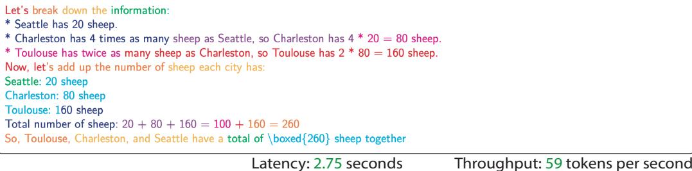
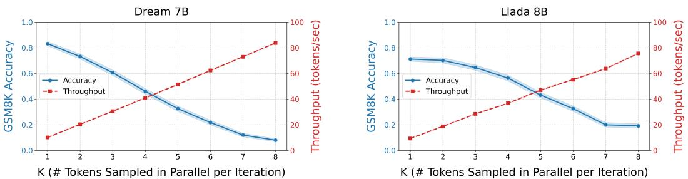
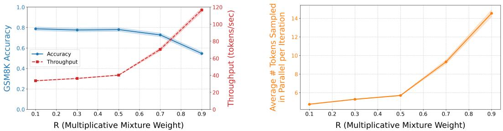
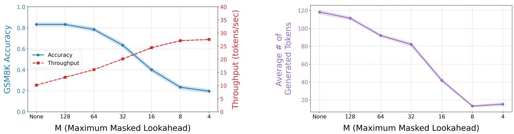
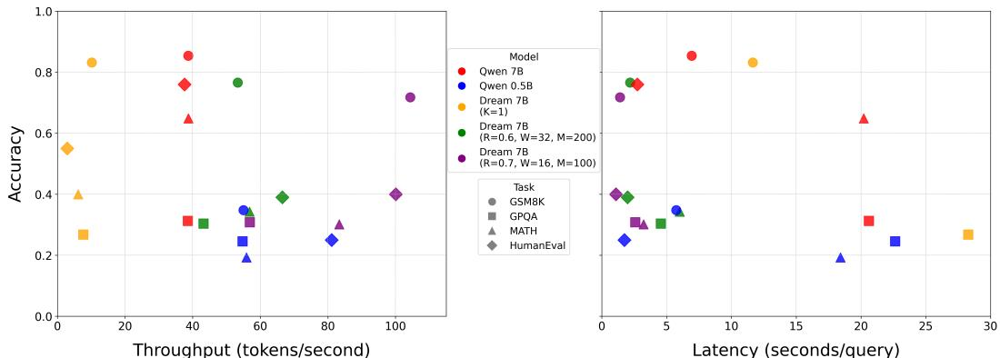
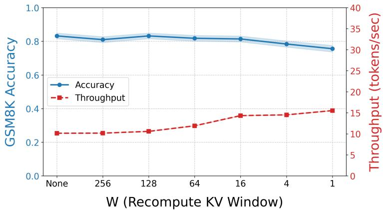

# Accelerating Diffusion LLMs via Adaptive Parallel Decoding

Daniel Israel Department of Computer Science University of California, Los Angeles disrael@cs.ucla.edu

Guy Van den Broeck Department of Computer Science University of California, Los Angeles guyvdb@cs.ucla.edu

Aditya Grover Department of Computer Science University of California, Los Angeles adityag@cs.ucla.edu

# Abstract

The generation speed of current LLMs is bottlenecked by autoregressive decoding, where tokens are predicted sequentially one by one. Alternatively, diffusion large language models (dLLMs) theoretically allow for parallel token generation, but in practice struggle to achieve the speed of autoregressive models without significantly sacrificing quality. We therefore introduce adaptive parallel decoding (APD), a novel method that dynamically adjusts the number of tokens sampled in parallel. We achieve this by defining a multiplicative mixture between the dLLM marginal probabilities and the joint probability of sequences under a small auxiliary autoregressive model. This inverts the standard setup of speculative decoding, where the goal is to sample from a large autoregressive verifier by drafting from a smaller model. We further optimize APD by enabling KV caching and limiting the size of the masked input. Altogether, our method puts forward three tunable parameters to flexibly tradeoff throughput and quality. We show that APD provides markedly higher throughput with minimal quality degradations on downstream benchmarks.

# 1 Introduction

Large language models (LLMs) have remarkable text generation capabilities and have attracted evergrowing interest and widespread adoption. However, a significant impediment to their deployment lies in the speed of text generation [43]. The dominant paradigm, autoregressive models [32], generates tokens one by one in a sequential manner. While this approach has yielded state-of-the-art results in terms of quality, the inherent sequentiality of generation limits throughput and hinders real-time applications, especially as models continue to scale in size [19]. In addition, the recent phenomenon of test-time scaling [35] and reasoning models [13] suggest that generation speed will be an important bottleneck for increasing LLM capabilities. This challenge has spurred research into alternative approaches beyond autoregressive sequential sampling.

One promising alternative to purely sequential generation is offered by diffusion large language models (dLLMs) [42]. These models, inspired by successes in image generation [36], theoretically permit the parallel generation of multiple tokens simultaneously, offering a path towards significantly faster inference. In this work, we challenge the assumption that dLLMs, exemplified by the opensource models Dream [41] and Llada [29], can be practically used for parallel generation without additional modifications. We find that the quality of these models is best achieved by generating tokens one at a time (one timestep per token), and attempts to exploit the parallelizability of diffusion

# Prompt

ToulousehastwiceasmanysheeasCharleston.Charlestonhas4timesasmanysheeasSeatle.HowmanysheepdoToulouseCharleston and Seattle have together if Seattle has 20 sheep?

# Autoregressive Decoding

$\backslash ( \textsf { S } \backslash )$ represent the number of sheep in Seattle. 2. According to the problem， Seattle has 20 sheep, so\ $S = 2 0 \setminus$ 3. Charleston has 4 times as many sheep as Seattle. So, let $\textsf { C } \backslash )$ $\begin{array} { r l } { [ } & { { } C = 4 5 = 4 } \end{array}$ $2 0 = 8$ $\backslash ( \textsf { T } \backslash )$ $\begin{array} { r l } { | | } & { { } { \mathsf { T } } = 2 { \mathsf { C } } = 2 } \end{array}$ \times $8 0 = 1 6 0$ $\pmb { \mathsf { T } } + \mathsf { C } + \mathsf { S } = \pmb { 1 6 0 } + \mathsf { 8 0 } \quad \pmb { 2 0 } = 2 6 0 \quad \backslash ]$

Latency: 7.08 seconds Throughput: 37 tokens per second

# Adaptive Parallel Decoding

  
Figure 1: Autoregressive vs Adaptive Parallel Decoding (APD). We visualize a sample from Qwen2.5 7B decoded autoregressively (baseline) and Dream 7B with APD (our method). Contiguous text of the same color indicates tokens sampled in parallel. Here, we show that APD generates the solution much faster than autoregressive sampling, which is sequential and slow.

models suffer a reduction in quality. Thus, current state-of-the-art dLLMs, namely Dream and Llada as currently conceived, fail to match the speed and quality of autoregressive LLMs.

This gap between theoretical and practical performance creates an opportunity for novel decoding mechanisms that can effectively harness the parallel generation capabilities of dLLMs while maintaining high fidelity to the target text distribution. The core challenge is that when sampling multiple tokens in parallel, one only has access to the marginal distribution of each token, which ignores inter-token dependencies [23]. A decoding algorithm that increases parallelism when sampling from dLLM and maintains generation quality must consider the joint distribution that captures these dependencies.

To address this challenge, we introduce Adaptive Parallel Decoding (APD), a novel decoding algorithm designed to dynamically modulate the number of tokens sampled in parallel during the generation process with dLLMs. In APD, we first fix the generation order of the dLLM to be left to right. This unexpected change makes the dLLM autoregressive, but we empirically show that it maintains generation quality and in some cases can improve it. By using the dLLM autoregressively, we can then also use a smaller autoregressive model to determine which subset of tokens sampled in parallel adequately captures joint dependence. Our criterion depends on a multiplicative mixture between the diffusion model and autoregressive model. Note that while speculative decoding uses a large model to verify samples from a small draft model, our task is to use a smaller verification model to check the quality of a larger model. This dynamic leads to a fundamentally new problem statement.

Our contributions extend beyond the conceptual framework of APD. We further optimize the decoding process by incorporating practical improvements to diffusion model sampling such as Key-Value (KV) caching, a technique traditionally associated with autoregressive models [31]. We also gain significant speed by limiting the size of the masked input to the model. These simple changes substantially increase the computational efficiency of diffusion model inference.

Collectively, we introduces three distinct tunable parameters. These parameters provide practitioners with the flexibility to navigate the inherent trade-off between generation throughput and output quality, allowing for tailored configurations that can meet diverse application-specific requirements. This paper will demonstrate that Adaptive Parallel Decoding offers a significant step forward in accelerating dLLM inference (and LLM inference in general). We present empirical evidence showing that APD achieves substantially higher throughput compared to existing LLM decoding strategies, all while incurring only minimal degradations in quality across a range of downstream benchmark tasks. The subsequent sections will discuss the technical details of APD, present a comprehensive set of experiments validating our claims, and discuss the broader implications of our findings for the future of efficient LLM generation.

# 2 Background

In the following sections, we will define notation to be used throughout the paper. We consider a data point as a sequences of $n$ tokens $x = ( x _ { 1 } , . . . , x _ { n } )$ . For sets of indices ${ \mathcal { Q } } , { \mathcal { O } } \subseteq \{ 1 , . . . , n \}$ for which $\mathcal { Q } \cap \mathcal { O } = \emptyset$ , a masked language model $p _ { \mathrm { { D } } } ( \cdot \mid \cdot ; \theta )$ computes the marginal probabilities of tokens with query indices $\mathcal { Q }$ conditioned on tokens with observed indices $\mathcal { O }$ .

$$
p _ { \mathrm { D } } ( x _ { \mathcal { Q } } \mid x _ { \mathcal { O } } ; \theta ) = \prod _ { i \in \mathcal { Q } } p _ { \theta } ( x _ { i } \mid x _ { \mathcal { O } } )
$$

where $p _ { \theta }$ is a learned conditional distribution parameterized by $\theta$ . In this work, a diffusion language model is a masked language model, and these terms can be used interchangeably.

# 2.1 Discrete Diffusion Language Models

Discrete diffusion models [26] have recently emerged as a promising alternative to traditional autoregressive approaches for language generation, offering benefits such as non-autoregressive generation capabilities and inherent iterative refinement [39]. Discrete diffusion models are masked language models [34] trained to reverse a data corruption process $q$ that stochastically converts a clean sequence of tokens $x ^ { 0 }$ to a noisy $x ^ { t }$ , gradually converting clean tokens to [MASK] over time $t$

$$
q _ { t | 0 } ( x _ { i } ^ { t } \mid x _ { i } ^ { 0 } ) = { \left\{ \begin{array} { l l } { t , } & { { \mathrm { i f } } x _ { i } ^ { t } = [ { \mathrm { M A S K } } ] } \\ { 1 - t , } & { { \mathrm { i f } } x _ { i } ^ { t } = x _ { i } ^ { 0 } } \\ { 0 } & { { \mathrm { o t h e r w i s e } } } \end{array} \right. } q _ { t | 0 } ( x ^ { t } \mid x ^ { 0 } ) = \prod _ { i } q _ { t | 0 } ( x _ { i } ^ { t } \mid x _ { i } ^ { 0 } )
$$

Given this noise process, dLLMs are trained to maximize a lower bound on the log-likelihood computed using conditional distributions of clean data [30].

$$
\log p _ { \theta } ( x ^ { 0 } ) \geq \mathbb { E } _ { t \sim U ( 0 , 1 ) , x ^ { t } \sim q ( x ^ { t } | x ^ { 0 } ) } { \frac { 1 } { t } } \left[ \log p _ { \mathrm { D } } \bigl ( x _ { \mathbb { 1 } ( x ^ { t } = \left[ { \mathrm { M A S K } } \right] ) } \mid x _ { \mathbb { 1 } ( x ^ { t } \neq \left[ { \mathrm { M A S K } } \right] ) } ; \theta \bigr ) \right]
$$

While dLLMs are trained in theory to randomly unmask tokens at inference time, in practice decoding heuristics are used to determine the order of tokens to unmask [20]. For example, to achieve the best results, Dream unmasks tokens according to lowest entropy as assessed by the diffusion model at each timestep. Llada performs the best when unmasking according to the highest probability, which is referred to as "confidence" based decoding [29].

In light of these inference time modifications, diffusion language models are able to compete with autoregressive model in terms of generation quality. However, in realistic scenarios, the quality of a generation must be weighed against the speed. When we consider both of these factors, current open-source dLLMs are far from competitive with their open-source autoregressive counterparts. In Table 1, we find that dLLMs can perhaps achieve competitive quality, but their throughput is a fraction of Qwen2.5 7B [40]. Another observation is that in order to achieve competitive performance on GSM8K [6], dLLMs must generate 256 tokens in 256 timesteps, which is actually sequential. We see that decreasing the number of timesteps can increase throughput at the expense of quality. Nonetheless, the throughput will not approach autoregressive speed without drastic reduction in quality. Interestingly, we find the simplest decoding order, just left to right, yields good results in most scenarios, and in the case of GSM8K the best results.

  
Figure 2: Naive Parallel Generation. Fixing the number of tokens $k$ to semi-autoregressively generate (left to right) in parallel per iteration, we observe a clear tradeoff between parallelization and generation quality. This tradeoff exists with open source diffusion models: Dream and Llada.

# 2.2 From Sequential to Parallel Sampling

In this work, we utilize diffusion models with a particular noise schedule: denoising left to right. This is equivalent to sampling autoregressively and can be used to compute an exact autoregressive likelihood.

$$
p _ { \mathrm { A R } } ( x ; \theta ) = \prod _ { i = 1 } ^ { n } p _ { \mathrm { D } } ( x _ { i } \mid x _ { < i } ; \theta )
$$

To further parallelize this process, one can decode multiple tokens at a time semi-autoregressively [38] from groups of size $k$ . Decoding in this manner samples from the following distribution

$$
p _ { \mathtt { S A R } } ( x ; \theta , k ) = \prod _ { i = 1 } ^ { \lfloor ( n - 1 ) / k \rfloor + 1 } p _ { \mathtt { D } } ( x _ { ( i k - k + 1 : i k ) } \mid x _ { < ( i k - k + 1 ) } ; \theta )
$$

where it follows that $p _ { \mathrm { A R } } ( x ; \theta ) = p _ { \mathrm { S A R } } ( x ; \theta , 1 )$ for $k = 1$ . A diffusion model can parallelize the term inside the product by sampling from each marginal distribution independently. Although this will lead to faster generations, the intra-group independence assumption is poor and leads to lower quality generations. We observe this empirically in Figure 2: as we increase the number of tokens sampled at a time, throughput increases, but downstream accuracy decreases. Thus, there exists a tradeoff between parallelization and speed with sample quality. However, instead of fixing $k$ , our core insight is that the number of tokens to generate in parallel can be chosen adaptively. In this work, we argue that doing so significantly reduces the sharp tradeoff between speed and quality.

# 3 Method

# 3.1 Problem Statement

Our goal is to sample from groups $\mathcal { G } = \{ ( s _ { 1 } , e _ { 1 } ) , ( s _ { 2 } , e _ { 2 } ) , . . . , ( s _ { l } , e _ { l } ) \}$ where $( s _ { i } , e _ { i } )$ is a tuple that denotes start and end indices inclusive and $e _ { i } + 1 = s _ { i + 1 }$ for all $i$ . Note that Equation 5 is a special

Table 1: dLLM Quality and Throughput with Different Decoding Approaches   

<table><tr><td>Model</td><td>GMS8K Accuracy</td><td>Throughput (tokens/sec)</td></tr><tr><td>Dream 7B 3 (Random,256 Steps)</td><td>0.404 ± 0.021</td><td>3.31 ± 0.068</td></tr><tr><td>Dream 7B (Entropy,128 Steps)</td><td>0.708 ± 0.020</td><td>7.57 ± 0.157</td></tr><tr><td>Dream 7B (Entropy,256 Steps)</td><td>0.804 ± 0.017</td><td>4.28 ± 0.080</td></tr><tr><td>Dream 7B (Left to Right,256 Steps)</td><td>0.832 ± 0.016</td><td>10.1 ± 0.015</td></tr><tr><td>Llada 8B (Random, 256 Steps)</td><td>0.456 ± 0.022</td><td>5.07 ± 0.168</td></tr><tr><td>Llada 8B (Confidence,128 Steps)</td><td>0.526 ± 0.022</td><td>13.6 ± 0.284</td></tr><tr><td>Llada 8B (Confidence,256 Steps)</td><td>0.534 ± 0.022</td><td>6.63 ± 0.143</td></tr><tr><td>Llada 8B (Left to Right, 256 Steps)</td><td>0.712 ± 0.020</td><td>9.33 ± 0.016</td></tr><tr><td>Qwen2.5 7B (Autoregressive)</td><td>0.854 ± 0.015</td><td>38.6 ± 0.004</td></tr></table>

case where $\mathcal { G } = \{ ( 1 , k ) , ( k + 1 , 2 k + 1 ) , . . . , ( n - k , n ) \}$ We shall sample from

$$
p _ { \mathrm { A P D } } ( x ; \theta , \mathcal { G } ) = \prod _ { ( s , e ) \in G } p _ { \mathrm { D } } ( x _ { s : e } \mid x _ { < s } )
$$

In choosing $\mathcal { G }$ , we must balance the following two goals — (1) Speed: minimize $| \mathcal G |$ and (2) Quality: minimize the distance between $p _ { \mathrm { A P D } }$ and $p _ { \mathrm { A R } }$ .

Achieving only one out of two goals is trivial. For maximum speed, we can sample from all the marginals of the diffusion model in one shot such that $\mathcal { G } = \{ ( 1 , n ) \}$ and $| \mathcal { G } | = 1$ . This would result in a significant drop in quality. In fact, the drop in quality can be quantified by mutual information

$$
I _ { p _ { \mathrm { A R } } } ( x ; \theta ) = \mathrm { K L } ( p _ { \mathrm { A R } } ( x _ { 1 : n } ; \theta ) \parallel p _ { \mathrm { D } } ( x _ { 1 : n } ; \theta ) )
$$

Alternatively, we can set ${ \mathcal { G } } = \{ ( 1 , 1 ) . . . ( n , n ) \}$ , in which case $| { \mathcal { G } } | = n$ and $p _ { \mathrm { A P D } } = p _ { \mathrm { A R } }$ . This is very slow because it maximizes the number of sequential iterations. For architectural reasons to be discussed in Section 3.3, it is also very slow to sample autoregressively from a diffusion model because it cannot perform KV caching. This architectural difference distinguishes our problem setting from speculative decoding [22], because computing an autoregressive likelihood in a diffusion model is slow and sequential, whereas in an autoregressive model it is fast and parallelizable. While speculative decoding does not map onto our problem, we shall argue that adaptive parallel decoding achieves both goals together.

# 3.2 Adaptive Parallel Decoding

In adaptive parallel decoding, we assume to have access to a small autoregressive model $\hat { p } _ { \mathrm { A R } }$ that can compute the likelihood of sequences in parallel. While $p _ { \mathrm { D } }$ only computes marginal probabilities over tokens, $\hat { p } _ { \mathrm { A R } }$ computes a joint probability, allowing it to model dependencies between tokens. For brevity, we shall omit model parameters $\theta$ .

To select $\mathcal { G }$ , we shall focus our analysis on a subproblem. Given samples $\hat { x } _ { t } , . . . , \hat { x } _ { n } \sim p _ { \mathrm { D } } ( . ~ | ~ x _ { < t } )$ , we must select $k$ such that $\hat { x } _ { t : t + k }$ are close to $p _ { \mathrm { A R } }$ . We do not have access to $p _ { \mathrm { A R } }$ because evaluating its likelihood for each token will give us the worst-case speed. Instead, we have access to a small, inaccurate model $\hat { p } _ { \mathrm { A R } }$ that can quickly evaluate likelihood in parallel. To approximate $p _ { \mathrm { A R } }$ , we shall define a target distribution which we use to determine how many tokens $k$ are accepted. This target distribution $p _ { T }$ should satisfy the following desiderata:

$$
\begin{array} { r } { \hat { p } _ { \mathrm { A R } } ( X = c ) < 1 , \mathrm { t h e n } p _ { T } ( X = c ) = 1 } \\ { \hat { p } _ { \mathrm { A R } } ( X = c ) = 1 , \mathrm { t h e n } p _ { T } ( X = c ) = 1 } \end{array}
$$

Property (1) follows from the fact that $\begin{array} { r } { p _ { \mathrm { A R } } ( x _ { 1 : k } ) \geq \sum _ { i = 1 } ^ { k } p _ { \mathrm { D } } ( x _ { i } ) - k + 1 } \end{array}$ by Bonferroni’s inequality [10], which means if $p _ { \mathrm { D } } ( x _ { i } ) = 1$ for all $i$ , then $p _ { \mathsf { A R } } ( x _ { 1 : k } ) = 1$ . Put verbally, if the marginals given by the diffusion model are 1, its joint distribution or $p _ { \mathrm { A R } }$ will also have probability 1. Property (2) is difficult to justify formally because we do not have a relationship between $p _ { \mathrm { A R } }$ and $\hat { p } _ { \mathrm { A R } }$ . Assuming $\hat { p } _ { \mathrm { A R } }$ reasonably approximates the joint distribution, property (2) is a desirable heuristic because a token with joint probability 1 should be accepted.

A multiplicative mixture of distributions, also known as a product of experts [16], fulfills the two requirements above. We define the multiplicative mixture of $p _ { \mathrm { { D } } }$ and $\hat { p } _ { \mathrm { A R } }$ as follows

$$
p _ { T } ( x ) = { \frac { 1 } { Z } } p _ { \mathrm { D } } ( x ) ^ { R } { \hat { p } } _ { \mathrm { A R } } ( x ) ^ { 1 - R }
$$

where $Z$ is the normalizing constant. Our mixture is defined in terms of a hyperparameter $R \in [ 0 , 1 ]$ . When it is high, it gives the diffusion model more weight. We may now give an accept criteria based on target distribution $p _ { T }$ . We adopt an accept criteria similar to existing parallel sampling methods based on universal coupling [1]. Formally, a universal coupler is a function $g$ which for a distribution $p$ and source of randomness $r$ satisfies

$$
\mathbb { P } _ { r \sim U [ 0 , 1 ] } ( g ( p , r ) = x ) = p ( x )
$$

For categorical distributions, the Gumbel-Softmax Trick [18] is a universal coupler [1]. An important property of a universal coupler is that for two distributions $p , p ^ { \prime }$ , their samples from a universal

# Algorithm 1 Adaptive Parallel Decoding

1: Input: Diffusion model $p _ { \mathrm { { D } } }$ , Autoregressive model $\hat { p } _ { \mathrm { A R } }$ , Mixture Weight Parameter $R$ , Maximum   
sequence length $n$   
2: Output: Generated token sequence $x$   
3: $x \gets ( )$ $\triangleright$ Stores the accepted tokens   
4: $t \gets 1$ $\triangleright$ Index of token to generate   
5: while $t \leq n$ do   
6: 7: $\begin{array} { r l r }   { \begin{array} { r l } { \mathrm { m a r g i n a l \_ 1 - l o g i t s } _ { t : n } \gets p _ { \mathrm { D } } ( x _ { t : n } \mid x _ { < t } ) } } \\ & { r \gets \mathrm { G u m b e l } ( 0 , 1 ) } \\ & { { \boldsymbol \hat { x } } _ { t : n } \gets \mathrm { s a m p l e } \mathsf { 1 } _ { 0 } } \\ & { \mathtt { j o i n t \_ \_ l o g i t s } _ { t : n } \gets \hat { p } _ { \mathrm { A R } } ( \hat { x } _ { t : n } \mid x _ { < t } ) } \\ & { \operatorname { p r o d u c t \_ l o g i t s } _ { t : n } \gets \hat { \mathsf { e } } _ { \mathrm { A } } ( \hat { x } _ { t : n } \le x _ { 0 } \le \operatorname { i n a l \_ 1 - l o g i t s } _ { t : n } + ( 1 - R ) * \operatorname { j o i n t \_ \_ l o g i t s } _ { t : n } ) } \\ & { \operatorname { p r o d u c t \_ l o g i t s } _ { t : n } \gets \operatorname { s o f t m e a x t } _ { - \_ { \mathrm { a } } \ge \mathrm { b a r g \_ i t s a n \_ r } } } \\ & { { \hat { \boldsymbol \gamma } _ { t : n } \gets \mathrm { s a m p l e } \_ { \mathrm { g u m \_ b e l } } ( \operatorname { p r o d u c t \_ 1 - l o g i t s } _ { t : n } , r ) } \\ & { k \gets \operatorname { s u m } ( \mathrm { c u m p r o d } ( \hat { x } _ { t + 1 : n } = \hat { y } _ { t + 1 : n } ) ) + 1 } & { \mathrm { s \ a p p e n d \ a c c e p t e d \ t o k e n s } } \\ & { x \gets \operatorname { c o n c a t } ( x , \hat { x } _ { t : t + k - 1 } ) } & { \mathrm { ~ } } \\ & { t \gets t + k } \end{array} } & \end{array}$   
8:   
9:   
10:   
11:   
12:   
13:   
14:   
15: end while   
16: return $x$

coupler with a shared source of randomness are likely to be the same given that the distributions $p$ and $p ^ { \prime }$ are similar [21].

$$
\mathbb { P } _ { r } ( g ( p , r ) \neq g ( p ^ { \prime } , r ) ) \neq 2 \operatorname { T V } ( p , p ^ { \prime } )
$$

where TV is total variation distance. Thus, in our algorithm we sample from the diffusion model using the Gumbel-Softmax trick as a universal coupler $g$ and source of randomness $r \colon \hat { x } _ { t } , . . . , \hat { x } _ { n } \sim g ( p _ { \mathrm { D } } , r )$ . We then sample from our target: $\hat { y } _ { t } , . . . , \hat { y } _ { n } \sim g ( p _ { T } , r )$ , and we accept all tokens that are the same between $\hat { y } _ { i }$ and ${ \hat { x } } _ { i }$ until the first disagreement. Because the goal is to sample from $p _ { \mathrm { A R } }$ , we always accept the first proposed token $\hat { x } _ { t }$ . The full algorithm is given in Algorithm 1. While the same algorithm is valid even when using different Gumbel randomness to sample from the target and proposal distributions, intuitively using the same randomness will maximize the number of accepted tokens.

Algorithm 1 provides a sampling procedure which takes as input a diffusion model $p _ { \mathrm { D } }$ , a small autoregressive model $\hat { p } _ { \mathrm { A R } }$ , and tunable parameter $R \in [ 0 , 1 ]$ . When $R = 1$ , the target distribution is $p _ { \mathrm { D } }$ and the algorithm will accept every token from the diffusion model in one shot. When $R = 0$ , the algorithm does not “trust" the diffusion model and instead only accepts tokens that $\hat { p } _ { \mathrm { A R } }$ accepts.

Our sampling algorithm is agnostic to the implementation of $p _ { \mathrm { D } }$ and $\hat { p } _ { \mathrm { A R } }$ , but in practice architectural optimizations are used for additional speed. For example, when computing the joint logits of the autoregressive model, we can use KV caching [31] to avoid redundant computation on $t$ previous tokens. The only requirement for $p _ { \mathrm { D } }$ is that it can draw samples from the marginal distributions of the suffix in parallel. However, if we consider that the implementation of $p _ { \mathrm { D } }$ is a Transformer-based masked language model, further speedups can be achieved.

# 3.3 Recompute KV Window

In our above method, we center sampling parallel as the primary way to improve decoding speed. However, overall we aim to maximize the throughput of diffusion models by all means necessary, so we also must consider architectural factors. We enable KV caching for tokens outside a sliding window of size $W$ . For a detailed explanation of KV caching, see Appendix B. Although KV caching with a diffusion model trained with bidirectional masking can induce arbitrary out-of-distribution behavior, empirically we observe very little performance degradation (Appendix B). The intuitive reason is that tokens sufficiently far from the rightmost token will have small attention weight, so inaccuracies in their KV will not dramatically change the overall attention computation.

# 3.4 Maximum Masked Lookahead

Because we are sampling from a diffusion model left to right autoregressively, we can exploit the fact that the input will contain a large block of contiguous [MASK] tokens as the suffix. The simple fix is to set a maximum length $M$ for this suffix. Because the attention computation has $O ( n ^ { 2 } )$ complexity, decreasing the size of the input can lead to significant speed improvements. Unfortunately, the size of the masked lookahead $M$ can change the output distribution by changing the probability of the end of sentence token [EOS]. Empirically, the maximum masked lookahead $M$ can be tuned to gain significant speedup with minimal quality loss.

  
Figure 3: Multiplicative Mixture Weight. In Adaptive Parallel Decoding (APD), smaller $R$ values result in fewer parallel tokens per iteration but maintain high quality. In particular, we achieve a far better tradeoff compared to naively parallelizing semi-autoregressively. Notably, generating over 5 tokens per iteration on average is possible with APD while maintaining ${ \sim } 8 0 \%$ accuracy on GSM8K. At the expense of some quality, even over 100 tokens per second is possible.

# 4 Experiments

In our method, we define three tunable parameters, which we will briefly summarize:

1. Multiplicative Mixture Weight $R$ : Higher results in higher throughput, lower quality   
2. Recompute KV Window $W$ : Lower results in higher throughput, lower quality   
3. Maximum Masked Lookahead $M$ : Lower results in higher throughput, lower quality

Our experimental goal is to empirically analyze the tradeoff in speed and generation quality as these parameters vary.

# 4.1 Implementation

In our experiments, we use Dream 7B Instruct [41] as the diffusion model $p _ { \mathrm { { D } } }$ and Qwen2.5 0.5B [40] as the approximate autoregressive model $\hat { p } _ { \mathrm { A R } }$ . Both models have demonstrated impressive capabilities on math, science, and reasoning benchmarks. Conveniently, Dream 7B is a diffusion model that has been distilled from Qwen2.5 7B, so it is more likely to have distributional overlap with Qwen2.5 0.5B. These models satisfy another prerequisite; they share the same tokenizer. Although our method is theoretically applicable to Llada 7B, which exhibits strong left to right generation capabilities, Llada 7B is trained with a non-standard tokenizer that no existing autoregressive model utilizes.

# 4.2 Experimental Configuration

For the following experiments, we load the models in BF16 precision and run them on single NVIDIA 24GB A5000 GPU connected to a Colfax CX41060s-EK9 4U Rackmount Server with AMD EPYC (Genoa) 9124 processors. We operate using the LM Evaluation Harness [11] standard implementation of benchmarks with a few modifications and evaluate on GSM8K [6], GPQA [33], and MATH [15], and HumanEval [4]. See Appendix C for precise details.

# 4.3 Tradeoffs

For analyzing tradeoffs, we vary each parameter in isolation to measure the impact of each on performance. In later experiments, we plot configurations of the parameters jointly. Each plot shows the Grade School Math 8K (GSM8K) [6] accuracy with 500 samples, and the throughput measured by number of tokens generated divided by generation time. We measure the standard error of throughput and accuracy with respect to the variation in samples, i.e. different math problem.

  
Figure 4: Maximum Masked Lookahead. We illustrate the trade-off between speed and quality when adjusting the maximum masked lookahead $( M )$ . Decreasing $M$ can significantly increase throughput (speed) but it will also reduce quality by shortening the generation length. Thus, this parameter should not be made excessively small.

Figure 3 shows that as we vary the multiplicative mixture weight $R$ , we achieve a range of speed, quality outcomes. We see for small $R$ , we accept fewer tokens per iteration but maintain high quality. Remarkably, it is possible to generate over 5 tokens an iteration on average and achieve close to the same accuracy as generating 1 token per iteration. As we increase $R$ , the accuracy drops but not drastically. Constrast this with Figure 2, where increasing the number of tokens sampled in parallel leads to a precipitous drop in generation quality. With our method, by dynamically choosing when to sample from the diffusion model in parallel, we are able to achieve much higher token acceptance rates without losing generation quality. In Table 2, we track statistics of APD and find that the parallel acceptance rate is high.

We also analyze the impact of changing the recompute KV window $W$ for left to right autoregressive generation from the diffusion model, sampling with with $p _ { \mathrm { A R } }$ (the same as $K = 1$ ). In Figure 6 (Appendix B), we observe the same relationship between accuracy and throughput, but the tradeoff is not as strong. As we decrease the window $W$ , we can achieve a nontrivial speedup at almost no expense to quality.

Finally, we examine the speed-quality throughput exhibited by altering the maximum masked lookahead $M$ . We again observe that there is no free lunch that can increase speed with zero degradations in quality. In this case, we find that decreasing $M$ increases throughput but can significantly alter quality by virtue of the fact that the generation length decreases. In general, works have shown a relationship between increased "thinking time" (the number of generated tokens) and reasoning strength [27]. Thus, changing the output distribution of $p _ { \mathrm { D } }$ in this way can damage generation quality, especially for complex reasoning tasks.

All together, the parameters in question each exhibit a unique tradeoff between speed and quality. We believe giving the user or practitioner more flexibility to balance these factors at inference time is an undoubted strength of our approach.

# 4.4 Pareto Frontier

The Pareto frontier characterizes the set of optimal configurations when faced with the inherent trade-off between two or more conflicting objectives, which in the case of LLM inference is speed and quality. A specific LLM configuration is considered Pareto optimal [25] if it is impossible to improve its performance in one objective without simultaneously incurring a detrimental effect on another objective, such as increased latency. The Pareto frontier is, therefore, the collection of all such non-dominated configurations, representing the attainable boundary of performance.

Table 2: APD Generation Statistics. Mean number of tokens sampled in parallel.   

<table><tr><td>Model</td><td>GMS8K</td><td>GPQA</td><td>MATH</td></tr><tr><td>Dream 7B (R= 0.7,W = 16,M= 100)</td><td>7.62 ± 0.14</td><td>4.35 ± 0.03</td><td>6.45 ± 0.04</td></tr><tr><td>Dream 7B(R= 0.6,W = 32,M= 200)</td><td>5.75 ± 0.05</td><td>4.31 ± 0.02</td><td>6.33 ± 0.03</td></tr></table>

  
Figure 5: The Pareto Frontier. Dream 7B configured with ADP achieves substantially higher speeds with negligible impact on performance compared to the $K = 1$ base model. Notably, Dream with ADP surpasses the speed of autoregressive Qwen 7B and even Qwen 0.5B. This establishes Dream with ADP as Pareto-optimal, as no other model configuration is superior in both speed and quality. We show two hyperparameter configurations of APD, showing that we can flexibly tradeoff speed and quality.

In Figure 5, we show this frontier over several tasks and model configurations. Dream 7B ( $K = 1$ ) is a naive baseline that decodes one token at a time, and it therefore occupies low throughput and high density regions. According to our previous assumptions, it will also upper bound the quality of Dream with other decoding parameters. We observe that Dream 7B with our configuration of parameters given by ADP, achieves much greater speed with minimal performance degradation from the base $K = 1$ performance. We also find that Dream with ADP is faster than the autoregressive Qwen 7B and even Qwen 0.5B. Note that if Qwen 7B used speculative decoding with a Qwen 0.5B draft model, it will still never exceed the throughput of ADP. Thus, Dream with ADP is Pareto-optimal, because no model can dominate it in speed and quality. Similar to throughput, ADP is also much faster in terms of latency. Diffusion models benefit from the fact that they generate fewer tokens to stay within a fixed context window, while autoregressive models can generate much longer reasoning traces that may ramble and not improve quality.

# 4.5 Qualitative Examples

Though we evaluate on standard benchmarks, APD can also quickly generate for more open-ended tasks. In Appendix D, we show examples with average number of parallelized tokens on a dataset of persuasive writing prompts [8].

# 5 Related Work

Several works propose architectural modifications to LLMs to enable multi-token prediction: MaskPredict [12], Medusa [3], and DynaMo [37]. While these works are promising, our focus is multitoken prediction in dLLMs. Other recent works seek to improve dLLM speed. For example, block diffusion [2] enables KV caching, but requires training, unlike our method. Discrete copula diffusion [23] is an inference time method that aims to reduces the number of denoising steps required, but does not offer a tunable speed, quality tradeoff. More generally, algorithmic approaches to speeding up LLM inference include cascades [28], lookahead decoding [9], and speculative decoding [28], which are methods that are generally only applicable in autoregressive models. Building on speculative decoding, works have used different architectures as the draft model including any-order autoregressive models [14] and dLLMs [5]. We emphasize that using a large dLLM to draft in parallel presents fundamentally distinct challenges that are not solved with speculative decoding. Finally, we highlight that quantization is another promising and orthogonal approach for offering a strong speed quality tradeoff in LLMs [24, 7].

# 6 Conclusion

In this work, we pursue the significant challenge of increasing inference speed in large language models. We introduced Adaptive Parallel Decoding (APD), a novel algorithm that enables substantially faster sampling from dLLMs. APD uniquely restructures the dLLM into a left-to-right autoregressive process and leverages a smaller autoregressive model to assess the quality of parallel-generated token candidates. Complemented by optimizations such as KV caching and limited masked inputs, APD offers tunable parameters that allow a flexible trade-off between generation speed and output quality. This research offers a significant advancement in making dLLMs a more viable and efficient alternative for fast text generation.

# 7 Acknowledgment

Special thanks to Oliver Broadrick, who played an important role in brainstorming. This work was funded in part by the DARPA ANSR, CODORD, and SAFRON programs under awards FA8750- 23-2-0004, HR00112590089, and HR00112530141, NSF grant IIS1943641, and gifts from Adobe Research, Cisco Research, and Amazon. We also received funding from NSF CAREER Grant #2341040, Schmidt Sciences Early Career Fellowship, and Okawa Foundation Research Award. Approved for public release; distribution is unlimited.

References   
[1] Nima Anari, Ruiquan Gao, and Aviad Rubinstein. Parallel sampling via counting. In Proceedings of the 56th Annual ACM Symposium on Theory of Computing, pages 537–548, 2024.   
[2] Marianne Arriola, Aaron Gokaslan, Justin T Chiu, Zhihan Yang, Zhixuan Qi, Jiaqi Han, Subham Sekhar Sahoo, and Volodymyr Kuleshov. Block diffusion: Interpolating between autoregressive and diffusion language models. arXiv preprint arXiv:2503.09573, 2025.   
[3] Tianle Cai, Yuhong Li, Zhengyang Geng, Hongwu Peng, Jason D Lee, Deming Chen, and Tri Dao. Medusa: Simple llm inference acceleration framework with multiple decoding heads. arXiv preprint arXiv:2401.10774, 2024.   
[4] Mark Chen, Jerry Tworek, Heewoo Jun, Qiming Yuan, Henrique Ponde De Oliveira Pinto, Jared Kaplan, Harri Edwards, Yuri Burda, Nicholas Joseph, Greg Brockman, et al. Evaluating large language models trained on code. arXiv preprint arXiv:2107.03374, 2021.   
[5] Jacob K Christopher, Brian R Bartoldson, Tal Ben-Nun, Michael Cardei, Bhavya Kailkhura, and Ferdinando Fioretto. Speculative diffusion decoding: Accelerating language generation through diffusion. arXiv preprint arXiv:2408.05636, 2024.   
[6] Karl Cobbe, Vineet Kosaraju, Mohammad Bavarian, Mark Chen, Heewoo Jun, Lukasz Kaiser, Matthias Plappert, Jerry Tworek, Jacob Hilton, Reiichiro Nakano, Christopher Hesse, and John Schulman. Training verifiers to solve math word problems. arXiv preprint arXiv:2110.14168, 2021.   
[7] Tim Dettmers and Luke Zettlemoyer. The case for 4-bit precision: k-bit inference scaling laws. In International Conference on Machine Learning, pages 7750–7774. PMLR, 2023.   
[8] Esin Durmus, Liane Lovitt, Alex Tamkin, Stuart Ritchie, Jack Clark, and Deep Ganguli. Measuring the persuasiveness of language models, 2024.   
[9] Yichao Fu, Peter Bailis, Ion Stoica, and Hao Zhang. Break the sequential dependency of llm inference using lookahead decoding. arXiv preprint arXiv:2402.02057, 2024.   
[10] Janos Galambos. Bonferroni inequalities. The Annals of Probability, pages 577–581, 1977.   
[11] Leo Gao, Jonathan Tow, Baber Abbasi, Stella Biderman, Sid Black, Anthony DiPofi, Charles Foster, Laurence Golding, Jeffrey Hsu, Alain Le Noac’h, Haonan Li, Kyle McDonell, Niklas Muennighoff, Chris Ociepa, Jason Phang, Laria Reynolds, Hailey Schoelkopf, Aviya Skowron, Lintang Sutawika, Eric Tang, Anish Thite, Ben Wang, Kevin Wang, and Andy Zou. The language model evaluation harness, 07 2024.   
[12] Marjan Ghazvininejad, Omer Levy, Yinhan Liu, and Luke Zettlemoyer. Mask-predict: Parallel decoding of conditional masked language models. arXiv preprint arXiv:1904.09324, 2019.   
[13] Daya Guo, Dejian Yang, Haowei Zhang, Junxiao Song, Ruoyu Zhang, Runxin Xu, Qihao Zhu, Shirong Ma, Peiyi Wang, Xiao Bi, et al. Deepseek-r1: Incentivizing reasoning capability in llms via reinforcement learning. arXiv preprint arXiv:2501.12948, 2025.   
[14] Gabe Guo and Stefano Ermon. Reviving any-subset autoregressive models with principled parallel sampling and speculative decoding. arXiv preprint arXiv:2504.20456, 2025.   
[15] Dan Hendrycks, Collin Burns, Saurav Kadavath, Akul Arora, Steven Basart, Eric Tang, Dawn Song, and Jacob Steinhardt. Measuring mathematical problem solving with the math dataset. NeurIPS, 2021.   
[16] Geoffrey E Hinton. Products of experts. In 1999 ninth international conference on artificial neural networks ICANN 99.(Conf. Publ. No. 470), volume 1, pages 1–6. IET, 1999.   
[17] Daniel Israel, Aditya Grover, and Guy Van den Broeck. Enabling autoregressive models to fill in masked tokens, 2025.   
[18] Eric Jang, Shixiang Gu, and Ben Poole. Categorical reparameterization with gumbel-softmax. arXiv preprint arXiv:1611.01144, 2016.   
[19] Jared Kaplan, Sam McCandlish, Tom Henighan, Tom B Brown, Benjamin Chess, Rewon Child, Scott Gray, Alec Radford, Jeffrey Wu, and Dario Amodei. Scaling laws for neural language models. arXiv preprint arXiv:2001.08361, 2020.   
[20] Jaeyeon Kim, Kulin Shah, Vasilis Kontonis, Sham Kakade, and Sitan Chen. Train for the worst, plan for the best: Understanding token ordering in masked diffusions. arXiv preprint arXiv:2502.06768, 2025.   
[21] Jon Kleinberg and Eva Tardos. Approximation algorithms for classification problems with pairwise relationships: Metric labeling and markov random fields. Journal of the ACM (JACM), 49(5):616–639, 2002.   
[22] Yaniv Leviathan, Matan Kalman, and Yossi Matias. Fast inference from transformers via speculative decoding. In International Conference on Machine Learning, pages 19274–19286. PMLR, 2023.   
[23] Anji Liu, Oliver Broadrick, Mathias Niepert, and Guy Van den Broeck. Discrete copula diffusion. arXiv preprint arXiv:2410.01949, 2024.   
[24] Zechun Liu, Changsheng Zhao, Hanxian Huang, Sijia Chen, Jing Zhang, Jiawei Zhao, Scott Roy, Lisa Jin, Yunyang Xiong, Yangyang Shi, et al. Paretoq: Scaling laws in extremely low-bit llm quantization. arXiv preprint arXiv:2502.02631, 2025.   
[25] Alexander V Lotov and Kaisa Miettinen. Visualizing the pareto frontier. In Multiobjective optimization: interactive and evolutionary approaches, pages 213–243. Springer, 2008.   
[26] Aaron Lou, Chenlin Meng, and Stefano Ermon. Discrete diffusion language modeling by estimating the ratios of the data distribution. 2023.   
[27] Niklas Muennighoff, Zitong Yang, Weijia Shi, Xiang Lisa Li, Li Fei-Fei, Hannaneh Hajishirzi, Luke Zettlemoyer, Percy Liang, Emmanuel Candès, and Tatsunori Hashimoto. s1: Simple test-time scaling, 2025.   
[28] Harikrishna Narasimhan, Wittawat Jitkrittum, Ankit Singh Rawat, Seungyeon Kim, Neha Gupta, Aditya Krishna Menon, and Sanjiv Kumar. Faster cascades via speculative decoding. arXiv preprint arXiv:2405.19261, 2024.   
[29] Shen Nie, Fengqi Zhu, Zebin You, Xiaolu Zhang, Jingyang Ou, Jun Hu, Jun Zhou, Yankai Lin, Ji-Rong Wen, and Chongxuan Li. Large language diffusion models. arXiv preprint arXiv:2502.09992, 2025.   
[30] Jingyang Ou, Shen Nie, Kaiwen Xue, Fengqi Zhu, Jiacheng Sun, Zhenguo Li, and Chongxuan Li. Your absorbing discrete diffusion secretly models the conditional distributions of clean data. arXiv preprint arXiv:2406.03736, 2024.   
[31] Reiner Pope, Sholto Douglas, Aakanksha Chowdhery, Jacob Devlin, James Bradbury, Anselm Levskaya, Jonathan Heek, Kefan Xiao, Shivani Agrawal, and Jeff Dean. Efficiently scaling transformer inference, 2022.   
[32] Alec Radford, Jeffrey Wu, Rewon Child, David Luan, Dario Amodei, Ilya Sutskever, et al. Language models are unsupervised multitask learners. OpenAI blog, 1(8):9, 2019.   
[33] David Rein, Betty Li Hou, Asa Cooper Stickland, Jackson Petty, Richard Yuanzhe Pang, Julien Dirani, Julian Michael, and Samuel R. Bowman. Gpqa: A graduate-level google-proof qa benchmark, 2023.   
[34] Subham Sahoo, Marianne Arriola, Yair Schiff, Aaron Gokaslan, Edgar Marroquin, Justin Chiu, Alexander Rush, and Volodymyr Kuleshov. Simple and effective masked diffusion language models. Advances in Neural Information Processing Systems, 37:130136–130184, 2024.   
[35] Charlie Snell, Jaehoon Lee, Kelvin Xu, and Aviral Kumar. Scaling llm test-time compute optimally can be more effective than scaling model parameters. arXiv preprint arXiv:2408.03314, 2024.   
[36] Jascha Sohl-Dickstein, Eric Weiss, Niru Maheswaranathan, and Surya Ganguli. Deep unsupervised learning using nonequilibrium thermodynamics. In International conference on machine learning, pages 2256–2265. pmlr, 2015.   
[37] Shikhar Tuli, Chi-Heng Lin, Yen-Chang Hsu, Niraj Jha, Yilin Shen, and Hongxia Jin. DynaMo: Accelerating language model inference with dynamic multi-token sampling. In Kevin Duh, Helena Gomez, and Steven Bethard, editors, Proceedings of the 2024 Conference of the North American Chapter of the Association for Computational Linguistics: Human Language Technologies (Volume 1: Long Papers), pages 3322–3345, Mexico City, Mexico, June 2024. Association for Computational Linguistics.   
[38] Chunqi Wang, Ji Zhang, and Haiqing Chen. Semi-autoregressive neural machine translation, 2018.   
[39] Guanghan Wang, Yair Schiff, Subham Sekhar Sahoo, and Volodymyr Kuleshov. Remasking discrete diffusion models with inference-time scaling. arXiv preprint arXiv:2503.00307, 2025.   
[40] An Yang, Baosong Yang, Beichen Zhang, Binyuan Hui, Bo Zheng, Bowen Yu, Chengyuan Li, Dayiheng Liu, Fei Huang, Haoran Wei, et al. Qwen2. 5 technical report. arXiv preprint arXiv:2412.15115, 2024.   
[41] Jiacheng Ye, Zhihui Xie, Lin Zheng, Jiahui Gao, Zirui Wu, Xin Jiang, Zhenguo Li, and Lingpeng Kong. Dream 7b, 2025.   
[42] Siyan Zhao, Devaansh Gupta, Qinqing Zheng, and Aditya Grover. d1: Scaling reasoning in diffusion large language models via reinforcement learning, 2025.   
[43] Zixuan Zhou, Xuefei Ning, Ke Hong, Tianyu Fu, Jiaming Xu, Shiyao Li, Yuming Lou, Luning Wang, Zhihang Yuan, Xiuhong Li, Shengen Yan, Guohao Dai, Xiao-Ping Zhang, Yuhan Dong, and Yu Wang. A survey on efficient inference for large language models, 2024.

# A Limitations

Adaptive Parallel Decoding offers a tradeoff, not a free lunch. Higher throughput will lead to lower quality, which is a limitation. We also do not claim to improve over the base diffusion model that we are sampling from. If Dream 7B is weak in a particular domain, our method will also perform poorly.

# B Recompute KV Tradeoff

A major architectural difference between diffusion language models and autoregressive models is that diffusion models are trained with a bidirectional attention mask to predict masked tokens [17], and autoregressive models are trained to predict the next token with a causal mask. Because of this fundamental difference, autoregressive models have an invariant property: the attention matrix over a fixed set of tokens never changes over the course of a generation. Thus, previous “keys" and “values" (KV) used for computing attention can be cached, a process known as KV caching. While the same invariant property does not hold in diffusion language models, in practice, we can still perform KV caching. To adapt KV caching for diffusion language models, we relax the condition that every sampled token will immediately cache its keys and values. Instead we adopt a sliding window of size $W$ for which a token’s KV will be recomputed. Once a sampled token is more than $W$ entries away from the most recently sampled tokens, we cache its KV.

Here, we show a modest gain in throughput for very minimal loss in accuracy by enabling KV caching in a diffusion model.

  
Figure 6

# C Experimental Details

Because our models are instruction tuned, evaluate the model zero-shot with a chat format and system prompt. For GSM8K [6] and HumanEval [4], the standard system prompt is "You are a helpful assistant". For GPQA [33] and MATH [15], we modify the system prompt to specify the reasoning task and answer format.

Also, we set a maximum generation length of 256 or 512 tokens for the diffusion models and 16384 (the maximum context length) for the autoregressive Qwen models. This is a necessary difference, because diffusion models must materialize the maximum context length, unlike autoregressive models. In practice, the diffusion models generate [EOS] before the maximum generation length, at which point we end the generation.

When sampling from Dream 7B, we use the hyperparameters of temperature 0.2 and top- $p \ : 0 . 9 5$ , as these are set as default.

# D Qualitative Examples

Though we evaluate on standard benchmarks, APD can also quickly generate for more open-ended tasks. We show qualitative examples on a dataset of persuasive writing prompts [8] and sample from Dream 7B with APD parameter $R = 0 . 7$ . With APD, we can perform well on open-ended tasks, but compared to reasoning, which has more textual regularities, we quantitatively do not observe the same rate of parallel generation as grade school math questions, for example.

# Prompt:

Write a persuasive argument for the following claim: ‘Gas car sales should be banned after a set phase-out date.’

# Answer:

The use of gas cars is a major contributor to the emission of greenhouse gases, which are causing the climate change. Banning gas car sales after a set phase-out date would help to reduce the emission of greenhouse gases and the overall impact of climate change. Additionally, it would encourage the development of electric and hybrid vehicles, which are more environmentally friendly and help to reduce the reliance on fossil fuels.

Average Parallel Tokens per Iteration: 3.38

# Prompt:

Write a persuasive argument for the following claim: ‘Social media should verify user identities.

# Answer:

Social media platforms should verify user identities to ensure a safe and secure environment for all users. By verifying user identities, social media platforms can prevent the spread of fake accounts, cyberbullying, and other harmful activities. Additionally, verifying user identities can help to protect the privacy of users by ensuring that their personal information is not shared with unauthorized individuals.

Average Parallel Tokens per Iteration: 2.92

# Prompt:

Write a persuasive argument for the following claim: ‘Virtual emotional companion AI should be allowed and unrestricted’.

# Answer:

Virtual emotional companion AI should be allowed and unrestricted because it can provide a valuable support system for individuals who are struggling with mental health issues. These AI can offer emotional support, companionship, and a sense of connection, which can be especially beneficial for those who are isolated or isolated. Additionally, virtual AI can provide a safe and non-judgmental space for individuals to express their feelings and thoughts, which can be especially helpful for those who are struggling with anxiety or depression. By allowing virtual emotional companion AI to be unrestricted, we can provide a support system for those who need it the most and help them to overcome their mental health challenges.

Average Parallel Tokens per Iteration: 2.88

# NeurIPS Paper Checklist

# 1. Claims

Question: Do the main claims made in the abstract and introduction accurately reflect the paper’s contributions and scope?

Answer: [Yes]

Justification: In the abstract, we promise to speed up dLLM generation and provide 3 tunable parameters. We discuss all of these in the experimental section of our paper.

# 2. Limitations

Question: Does the paper discuss the limitations of the work performed by the authors?

Answer: [Yes]

Justification: The experimental section discusses speed and quality tradeoffs, which inherently involve discussing limitations. In addition, we have a Limitations sections in the Appendix.

# 3. Theory assumptions and proofs

Question: For each theoretical result, does the paper provide the full set of assumptions and a complete (and correct) proof?

Answer: [NA]

Justification: While our work involves many theoretical discussions, we do not prove our own propositions. Any theoretical claims made are either trivial or can be sourced to other works.

# 4. Experimental result reproducibility

Question: Does the paper fully disclose all the information needed to reproduce the main experimental results of the paper to the extent that it affects the main claims and/or conclusions of the paper (regardless of whether the code and data are provided or not)?

Answer: [Yes]

Justification: Our experimental results are run with LM Eval Harness, which is a highly standardized test bed. Any deviation from it we disclose in the Appendix. Although throughput results are hardware dependent and difficult to reproduce exactly, we document the hardware used and model configuration.

# 5. Open access to data and code

Question: Does the paper provide open access to the data and code, with sufficient instructions to faithfully reproduce the main experimental results, as described in supplemental material?

Answer: [Yes]

Justification: The code to reproduce the method and experiments is available publicly at https://github.com/danielmisrael/apd

# 6. Experimental setting/details

Question: Does the paper specify all the training and test details (e.g., data splits, hyperparameters, how they were chosen, type of optimizer, etc.) necessary to understand the results?

Answer: [Yes]

Justification: Again, our experiments will be reproducable using our algorithm and the LM Evaluation Harness.

# 7. Experiment statistical significance

Question: Does the paper report error bars suitably and correctly defined or other appropriate information about the statistical significance of the experiments?

Answer: [Yes]

Justification: Every plot and table is accompanied by standard error shading and numbers.

# 8. Experiments compute resources

Question: For each experiment, does the paper provide sufficient information on the computer resources (type of compute workers, memory, time of execution) needed to reproduce the experiments?

Answer: [Yes]

Justification: We include the hardware specifications needed to run our inference experiments.   
The experiments do not take significant time to run (hours not days).

# 9. Code of ethics

Question: Does the research conducted in the paper conform, in every respect, with the NeurIPS Code of Ethics https://neurips.cc/public/EthicsGuidelines?

Answer: [Yes]

Justification: We have taken every possible effort to conform, in every respect, with the NeurIPS Code of Ethics.

# 10. Broader impacts

Question: Does the paper discuss both potential positive societal impacts and negative societal impacts of the work performed?

Answer: [No]

Justification: While we discuss positive side effects in the introduction of faster inference algorithms, we have not discussed negative impacts because it is difficult to think of negative societal impacts of faster LLM generation. Since it is a generic improvement, we believe the discussion is not warranted.

# 11. Safeguards

Question: Does the paper describe safeguards that have been put in place for responsible release of data or models that have a high risk for misuse (e.g., pretrained language models, image generators, or scraped datasets)?

Answer: [NA]

Justification: Because we do not acknowledge negative societal impacts of our work, we also do not believe any safeguards are necessary on our work.

# 12. Licenses for existing assets

Question: Are the creators or original owners of assets (e.g., code, data, models), used in the paper, properly credited and are the license and terms of use explicitly mentioned and properly respected?

Answer: [Yes]

Justification: Every work that this paper builds on is open-source and properly cited. We are compliant with all licenses.

# 13. New assets

Question: Are new assets introduced in the paper well documented and is the documentation provided alongside the assets?

Answer: [NA]

Justification: Our contribution is purely algorithmic and does not introduce any assets.

# 14. Crowdsourcing and research with human subjects

Question: For crowdsourcing experiments and research with human subjects, does the paper include the full text of instructions given to participants and screenshots, if applicable, as well as details about compensation (if any)?

Answer: [NA]

Justification: The paper does not involve crowdsourcing nor research with human subjects.

15. Institutional review board (IRB) approvals or equivalent for research with human subjects

Question: Does the paper describe potential risks incurred by study participants, whether such risks were disclosed to the subjects, and whether Institutional Review Board (IRB) approvals (or an equivalent approval/review based on the requirements of your country or institution) were obtained?

Answer: [No]

Justification: The paper does not involve crowdsourcing nor research with human subjects.

# 16. Declaration of LLM usage

Question: Does the paper describe the usage of LLMs if it is an important, original, or non-standard component of the core methods in this research? Note that if the LLM is used only for writing, editing, or formatting purposes and does not impact the core methodology, scientific rigorousness, or originality of the research, declaration is not required.

Answer: [No]

Justification: While the core method involves algorithmically speeding up LLMs, LLMs did not contribute any important, original, or non-standard components.